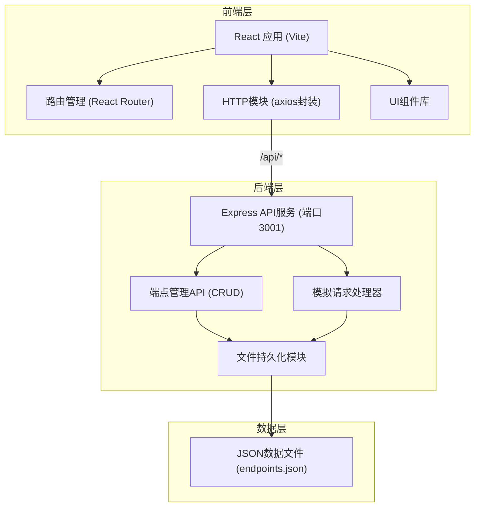
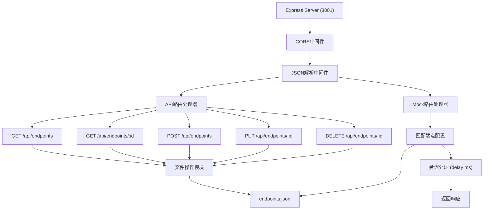
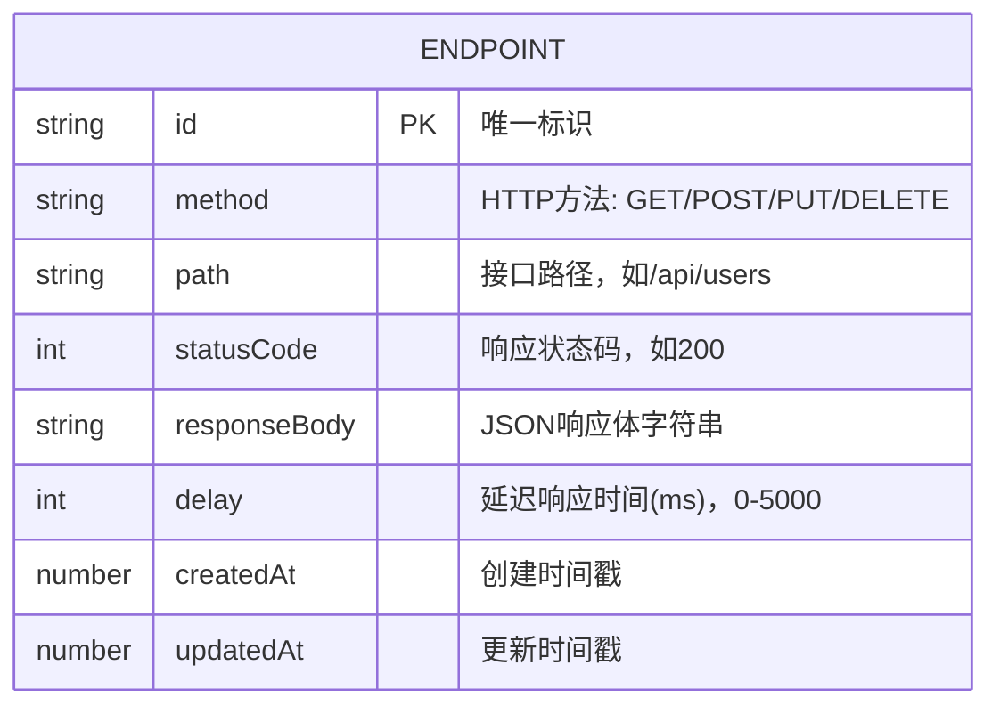

## 1. 架构设计



## 2. 技术描述

- **前端框架**: React 18 + TypeScript
- **构建工具**: Vite 5
- **前端路由**: React Router DOM 6
- **HTTP客户端**: Axios
- **样式方案**: 原生CSS + CSS变量 + CSS Modules
- **后端框架**: Express 4
- **后端语言**: JavaScript (Node.js)
- **数据持久化**: JSON文件（endpoints.json）
- **跨域处理**: cors中间件
- **代理配置**: Vite开发服务器代理 /api → http://localhost:3001

## 3. 前端路由定义

| 路由路径 | 页面组件 | 用途说明 |
|----------|----------|----------|
| / | HomePage | 端点列表首页，展示所有模拟端点卡片 |
| /endpoint/new | EndpointEditor | 创建新的模拟端点 |
| /endpoint/:id | EndpointEditor | 编辑已有模拟端点 |

## 4. API接口定义

### 4.1 TypeScript 类型定义

```typescript
interface Endpoint {
  id: string;
  method: 'GET' | 'POST' | 'PUT' | 'DELETE';
  path: string;
  statusCode: number;
  responseBody: string;
  delay: number;
  createdAt: number;
  updatedAt: number;
}

interface EndpointCreateRequest {
  method: 'GET' | 'POST' | 'PUT' | 'DELETE';
  path: string;
  statusCode: number;
  responseBody: string;
  delay: number;
}

interface EndpointUpdateRequest extends EndpointCreateRequest {
  id: string;
}

interface TestResponse {
  status: number;
  statusText: string;
  data: any;
  time: number;
}
```

### 4.2 后端API端点

| HTTP方法 | 路径 | 功能描述 | 请求体 | 响应体 |
|----------|------|----------|--------|--------|
| GET | /api/endpoints | 获取所有端点列表 | 无 | Endpoint[] |
| GET | /api/endpoints/:id | 获取单个端点详情 | 无 | Endpoint |
| POST | /api/endpoints | 创建新端点 | EndpointCreateRequest | Endpoint |
| PUT | /api/endpoints/:id | 更新端点 | EndpointUpdateRequest | Endpoint |
| DELETE | /api/endpoints/:id | 删除端点 | 无 | { success: boolean } |
| ANY | /mock/* | 模拟请求处理 | 任意 | 根据端点配置返回JSON |

## 5. 服务端架构



## 6. 数据模型

### 6.1 数据模型定义



### 6.2 endpoints.json 数据结构示例

```json
{
  "endpoints": [
    {
      "id": "uuid-1",
      "method": "GET",
      "path": "/api/users",
      "statusCode": 200,
      "responseBody": "{\"users\": [{\"id\": 1, \"name\": \"John\"}]}",
      "delay": 500,
      "createdAt": 1718000000000,
      "updatedAt": 1718000100000
    }
  ]
}
```

## 7. 项目文件结构

```
stubbubble/
├── package.json
├── index.html
├── vite.config.ts
├── tsconfig.json
├── src/
│   ├── App.tsx
│   ├── main.tsx
│   ├── http.ts
│   ├── types/
│   │   └── index.ts
│   ├── components/
│   │   ├── EndpointCard.tsx
│   │   ├── JsonEditor.tsx
│   │   ├── Sidebar.tsx
│   │   └── MethodBadge.tsx
│   ├── pages/
│   │   ├── HomePage.tsx
│   │   └── EndpointEditor.tsx
│   └── styles/
│       ├── global.css
│       └── variables.css
└── server/
    ├── index.js
    ├── endpoints.json
    └── package.json
```

## 8. 性能优化策略

1. **虚拟滚动/懒加载**：端点列表超过50项时考虑虚拟滚动
2. **防抖处理**：JSON编辑器键盘事件使用100ms防抖
3. **状态管理优化**：使用React.memo优化卡片组件重渲染
4. **并发请求**：前端HTTP请求支持并发和取消
5. **文件缓存**：后端读取endpoints.json时使用内存缓存，写入后失效
6. **CSS优化**：使用CSS变量和类选择器，避免复杂选择器
7. **构建优化**：Vite开启代码分割和tree shaking
