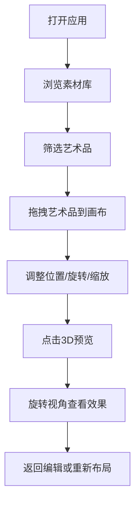

## 1. 产品概述

线上虚拟画廊策展工具，为艺术爱好者和策展人提供交互式的虚拟展厅布局体验。用户可从素材库拖拽艺术品至画布自由布局，实时调整艺术品参数，并一键生成3D预览效果。

- 主要用途：虚拟画廊策展、艺术品布局规划、展览效果预览
- 目标用户：画廊策展人、艺术收藏家、展览设计师
- 产品价值：降低策展成本，提升布局效率，直观预览展览效果

## 2. 核心功能

### 2.1 功能模块

1. **素材库模块**：艺术品缩略图展示、多维度筛选、拖拽源
2. **画布布局模块**：拖拽放置、网格吸附、艺术品编辑
3. **3D预览模块**：三维展厅生成、视角旋转、整体效果查看

### 2.2 页面详情

| 页面名称 | 模块名称 | 功能描述 |
|---------|----------|---------|
| 主页面 | 素材库 | 15件艺术品缩略图展示，带标题、作者、年份信息 |
| 主页面 | 筛选器 | 按流派（印象派/现代/雕塑）和年代筛选，0.25秒缩放淡出动画 |
| 主页面 | 画布区 | 800x600px俯视展厅平面图，支持拖拽放置、网格吸附（20px） |
| 主页面 | 详情面板 | 调整旋转角度（0-360度滑块）和缩放比例（0.5-2.0倍），同步动画 |
| 主页面 | 3D预览 | CSS3D变换生成三维展厅，支持视角旋转查看 |

## 3. 核心流程

用户从素材库选择艺术品，通过拖拽放置到画布上进行布局，调整每件艺术品的位置、旋转角度和缩放比例，完成后点击预览按钮查看3D效果。

## 4. 用户界面设计

### 4.1 设计风格

- **主色调**：暖灰背景 #F5F0EB
- **素材库区**：深灰卡片 #2C2C2C
- **交互按钮**：默认低饱和 #8B7D72，点击时深褐 #5C4F44，过渡0.2秒
- **布局风格**：三栏布局，左侧素材库，中间画布区，右侧详情面板
- **字体**：使用优雅的衬线字体提升艺术感，标题使用Playfair Display，正文使用Cormorant Garamond
- **动画**：所有交互都有平滑过渡，弹性动画增强质感

### 4.2 页面设计概述

| 页面名称 | 模块名称 | UI元素 |
|---------|----------|--------|
| 主页面 | 素材库 | 深灰背景卡片网格，艺术品缩略图带信息标签，筛选按钮组 |
| 主页面 | 画布区 | 白色画布带柔和阴影，20px网格线，拖拽半透明预览 |
| 主页面 | 详情面板 | 滑出式面板，滑块控件，实时预览 |
| 主页面 | 3D预览 | 模态框，CSS3D展厅，视角控制按钮 |

### 4.3 响应式

桌面端优先设计，固定画布尺寸800x600px，素材库宽度320px，详情面板宽度280px。

### 4.4 3D场景指导

- **环境**：简约白盒子展厅，聚光照明
- **光照**：顶部主光源 + 墙面辅助光，突出艺术品
- **相机**：透视视角，可水平360度旋转
- **交互**：鼠标拖拽旋转视角，滚轮缩放
- **后处理**：柔和阴影，轻微环境光遮蔽

## 5. 性能要求

- 拖拽操作帧率不低于45fps
- 3D预览生成在1秒内完成
- 筛选动画流畅，无卡顿
