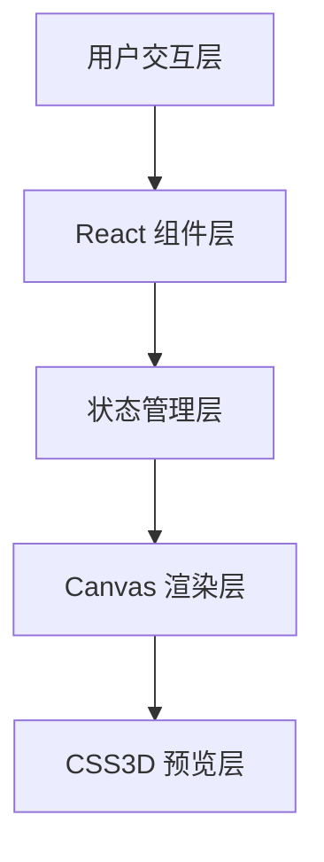

## 1. 架构设计



## 2. 技术描述

- **前端框架**: React@18 + TypeScript@5 + Vite@5
- **状态管理**: React useState/useReducer 本地状态
- **渲染技术**: Canvas 2D API（画布绘制）+ CSS3D Transform（3D预览）
- **构建工具**: Vite
- **第三方依赖**: uuid（唯一ID生成）
- **无后端**：所有数据为本地Mock数据

## 3. 项目结构

```
src/
├── main.tsx              # React 入口文件
├── App.tsx               # 主布局组件，状态管理
├── GalleryCanvas.tsx     # 画布组件，Canvas渲染
├── AssetLibrary.tsx      # 素材库组件
├── types.ts              # TypeScript 类型定义
└── data/
    └── artworks.ts       # 15件艺术品Mock数据
```

## 4. 核心组件说明

### 4.1 App.tsx
- 管理全局状态：艺术品列表、筛选条件、画布物品列表、选中物品
- 协调子组件间通信
- 渲染三栏布局

### 4.2 AssetLibrary.tsx
- 渲染15件艺术品缩略图网格
- 实现流派和年代筛选器
- 处理HTML5 Drag and Drop API
- 筛选动画（0.25秒缩放淡出）

### 4.3 GalleryCanvas.tsx
- Canvas 2D 绘制800x600px画布
- 处理拖拽放置逻辑
- 网格吸附算法（20px）
- 弹性动画（cubic-bezier(0.34, 1.56, 0.64, 1)）
- 旋转和缩放变换
- 触发3D预览模态框

### 4.4 Preview3D.tsx（新增）
- CSS3D Transform 实现三维展厅
- 视角旋转控制
- 透视投影效果

## 5. 类型定义

```typescript
interface Artwork {
  id: string;
  title: string;
  artist: string;
  year: number;
  genre: 'impressionism' | 'modern' | 'sculpture';
  type: 'painting' | 'sculpture';
  width: number;
  height: number;
  color: string;
  thumbnail: string;
}

interface PlacedItem {
  id: string;
  artworkId: string;
  x: number;
  y: number;
  rotation: number;
  scale: number;
}

interface FilterState {
  genre: 'all' | 'impressionism' | 'modern' | 'sculpture';
  yearRange: [number, number];
}
```

## 6. 性能优化策略

1. **Canvas渲染优化**：使用requestAnimationFrame，仅在状态变化时重绘
2. **拖拽性能**：使用pointer events，避免频繁重排
3. **动画优化**：CSS transform + opacity 实现GPU加速动画
4. **防抖节流**：筛选操作防抖，滑块更新节流
5. **对象池**：Canvas绘制时复用Path2D对象

## 7. 数据模型

### 7.1 艺术品数据（15件）
- 印象派：5件（莫奈、雷诺阿、德加等）
- 现代派：5件（毕加索、达利、康定斯基等）
- 雕塑：5件（罗丹、米开朗基罗等）

### 7.2 数据字段
每个艺术品包含：id、标题、作者、年份、流派、类型、尺寸、代表色
