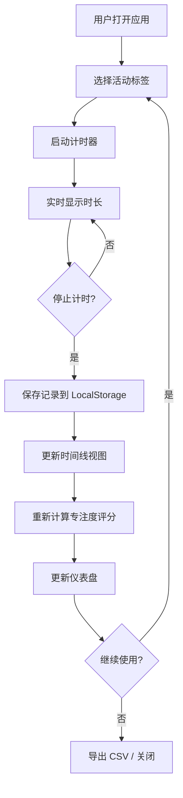

## 1. 产品概述

专注度追踪器（FocusTracker）——一款帮助用户量化每日屏幕时间、可视化活动分布并生成专注度评分的本地 Web 应用。解决现代人难以量化数字设备使用习惯、缺乏可视化反馈来改善专注力的核心痛点。

- 目标用户：希望改善时间管理、提升专注力的知识工作者和学生
- 核心价值：通过计时→可视化→评分→趋势分析的闭环，让用户清晰感知时间去向并获得改善动力

## 2. 核心功能

### 2.1 用户角色
| 角色 | 注册方式 | 核心权限 |
|------|----------|----------|
| 单用户 | 无需注册 | 使用全部功能，数据存储在本地 LocalStorage |

### 2.2 功能模块
1. **计时页面**：活动计时器、活动标签选择、实时时长显示
2. **时间线页面**：当日活动时间线视图、缩放控制
3. **仪表盘页面**：专注度评分环形图、7天趋势折线图、历史详情、CSV 导出

### 2.3 页面详情
| 页面名称 | 模块名称 | 功能描述 |
|----------|----------|----------|
| 计时页面 | 计时器卡片 | 手动启动/停止计时器，选择活动标签，显示实时时长，停止后自动保存记录 |
| 计时页面 | 活动标签管理 | 预设活动标签列表，标记高效/低效活动 |
| 时间线页面 | 时间线视图 | 按时间轴水平展示当日所有活动记录，不同活动用不同颜色条表示 |
| 时间线页面 | 缩放控制 | 1x/2x/4x 三档缩放倍率，水平条宽度平滑过渡（0.3s 动画） |
| 仪表盘页面 | 专注度评分 | 环形进度条展示 0-100 评分，基于高效活动时长占比，0.5s 弧度动画 |
| 仪表盘页面 | 7天趋势图 | 折线图展示过去7天评分，圆点标记每日评分，点击显示详情 |
| 仪表盘页面 | 每日详情 | 点击趋势图圆点弹出：总时长、高效时长、分类饼图 |
| 仪表盘页面 | CSV 导出 | 一键导出所有活动记录为 CSV 文件 |

## 3. 核心流程

用户启动计时器 → 选择活动标签 → 开始计时 → 停止计时 → 记录自动保存至 LocalStorage → 时间线实时更新 → 专注度评分自动计算 → 仪表盘展示评分和趋势 → 用户导出数据或继续计时

## 4. 用户界面设计

### 4.1 设计风格
- 主色：深灰 #1e1e2e（背景）、亮色 #cdd6f4（文字）
- 强调色：Teal #0db9a0（按钮、进度环、高亮元素）
- 按钮风格：圆角 12px，Teal 填充，hover 时阴影提升
- 字体：JetBrains Mono（计时数字）+ Noto Sans SC（中文正文）
- 布局风格：左侧固定导航栏 + 右侧主内容区，卡片化设计
- 图标风格：Lucide React 线性图标

### 4.2 页面设计概览
| 页面名称 | 模块名称 | UI 元素 |
|----------|----------|----------|
| 主页面 | 顶部计时卡片 | 圆角卡片、活动标签下拉、开始/停止按钮、计时数字居中、脉动动画 |
| 主页面 | 中部时间线 | 水平时间轴、彩色活动条、缩放按钮组、1小时刻度标记 |
| 主页面 | 下部仪表盘 | 环形评分图、折线趋势图、详情弹出层、导出按钮 |
| 全局 | 左侧导航栏 | 图标+文字导航项、Teal 高亮当前项、折叠汉堡菜单（≤768px） |

### 4.3 响应式设计
- 桌面优先，屏幕宽度 ≥ 768px：左侧固定导航栏 + 右侧主内容
- 屏幕宽度 < 768px：导航栏折叠为悬浮汉堡菜单，时间线刻度标签缩小一半
- 所有卡片在移动端全宽展示

### 4.4 动效设计
- 计时器脉动动画：计时中计时数字有呼吸效果
- 时间条缩放过渡：0.3s ease-in-out
- 环形进度动画：0.5s ease 弧度过渡
- 卡片悬停：0.2s 阴影提升
- 导航项高亮过渡：0.15s 背景色变化
