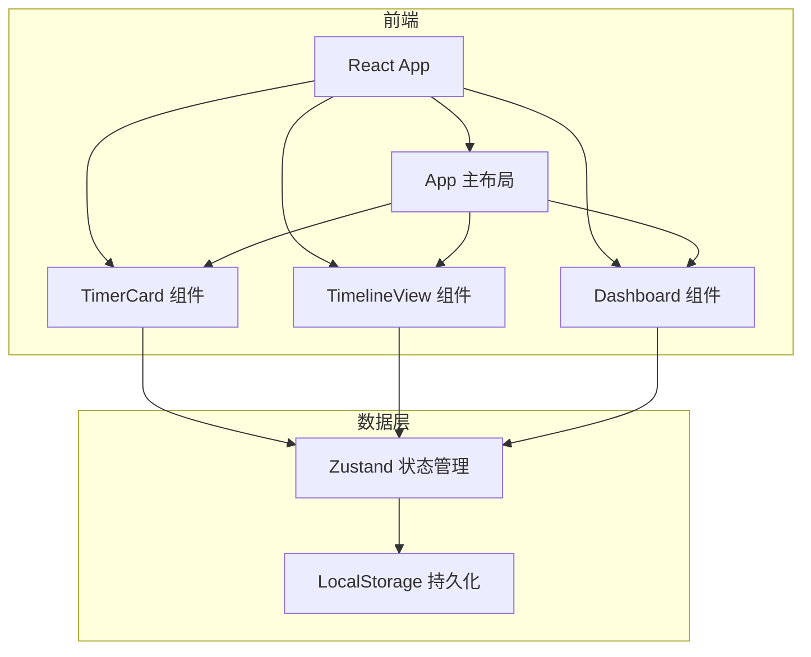
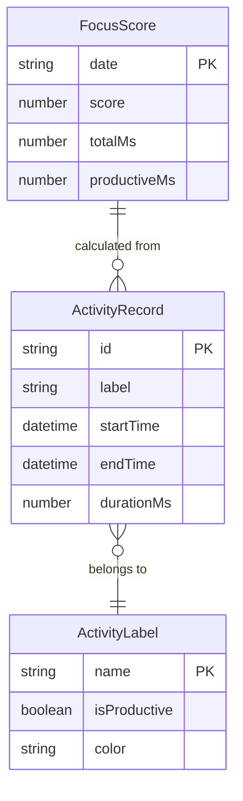

## 1. 架构设计



纯前端架构，无后端服务。所有数据存储在浏览器 LocalStorage 中，状态管理使用 Zustand。

## 2. 技术说明
- 前端框架：React 18 + TypeScript + Vite
- 状态管理：Zustand（轻量级，适合纯前端应用）
- 样式方案：CSS Modules + CSS 变量（暗色主题）
- 数据持久化：LocalStorage（JSON 序列化）
- 图表绘制：Canvas 2D API（环形图、折线图、饼图）
- 唯一标识：uuid 库生成记录 ID
- 初始化工具：vite-init（react-ts 模板）

## 3. 路由定义
| 路由 | 用途 |
|------|------|
| / | 主页面，包含计时卡片、时间线、仪表盘（单页应用，通过导航切换可见区域） |

## 4. 数据模型

### 4.1 数据模型定义



### 4.2 数据定义

**ActivityRecord（活动记录）**
- id: string — uuid 生成
- label: string — 活动标签名称
- startTime: number — 开始时间戳（ms）
- endTime: number — 结束时间戳（ms）
- durationMs: number — 持续时间（ms）

**ActivityLabel（活动标签）**
- name: string — 标签名称（如"编程"、"阅读"、"刷视频"）
- isProductive: boolean — 是否为高效活动
- color: string — 显示颜色（十六进制）

**LocalStorage 键设计**
- `focus-tracker:records` — ActivityRecord[]
- `focus-tracker:labels` — ActivityLabel[]
- `focus-tracker:productive-list` — string[]（高效活动名称列表）

## 5. 文件结构

```
├── package.json
├── vite.config.js
├── tsconfig.json
├── index.html
├── src/
│   ├── main.tsx
│   ├── App.tsx
│   ├── store.ts                 # Zustand 状态管理
│   ├── types.ts                 # TypeScript 类型定义
│   ├── components/
│   │   ├── TimerCard.tsx
│   │   ├── TimelineView.tsx
│   │   ├── Dashboard.tsx
│   │   └── Sidebar.tsx          # 导航栏组件
│   └── styles/
│       └── global.css           # 全局样式和 CSS 变量
```

## 6. 性能约束
- 计时器更新间隔：1 秒（setInterval）
- 时间线渲染：100 条记录时滚动帧率 ≥ 45fps（使用 CSS transform 代替 left/width 动画）
- Canvas 图表：使用 requestAnimationFrame 绘制，避免频繁重绘
