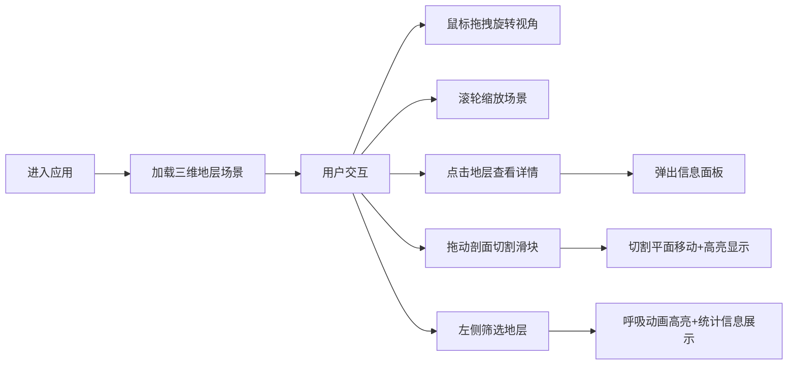

## 1. 产品概述

三维地层可视化应用是一款面向地质学家的科学可视化工具，通过三维交互式场景直观展示地下岩层空间关系和多层位之间的交切关系，解决传统二维剖面图无法直观呈现地下结构的问题。

- 核心价值：将抽象的地质数据转化为可交互的三维可视化场景，提升地质分析效率和准确性
- 目标用户：地质学家、勘探工程师、地质教育工作者
- 应用场景：油气勘探、矿产勘查、地质教学、城市地下空间规划

## 2. 核心功能

### 2.1 用户角色
| 角色 | 注册方式 | 核心权限 |
|------|----------|----------|
| 地质工作者 | 无需注册，直接使用 | 浏览地层结构、交互标注、剖面切割、属性查询 |

### 2.2 功能模块
1. **三维地层渲染模块**：多层地层展示、波浪状地形、视角交互、抗锯齿平滑
2. **断层交互标注模块**：点击查询、信息面板、层位详情展示
3. **剖面切割可视化模块**：滑动条控制、切割平面、高亮效果、视厚度计算
4. **地层属性查询模块**：筛选面板、呼吸动画高亮、统计信息展示

### 2.3 功能详情
| 功能模块 | 子功能 | 功能描述 |
|----------|--------|----------|
| 三维地层渲染 | 多层地层 | 至少5层不同颜色和纹理的地层，从地表至深部依次为沙色、棕色、深灰、暗灰、深绿灰 |
| 三维地层渲染 | 地形起伏 | 地层表面0.5单位高度波浪状扰动模拟真实地形 |
| 三维地层渲染 | 视角控制 | 鼠标拖拽旋转视角、滚轮缩放 |
| 三维地层渲染 | 抗锯齿过渡 | 视角旋转时地层边界0.3秒抗锯齿平滑过渡 |
| 断层交互标注 | 点击查询 | 点击场景自动计算最近的岩层面 |
| 断层交互标注 | 信息面板 | 半透明深色背景、淡金色文字，显示层位名称、深度、岩性、地质年代 |
| 断层交互标注 | 动画效果 | 0.2秒缩放动画浮现，点击外部区域收缩消失 |
| 剖面切割可视化 | 滑动控制 | 右侧垂直剖面控制条，范围0-100，步长1 |
| 剖面切割可视化 | 切割平面 | 沿X轴半透明白色切割平面（0.3不透明度） |
| 剖面切割可视化 | 高亮效果 | 被切地层0.1秒渐变色变化（变为金色） |
| 剖面切割可视化 | 厚度显示 | 左侧信息区显示当前切割位置各层视厚度值列表 |
| 地层属性查询 | 筛选面板 | 左侧地层名称下拉列表、深度范围输入框 |
| 地层属性查询 | 呼吸动画 | 选中地层0.5秒呼吸动画（透明度0.8-1.0循环） |
| 地层属性查询 | 半透明化 | 非选中地层透明度降至0.2 |
| 地层属性查询 | 统计信息 | 平均厚度、最大最小深度、面积估算值 |

## 3. 核心流程

## 4. 用户界面设计

### 4.1 设计风格
- 设计主题：深色科学可视化风格
- 主背景色：#0D1117 暗蓝色
- 边框装饰：极细的#1E3A5F深蓝边框
- 文字颜色：#C9D1D9 浅灰色
- 强调色：#D4AF37 淡金色（信息面板文字）、#4A90D9 蓝色（滑块）、#FFD700 金色（高亮）
- 控件样式：圆角矩形，圆角半径8px
- 按钮交互：悬停时背景从#1E3A5F过渡到#2B5278，0.2秒动画
- 滑动条：轨道#2C3E50，滑块#4A90D9，选中时#5BA3E6

### 4.2 页面设计概述
| 页面区域 | 模块名称 | UI元素 |
|----------|----------|--------|
| 主场景区 | 三维视口 | Three.js渲染画布、地层模型、粒子纹理 |
| 左侧面板 | 筛选控制 | 地层下拉列表、深度输入框、统计信息 |
| 右侧控制 | 剖面切割 | 垂直滑动条、切割平面、厚度列表 |
| 浮动层 | 信息面板 | 半透明面板、层位详情、缩放动画 |
| 顶部导航 | 响应式菜单 | 汉堡图标、折叠展开动画 |

### 4.3 响应式设计
- **1440px以上（桌面端）**：左侧固定控制面板（宽度280px），主场景居中展示
- **768px-1440px（平板端）**：顶部折叠导航栏，点击汉堡图标展开（0.3秒下滑动画）
- **768px以下（移动端）**：全屏3D场景，右下角浮动圆形控制按钮

### 4.4 3D场景指引
- **环境与氛围**：深色宇宙背景，蓝色调雾效，营造深邃的地下空间感
- **光照设置**：环境光（强度0.4）+ 方向光（强度0.8，45度俯角）+ 点光源补光
- **相机设置**：透视相机，初始距离15单位，俯视角45度，可环绕旋转
- **构图与焦点**：地层模型居中，预留足够旋转空间，底部有网格参考
- **交互动画**：平滑的轨道控制，边界抗锯齿过渡，点击反馈
- **后处理效果**：抗锯齿（FXAA），柔和阴影
- **资源与性能**：粒子数量≤2000，稳定45FPS以上，UI动画≥30FPS
