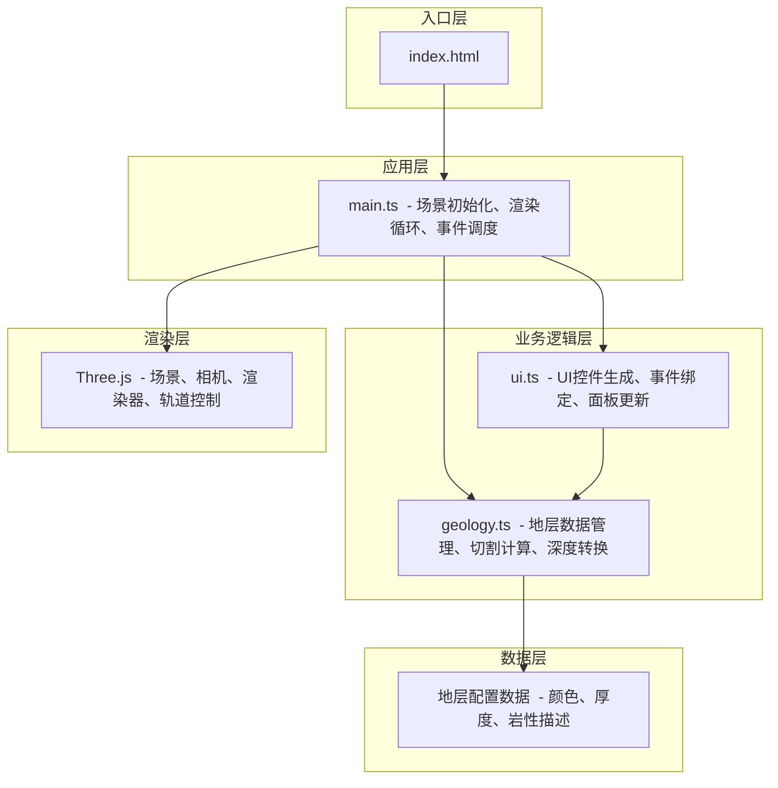

## 1. 架构设计



## 2. 技术栈描述

- **前端框架**：纯 TypeScript + Three.js，不使用React/Vue等框架，直接操作DOM和Three.js
- **构建工具**：Vite 5.x，支持HMR和快速构建
- **3D引擎**：Three.js r160+，用于三维场景渲染
- **类型系统**：TypeScript 5.x，严格模式
- **样式方案**：原生CSS + CSS变量，无需Tailwind
- **无后端**：纯前端应用，数据内置在geology模块中

## 3. 文件结构与路由

| 文件路径 | 作用说明 |
|----------|----------|
| `/index.html` | 入口HTML页面，包含root容器和基础样式链接 |
| `/package.json` | 项目依赖配置（three, typescript, vite, @types/three） |
| `/vite.config.js` | Vite构建配置（基础路径为'/'） |
| `/tsconfig.json` | TypeScript配置（严格模式、ES2020、bundler模块解析） |
| `/src/main.ts` | 主入口：初始化Three.js场景、相机、渲染器、轨道控制器、动画循环、事件绑定 |
| `/src/geology.ts` | 地质数据模块：地层定义、厚度计算、切割平面参数、深度转换逻辑 |
| `/src/ui.ts` | UI交互模块：左侧筛选面板、右侧剖面滑块、点击信息面板、响应式布局 |

## 4. 核心数据模型

### 4.1 地层数据结构

```typescript
interface Stratum {
  id: number;
  name: string;        // 地层名称，如"第四系"、"侏罗系"等
  color: string;       // 颜色值（十六进制）
  thickness: number;   // 厚度（单位）
  depthTop: number;    // 顶部深度
  depthBottom: number; // 底部深度
  lithology: string;   // 岩性描述
  age: string;         // 地质年代
  roughness: number;   // 表面起伏程度
}
```

### 4.2 切割平面参数

```typescript
interface CutPlaneParams {
  position: number;    // X轴位置（0-100百分比）
  isActive: boolean;   // 是否激活
  opacity: number;     // 不透明度
}
```

### 4.3 地层统计信息

```typescript
interface StratumStats {
  avgThickness: number;  // 平均厚度
  minDepth: number;      // 最小深度
  maxDepth: number;      // 最大深度
  estimatedArea: number; // 估算面积
}
```

## 5. 核心模块设计

### 5.1 geology.ts 模块
- **createStrata()**：生成5层随机厚度的地层数据
- **calculateCutThickness(stratumId, cutX)**：计算某地层在切割位置的视厚度
- **getStratumAtPoint(x, y, z)**：查找给定点最近的地层
- **getStratumStats(stratumId)**：获取指定地层的统计信息
- **depthToWorld(depth)**：深度值与世界坐标转换

### 5.2 ui.ts 模块
- **createLeftPanel()**：创建左侧筛选面板（地层下拉、深度输入、统计信息）
- **createRightSlider()**：创建右侧垂直剖面滑动条
- **createInfoPanel()**：创建点击信息面板
- **createMobileControls()**：创建移动端浮动按钮
- **bindEvents()**：绑定所有UI交互事件
- **updateInfoPanel(data)**：更新信息面板内容
- **updateStatsPanel(stats)**：更新统计信息面板

### 5.3 main.ts 模块
- **initScene()**：初始化Three.js场景、相机、渲染器
- **createStratumMeshes()**：创建地层网格（带波浪扰动）
- **createParticles()**：创建地层纹理粒子（≤2000个）
- **setupOrbitControls()**：设置轨道控制器
- **setupRaycaster()**：设置射线检测用于点击交互
- **animate()**：动画循环（呼吸动画、平滑过渡）
- **handleResize()**：窗口大小变化处理

## 6. 性能优化策略

1. **粒子数量控制**：严格控制粒子总数不超过2000个
2. **材质复用**：相同颜色的地层复用材质实例
3. **几何合并**：静态地层使用合并几何体减少draw call
4. **LOD策略**：远景简化地层细节
5. **帧率监控**：实时监控FPS，动态调整渲染质量
6. **CSS动画优先**：UI动画使用CSS transform提升性能
7. **节流处理**：滚轮和滑动条事件使用节流优化

## 7. 浏览器兼容性

- 支持Chrome/Edge/Firefox/Safari现代浏览器
- 需要WebGL 2.0支持
- 移动端支持触摸操作
