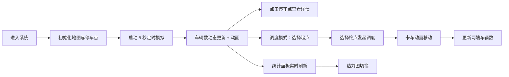

## 1. 产品概述

城市共享单车调度模拟系统是一个基于地图可视化的交互式模拟平台，通过动态展示停车点车辆分布和调度过程，帮助用户理解共享单车运营调度逻辑。

- 主要用途：可视化展示共享单车停车点实时状态，模拟车辆调度流程
- 目标用户：城市规划人员、运营管理人员、教学演示场景
- 产品价值：直观呈现共享单车供需分布与调度优化的可视化效果

## 2. 核心功能

### 2.1 用户角色

| 角色 | 登录方式 | 核心权限 |
|------|----------|----------|
| 访客用户 | 无需登录 | 查看地图、观察模拟、发起调度任务 |

### 2.2 功能模块

1. **地图主界面**：OSM 底图、20 个停车点气泡标记、车辆数量可视化
2. **实时数据模拟**：每 5 秒自动模拟取还车行为、车辆数动态变化
3. **调度员模式**：点击两点发起调度、卡车动画移动、车辆数同步更新
4. **统计面板**：总车辆数、平均满载率、活跃调度数、热力图切换
5. **详情弹窗**：停车点历史占用率折线图（12 小时模拟数据）

### 2.3 页面详情

| 页面名称 | 模块名称 | 功能描述 |
|----------|----------|----------|
| 主页面 | 地图图层 | OSM 瓦片底图、20 个随机经纬度停车点 |
| 主页面 | 气泡标记 | 带数字圆形气泡、红-绿渐变色、阴影发光效果 |
| 主页面 | 动画效果 | 车辆数变化缩放动画、扩散波纹光效 |
| 主页面 | 详情面板 | 点击气泡弹出 12 小时历史占用率折线图 |
| 主页面 | 调度功能 | 点击两点发起调度、卡车沿直线移动 2 秒动画 |
| 主页面 | 统计面板 | 右上角全局统计、数字滚动动画、热力图切换 |
| 主页面 | 热力图层 | 0.5 秒淡入淡出、车辆密度可视化 |
| 主页面 | 响应式布局 | 桌面端右侧面板、移动端底部抽屉 |

## 3. 核心流程

用户进入系统后，地图自动加载并展示 20 个停车点的实时状态。系统每 5 秒自动模拟一次用户取还车行为，各停车点车辆数动态变化并伴随动画效果。用户可点击任意停车点查看历史占用率详情，也可通过调度模式依次点击起点和终点来发起车辆调度任务，调度过程中卡车图标沿路径移动，到达后两端车辆数同步更新。右上角统计面板实时展示全局数据，并支持热力图开关切换。

## 4. 用户界面设计

### 4.1 设计风格

- **主色调**：Google Maps 蓝色 `#1a73e8`
- **背景色**：白色 `#ffffff`
- **次要信息**：灰色 `#5f6368`、浅灰 `#dadce0`
- **气泡渐变**：红色 `#ea4335`（0 辆）→ 黄色 `#fbbc04` → 绿色 `#34a853`（15 辆）
- **气泡效果**：阴影 + 轻微发光 + 圆角
- **字体**：系统无衬线字体，清晰易读
- **布局风格**：悬浮卡片式设计，圆角矩形面板

### 4.2 页面设计概览

| 页面名称 | 模块名称 | UI 元素 |
|----------|----------|---------|
| 主页面 | 地图底图 | OSM 瓦片、白色背景风格 |
| 主页面 | 停车点气泡 | 圆形、数字、渐变色、阴影、发光 |
| 主页面 | 波纹动画 | 车辆变化时扩散光环 |
| 主页面 | 详情弹窗 | 折线图、标题、关闭按钮 |
| 主页面 | 统计面板 | 右上角卡片、数字滚动、切换按钮 |
| 主页面 | 调度卡车 | 移动图标、直线路径 |
| 主页面 | 热力图层 | 半透明叠加、平滑渐变 |

### 4.3 响应式设计

- **桌面端**（>768px）：统计面板悬浮于右上角，详情弹窗居中显示
- **平板端**：适当缩小面板尺寸，保持布局完整
- **移动端**（≤768px）：统计面板折叠为底部抽屉，支持上滑展开，地图全屏显示
- **触摸优化**：气泡点击区域放大，手势滑动支持

### 4.4 动画与交互

- 气泡数字变化：0.3 秒缩放过渡动画
- 车辆更新波纹：扩散光效，渐隐消失
- 热力图切换：0.5 秒淡入淡出
- 数字统计：滚动数字动画
- 卡车调度：2 秒直线平移动画
- 面板抽屉：平滑滑入滑出
