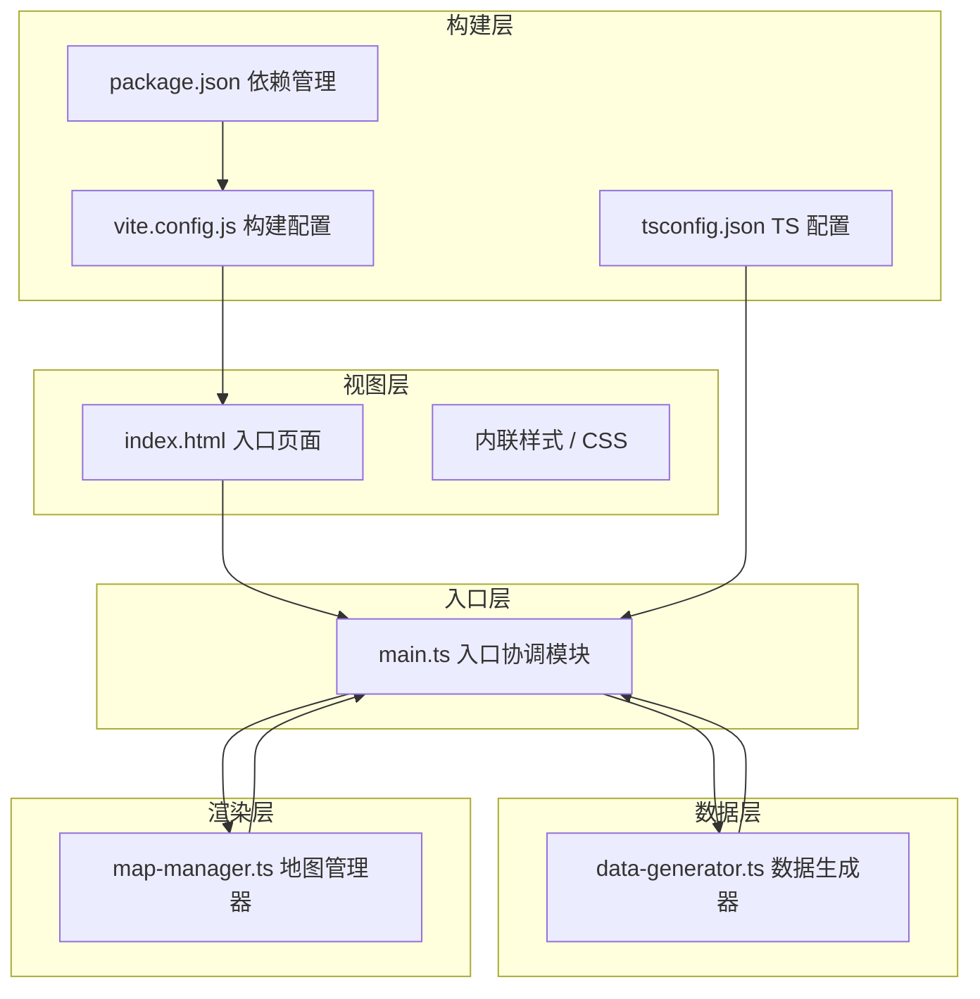

## 1. 架构设计

系统采用模块化前端架构，以 Vite 为构建工具，TypeScript 为开发语言，Leaflet 为地图引擎。整体分为数据层、地图渲染层和协调层三层结构，各模块职责清晰，通过明确的接口进行数据交互。



## 2. 技术栈说明

- **前端框架**：原生 TypeScript（无框架）+ Leaflet 地图库
- **构建工具**：Vite 5.x
- **语言**：TypeScript 5.x（严格模式）
- **地图引擎**：Leaflet 1.9.x
- **地图瓦片**：OpenStreetMap 免费瓦片
- **辅助库**：uuid（生成唯一 ID）
- **图表**：原生 Canvas 绘制折线图（不引入额外图表库以保持轻量）

## 3. 模块定义

| 模块文件 | 职责描述 | 关键输出 |
|----------|----------|----------|
| `src/data-generator.ts` | 生成 20 个虚拟停车点初始数据，提供随机取还车模拟函数，维护历史占用率数据 | 停车点数组、模拟更新函数、历史数据 |
| `src/map-manager.ts` | 初始化 Leaflet 地图，管理气泡标记渲染与更新，绘制调度卡车动画，切换热力图层 | 地图实例、气泡更新 API、调度动画 API |
| `src/main.ts` | 入口协调模块，串联数据层与渲染层，建立定时更新循环，处理用户交互事件 | 应用初始化、定时循环、事件调度 |
| `index.html` | 页面入口，包含地图容器和统计面板 DOM 结构 | HTML 骨架 |

## 4. 数据模型

### 4.1 停车点数据模型

```typescript
interface BikeStation {
  id: string;
  name: string;
  lat: number;
  lng: number;
  bikeCount: number;
  capacity: number;
  hourlyHistory: number[];
}
```

### 4.2 调度任务数据模型

```typescript
interface DispatchTask {
  id: string;
  fromStationId: string;
  toStationId: string;
  bikeCount: number;
  status: 'pending' | 'moving' | 'completed';
  startTime: number;
  duration: number;
}
```

### 4.3 全局统计数据模型

```typescript
interface GlobalStats {
  totalBikes: number;
  avgOccupancy: number;
  activeDispatches: number;
}
```

## 5. 文件结构

```
.
├── index.html
├── package.json
├── vite.config.js
├── tsconfig.json
└── src/
    ├── main.ts
    ├── data-generator.ts
    └── map-manager.ts
```

## 6. 关键技术实现

### 6.1 气泡标记实现
- 使用 Leaflet DivIcon 创建自定义 DOM 标记
- 通过 CSS 渐变实现红-黄-绿颜色过渡
- 使用 CSS transform + transition 实现缩放动画
- 通过 CSS ::before 伪元素和 animation 实现波纹效果

### 6.2 调度卡车动画
- 使用 Leaflet Marker 承载卡车图标
- 通过 requestAnimationFrame 计算中间位置
- 使用线性插值（lerp）实现平滑移动
- 动画时长固定 2 秒

### 6.3 热力图实现
- 使用 Leaflet CanvasOverlay 或 CircleMarker 集合实现
- 基于车辆数计算半径和透明度
- 使用 CSS opacity + transition 实现淡入淡出

### 6.4 数字滚动动画
- 使用 requestAnimationFrame 逐步更新显示数值
- 采用缓动函数实现平滑的数字滚动效果

### 6.5 历史折线图
- 使用原生 Canvas 2D API 绘制
- 12 小时数据点，平滑曲线连接
- 坐标轴和网格线绘制
