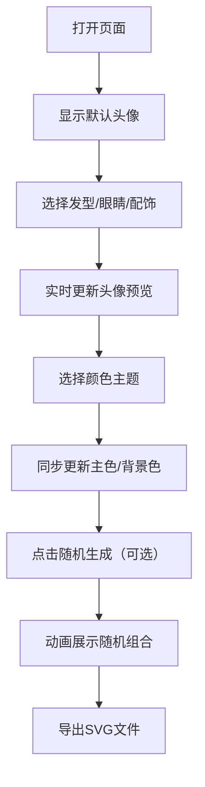

## 1. 产品概述
个人IP形象徽章生成器是一个让用户通过选择不同风格元素来定制卡通头像徽章的Web应用，支持SVG格式导出。
- 主要目标：提供直观、有趣的头像定制体验，让用户快速创建个性化卡通头像
- 目标用户：需要创建个人IP形象、社交媒体头像、徽章设计的普通用户

## 2. 核心功能

### 2.1 功能模块
1. **主页面**: 头像预览区、元素选择面板、颜色主题选择、随机生成、SVG导出

### 2.2 页面详情
| 页面名称 | 模块名称 | 功能描述 |
|-----------|-------------|---------------------|
| 主页面 | 头像预览区 | 240x240像素圆形画布，实时渲染SVG头像，带渐变发光边框 |
| 主页面 | 元素选择面板 | 三个分类面板（发型5种、眼睛4种、配饰5种），点击切换，0.3秒平滑过渡动画 |
| 主页面 | 颜色主题选择 | 6种预设主题（霓虹紫、复古橙、冰河蓝等），主色/边框色/背景色同步变化，0.5秒渐变动画 |
| 主页面 | 随机生成按钮 | 随机组合所有元素，每0.8秒切换一次，三次后停止，配合旋转缩放动画 |
| 主页面 | SVG导出 | 将当前头像导出为SVG文件 |

## 3. 核心流程
用户打开页面 → 查看默认头像 → 选择发型/眼睛/配饰 → 切换颜色主题 → 点击随机生成（可选）→ 导出SVG头像

## 4. 用户界面设计

### 4.1 设计风格
- 主色调：深色背景（#1a1a2e 到 #16213e 渐变），亮色头像
- 按钮样式：圆角卡片，悬浮时有上浮阴影效果
- 字体：现代无衬线字体，清晰易读
- 布局风格：左侧头像预览，右侧操作面板（窄屏时下移）
- 动画风格：平滑过渡、旋转缩放、渐变发光

### 4.2 页面设计概述
| 页面名称 | 模块名称 | UI元素 |
|-----------|-------------|-------------|
| 主页面 | 头像预览区 | 240x240圆形画布、渐变发光边框、SVG图形、过渡动画 |
| 主页面 | 元素选择面板 | 分类标签、选项卡片、点击反馈、悬浮阴影 |
| 主页面 | 颜色主题选择 | 6个颜色方块、选中高亮、渐变切换 |
| 主页面 | 随机生成按钮 | 旋转动画、缩放效果 |

### 4.3 响应式
- 桌面端：左侧头像预览 + 右侧操作面板（双栏布局）
- 移动端：上方头像预览 + 下方操作面板（单栏布局）
- 画布自适应缩放，触控优化
