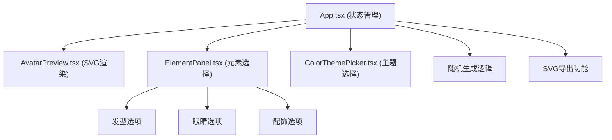

## 1. 架构设计



## 2. 技术说明
- 前端：React@18 + TypeScript + Vite + Tailwind CSS
- 构建工具：Vite
- 状态管理：React useState/useEffect（局部状态，无需全局状态管理）
- 图标：Lucide React

## 3. 文件结构
```
├── package.json
├── index.html
├── vite.config.js
├── tsconfig.json
├── tailwind.config.js (可选)
├── postcss.config.js (可选)
└── src/
    ├── main.tsx
    ├── App.tsx
    └── components/
        ├── AvatarPreview.tsx
        ├── ElementPanel.tsx
        └── ColorThemePicker.tsx
```

## 4. 数据模型

### 4.1 类型定义
```typescript
interface AvatarConfig {
  hair: string;
  eyes: string;
  accessory: string;
}

interface ColorTheme {
  id: string;
  name: string;
  primary: string;
  border: string;
  background: string;
}

interface ElementOption {
  id: string;
  name: string;
  svgPath: React.ReactNode;
}
```

## 5. 性能要求
- 元素切换渲染延迟：≤ 50ms
- 动画帧率：≥ 30fps
- 使用CSS transitions/transforms 实现硬件加速动画
