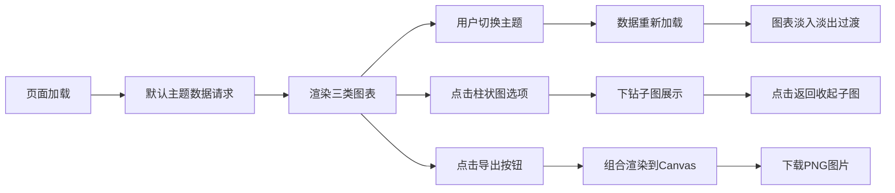

## 1. 产品概述
线上投票结果可视化分析面板，解决运营社区活动投票统计费时易错的问题。为运营人员提供自动统计、多维度可视化展示和一键导出功能。
- 主要用途：投票活动结束后自动生成分布曲线和汇总报告
- 目标用户：社区运营人员、活动策划人员
- 产品价值：提升统计效率，降低人工错误，提供专业的数据分析展示

## 2. 核心 Features

### 2.1 用户角色
| 角色 | 注册方式 | 核心权限 |
|------|----------|----------|
| 运营人员 | 无需注册，直接使用 | 查看投票数据、切换主题、导出报告 |

### 2.2 功能模块
1. **主题选择模块**：下拉框切换三个预设投票主题
2. **得票分布图表**：柱状图/雷达图展示各选项得票情况，支持类型切换
3. **投票趋势图表**：折线图展示按时间维度的投票趋势
4. **统计摘要面板**：显示总票数、最高票选项、投票峰值时段等指标
5. **图表下钻功能**：点击柱状图选项查看该选项的详细时间分布
6. **数据导出功能**：将所有图表组合导出为 PNG 图片

### 2.3 页面详情
| 页面名称 | 模块名称 | 功能描述 |
|----------|----------|----------|
| 主面板 | 主题选择区 | 下拉框选择投票主题，切换时标题缩放动画 |
| 主面板 | 得票分布图 | 柱状图/雷达图切换，点击选项下钻，淡入淡出过渡 |
| 主面板 | 投票趋势图 | 折线图展示时间趋势，支持下钻子图 |
| 主面板 | 统计摘要面板 | 数字滚动动画，导出按钮，关键指标展示 |

## 3. 核心流程
用户进入页面 → 默认加载第一个投票主题 → 查看三个维度的图表分析 → 可切换主题查看不同投票数据 → 点击柱状图选项下钻查看详细时间分布 → 点击导出按钮生成 PNG 报告

## 4. 用户界面设计

### 4.1 设计风格
- 主色调：深蓝(#1a1a2e)与白色(#f0f0f5)搭配
- 强调色：浅蓝(#4db8ff)用于按钮和图表高亮
- 卡片风格：半透明磨砂效果(backdrop-filter: blur(8px))，12px圆角，24px间距
- 字体：展示字体选用独特的显示字体，正文字体选用清晰易读的无衬线字体
- 动画：主题切换0.4秒淡入淡出，标题0.3秒缩放弹入，数字0.5秒滚动动画，微过渡0.15秒

### 4.2 页面设计概述
| 页面名称 | 模块名称 | UI 元素 |
|----------|----------|----------|
| 主面板 | 标题区 | 深色背景，白色标题，浅蓝强调，缩放动画 |
| 主面板 | 主题选择 | 自定义下拉框，悬停效果，过渡动画 |
| 主面板 | 图表卡片 | 磨砂半透明背景，圆角边框，内部阴影 |
| 主面板 | 摘要面板 | 大号数字展示，滚动动画，导出按钮 |

### 4.3 响应式
- 宽屏(>1024px)：三列布局，三个图表并排
- 中屏(768-1024px)：两列布局，折线图独占一行
- 窄屏(<768px)：单列堆叠布局
- 每个图表区域高度不低于320px，自适应

### 4.4 交互细节
- 数据点悬停：带箭头的tooltip，0.2秒淡入
- 按钮悬停：颜色/背景变化，0.15秒过渡
- 子图收起：0.2秒翻转动画
- 图表过渡：主题切换0.4秒淡入淡出
