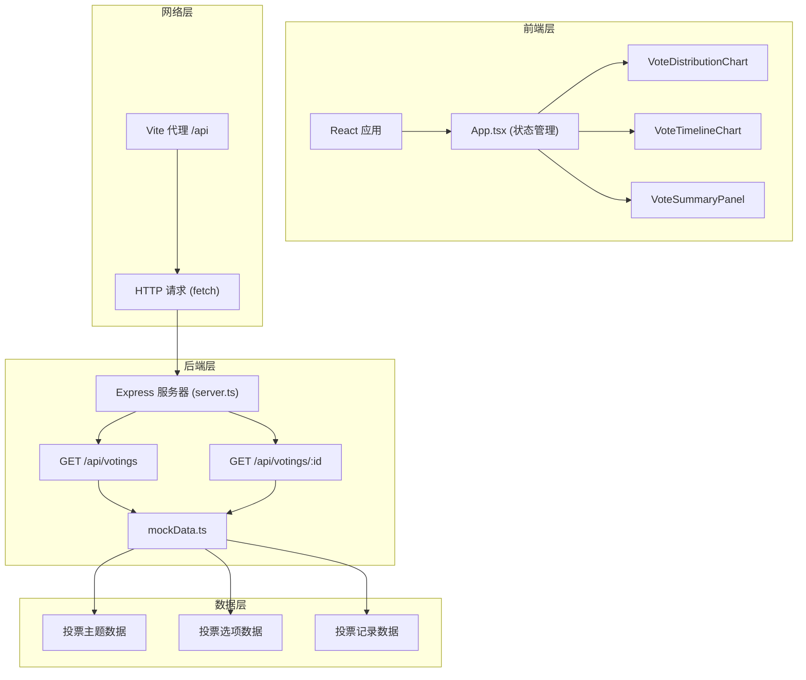
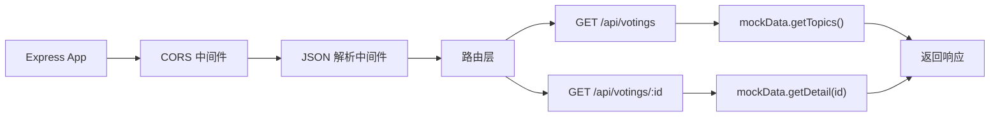
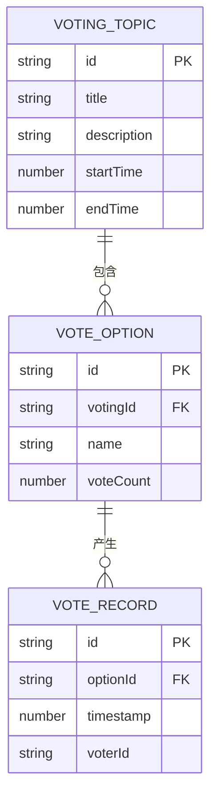

## 1. 架构设计



**数据流向说明：**
1. `mockData.ts` → `server.ts`：提供原始投票数据
2. `server.ts` → 前端：通过 RESTful API 返回 JSON 数据
3. `App.tsx` → 子组件：通过 props 分发数据
4. 子组件 → Recharts：数据转换后渲染图表

**文件调用关系：**
- [server/mockData.ts](file:///d:/VersionFastPro/tasks/auto28/server/mockData.ts) → 被 [server/server.ts](file:///d:/VersionFastPro/tasks/auto28/server/server.ts) 调用
- [src/App.tsx](file:///d:/VersionFastPro/tasks/auto28/src/App.tsx) → 调用 [src/VoteDistributionChart.tsx](file:///d:/VersionFastPro/tasks/auto28/src/VoteDistributionChart.tsx)、[src/VoteTimelineChart.tsx](file:///d:/VersionFastPro/tasks/auto28/src/VoteTimelineChart.tsx)、[src/VoteSummaryPanel.tsx](file:///d:/VersionFastPro/tasks/auto28/src/VoteSummaryPanel.tsx)

## 2. 技术描述

- **前端**：React 18 + TypeScript 5 + Vite 5 + Recharts 2
- **后端**：Express 4 + TypeScript 5
- **构建工具**：Vite 5
- **数据**：Mock 数据模块，独立生成
- **图表库**：Recharts（React 图表库）
- **唯一标识**：uuid
- **类型定义**：@types/react、@types/react-dom、@types/express、@types/uuid

**性能保障：**
- 数据处理：前端缓存已加载数据，避免重复请求
- 动画优化：使用 CSS transition 和 transform，确保 30fps+
- 大数据处理：300条记录处理时间 < 1秒

## 3. 路由定义

| 路由 | 用途 |
|------|------|
| / | 主面板页面，展示所有图表 |
| GET /api/votings | 获取投票主题列表 |
| GET /api/votings/:id | 获取指定主题的详细投票数据 |

## 4. API 定义

### 类型定义

```typescript
// 投票选项
interface VoteOption {
  id: string;
  name: string;
  voteCount: number;
}

// 投票记录
interface VoteRecord {
  id: string;
  optionId: string;
  timestamp: number;
  voterId?: string;
}

// 投票主题（列表项）
interface VotingTopic {
  id: string;
  title: string;
  description: string;
  optionCount: number;
  totalVotes: number;
  startTime: number;
  endTime: number;
}

// 投票主题详情
interface VotingDetail extends VotingTopic {
  options: VoteOption[];
  records: VoteRecord[];
}

// API 响应
interface ApiResponse<T> {
  success: boolean;
  data: T;
  message?: string;
}
```

### API 接口

**GET /api/votings**
- 请求：无参数
- 响应：`ApiResponse<VotingTopic[]>`
- 示例：
```json
{
  "success": true,
  "data": [
    {
      "id": "uuid-1",
      "title": "最佳旅游目的地",
      "description": "2026年度最受欢迎旅游目的地评选",
      "optionCount": 10,
      "totalVotes": 350,
      "startTime": 1717209600000,
      "endTime":  1719801600000
    }
  ]
}
```

**GET /api/votings/:id**
- 请求参数：`id` - 投票主题ID
- 响应：`ApiResponse<VotingDetail>`

## 5. 服务器架构



## 6. 数据模型

### 6.1 数据模型定义



### 6.2 Mock 数据生成规则

**三个预设主题：**
1. 最佳旅游目的地（10个选项，350条投票记录）
2. 最受欢迎编程语言（12个选项，420条投票记录）
3. 年度电影评选（8个选项，280条投票记录）

**数据生成逻辑：**
- 选项ID：使用 uuid v4
- 投票记录时间：在 startTime 和 endTime 之间随机分布
- 得票分布：正态分布模拟，部分选项有明显优势
- 投票趋势：模拟工作日高峰、夜间低谷的真实模式
