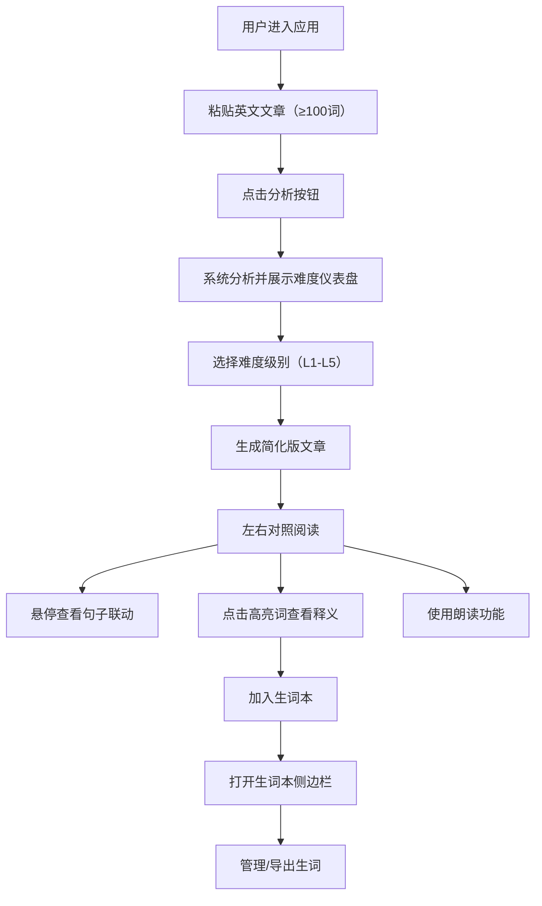

# 英文分级阅读助手 - 产品需求文档

## 1. 产品概述

### 1.1 产品定位
面向英语学习者的文章分级阅读工具，通过智能难度分析和词汇简化技术，帮助不同水平的学习者克服阅读障碍，建立阅读自信。

### 1.2 核心痛点
- 英语学习者面对生词过多、句式复杂的原文时难以持续阅读
- 频繁查词打断阅读节奏，降低学习效率
- 缺乏难度匹配的阅读材料，学习者难以找到适合自己水平的文章

### 1.3 目标用户
- 初中至大学水平的英语学习者
- 准备英语考试（雅思、托福、GRE等）的考生
- 希望通过阅读提升英语水平的自学者

---

## 2. 功能需求

### 2.1 文章输入与难度分析
**功能描述：** 用户粘贴英文文章后，系统自动进行多维度难度分析。

**核心指标：**
- 总词数统计
- 不重复词数（词汇丰富度）
- 平均句长（句法复杂度）
- Flesch-Kincaid可读性指数（综合难度评分）

**可视化要求：**
- 仪表盘形式展示分析结果
- 仪表盘指针旋转动画：0.6秒
- 性能要求：分析过程 ≤ 200ms

### 2.2 一键分级简化
**功能描述：** 提供5个难度级别（L1-L5），L1最简单，L5最接近原文。

**核心逻辑：**
- L1: 替换80%高频生词
- L2: 替换60%高频生词
- L3: 替换40%高频生词
- L4: 替换20%高频生词
- L5: 不替换（保留原文）

**交互设计：**
- 替换的词以蓝色高亮 + 下虚线标记
- 点击高亮词弹出悬浮卡片，显示：
  - 原词
  - 中文释义
  - 难度级别

### 2.3 逐句对照阅读
**功能描述：** 原文与简化版左右并排显示，支持联动交互。

**交互特性：**
- 左右对应句子悬停时同时高亮（背景色淡黄，过渡0.2秒）
- 逐句高亮朗读（Web Speech API）
- 朗读时当前句显示绿色边框 + 波纹扩散效果

**布局要求：**
- 左右两栏之间分隔线可拖拽调整宽度
- 拖拽时光标变为 col-resize

### 2.4 生词本收藏导出
**功能描述：** 用户可收藏高亮生词，支持管理和导出。

**核心功能：**
- 点击高亮词可加入生词本
- 侧边栏展示生词本
- 按时间倒序排序
- 批量删除功能
- 一键导出为CSV格式下载

---

## 3. 界面设计规范

### 3.1 视觉风格
- **设计风格：** 浅色极简风格
- **主色调：** 白底 + 蓝灰色（#4A90D9）点缀
- **布局：** 卡片式布局，带轻微阴影
- **阴影规范：** box-shadow: 0 2px 8px rgba(0,0,0,0.08)

### 3.2 动效规范
- 所有交互反馈（点击、悬停、切换）：0.2-0.3秒 CSS 过渡动画
- 仪表盘指针动画：0.6秒
- 句子高亮过渡：0.2秒
- 动画帧率：≥ 30fps

### 3.3 响应式设计
- 桌面端：左右双栏对照布局
- 字体：Google Fonts 精选字体
- 最小宽度：1024px

---

## 4. 技术约束

### 4.1 技术栈
- 框架：React 18 + TypeScript
- 构建工具：Vite
- 状态管理：React Hooks（内置）
- 音频：Web Speech API

### 4.2 性能要求
- 文章分析过程：≤ 200ms
- 动画帧率：≥ 30fps
- 首屏加载时间：≤ 2s

### 4.3 数据要求
- 内置200个高频生词及其简化映射表
- 所有数据本地处理，无需后端服务

---

## 5. 用户使用流程

---

## 6. 验收标准

### 6.1 功能验收
- ✅ 支持粘贴任意英文文章并进行难度分析
- ✅ 正确计算Flesch-Kincaid可读性指数
- ✅ 5个难度级别的词汇简化效果明显
- ✅ 左右对照句子悬停联动正常
- ✅ Web Speech API朗读功能正常
- ✅ 生词本收藏、删除、导出功能正常
- ✅ 分隔线拖拽调整宽度功能正常

### 6.2 性能验收
- ✅ 文章分析时间 ≤ 200ms
- ✅ 所有动画帧率 ≥ 30fps
- ✅ 界面交互响应延迟 ≤ 100ms

### 6.3 界面验收
- ✅ 浅色极简风格，符合设计规范
- ✅ 仪表盘动画流畅（0.6秒）
- ✅ 所有过渡动画自然流畅（0.2-0.3秒）
- ✅ 卡片阴影效果符合规范

---

## 7. 风险与应对

| 风险 | 影响 | 应对措施 |
|------|------|----------|
| 词汇替换不准确 | 影响阅读体验 | 内置200个高频词，确保常见词汇替换准确 |
| 句子对齐不准确 | 对照功能失效 | 采用标点符号分割算法，确保句子一一对应 |
| Web Speech API兼容性 | 朗读功能不可用 | 检测浏览器支持，提供降级提示 |
| 大文章性能问题 | 分析卡顿 | 优化算法，使用Web Worker（如需要） |
