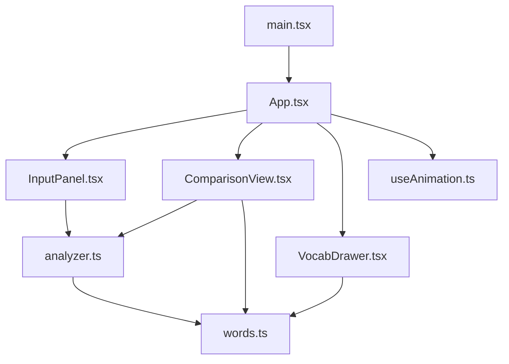

# 英文分级阅读助手 - 技术架构文档

## 1. 技术选型

### 1.1 核心技术栈

| 技术 | 版本 | 用途 | 选型理由 |
|------|------|------|----------|
| React | ^18.2.0 | UI 框架 | 组件化开发，生态成熟，Hook 机制便于状态管理 |
| TypeScript | ^5.0.0 | 类型系统 | 提供类型安全，减少运行时错误，提升代码可维护性 |
| Vite | ^5.0.0 | 构建工具 | 极快的冷启动和热更新，原生 ES Module 支持 |
| @vitejs/plugin-react | ^4.2.0 | React 插件 | Vite 的 React 支持，包含 Fast Refresh |
| uuid | ^9.0.0 | ID 生成 | 为句子、生词等生成唯一标识符 |
| Web Speech API | 浏览器内置 | 语音合成 | 无需额外依赖，原生支持文本朗读 |

### 1.2 开发规范

- **代码风格**：ESLint + Prettier（通过 TypeScript 配置）
- **提交规范**：Conventional Commits
- **分支策略**：main 为主分支，feature 分支开发
- **CSS 方案**：CSS-in-JS（styled-components）+ CSS Variables

---

## 2. 项目结构

### 2.1 目录结构

```
auto32/
├── .trae/
│   └── documents/          # 项目文档
│       ├── PRD.md
│       └── 技术架构.md
├── src/
│   ├── components/         # React 组件
│   │   ├── InputPanel.tsx      # 文本输入与难度选择
│   │   ├── ComparisonView.tsx  # 左右对照栏
│   │   └── VocabDrawer.tsx     # 生词本侧边栏
│   ├── hooks/              # 自定义 Hooks
│   │   └── useAnimation.ts     # 动画状态管理
│   ├── analyzer.ts         # 文本分析核心模块
│   ├── words.ts            # 词汇映射数据
│   ├── App.tsx             # 主应用组件
│   ├── main.tsx            # 入口文件
│   └── types.ts            # TypeScript 类型定义
├── index.html              # HTML 入口
├── package.json
├── tsconfig.json
└── vite.config.js
```

### 2.2 模块依赖关系



---

## 3. 核心模块设计

### 3.1 文本分析模块 (analyzer.ts)

**职责**：纯函数模块，负责文本统计和难度计算，无副作用。

**导出函数**：

```typescript
// 文本分析结果接口
interface TextAnalysis {
  totalWords: number;           // 总词数
  uniqueWords: number;          // 不重复词数
  avgSentenceLength: number;    // 平均句长
  fleschKincaid: number;        // Flesch-Kincaid可读性指数
  sentences: string[];          // 分割后的句子数组
}

// 分析文本，返回分析结果
function analyzeText(text: string): TextAnalysis;

// 简化文本，按难度级别替换生词
interface SimplifiedWord {
  original: string;
  simplified: string;
  definition: string;
  level: number;  // 1-5
}

interface SimplifiedResult {
  sentences: Array<{
    original: string;
    simplified: string;
    words: SimplifiedWord[];  // 本句中被替换的词
  }>;
}

function simplifyText(
  text: string,
  level: number,  // 1-5
  wordMap: WordMap
): SimplifiedResult;
```

**Flesch-Kincaid 计算公式**：
```
FKRA = 0.39 × (总词数/总句数) + 11.8 × (总音节数/总词数) - 15.59
```

### 3.2 词汇数据模块 (words.ts)

**职责**：内置高频生词及其简化映射表。

**数据结构**：

```typescript
interface WordEntry {
  word: string;           // 原词
  simplified: string;     // 简化词
  definition: string;     // 中文释义
  frequency: number;      // 词频排名（1-200，越小越常见）
  level: number;          // 难度级别（1-5）
}

// 导出函数：根据难度级别获取可替换的词
function getSimplifiedWord(
  word: string,
  targetLevel: number
): WordEntry | null;
```

**词汇覆盖范围**：200个高频学术/通用生词，涵盖CET-4/6、雅思、托福核心词汇。

### 3.3 自定义 Hook (useAnimation.ts)

**职责**：管理仪表盘指针和句子高亮的动画状态。

```typescript
interface UseAnimationReturn {
  // 仪表盘指针角度（0-180度）
  gaugeAngle: number;
  // 设置仪表盘目标值（0-100）
  setGaugeValue: (value: number) => void;
  // 当前高亮句子ID
  highlightedSentenceId: string | null;
  // 设置高亮句子
  setHighlightedSentence: (id: string | null) => void;
  // 当前朗读句子ID
  speakingSentenceId: string | null;
  // 设置朗读句子
  setSpeakingSentence: (id: string | null) => void;
}

function useAnimation(): UseAnimationReturn;
```

---

## 4. 组件设计

### 4.1 InputPanel 组件

**Props**：
```typescript
interface InputPanelProps {
  onAnalyze: (text: string, level: number) => void;
  isAnalyzing: boolean;
}
```

**内部状态**：
- `text`: string - 用户输入的文本
- `selectedLevel`: number (1-5) - 选中的难度级别
- `error`: string | null - 验证错误信息

**核心逻辑**：
- 验证文本长度 ≥ 100词
- 难度级别切换按钮（L1-L5）
- 提交按钮触发分析回调

### 4.2 ComparisonView 组件

**Props**：
```typescript
interface ComparisonViewProps {
  originalSentences: string[];
  simplifiedSentences: Array<{
    text: string;
    words: SimplifiedWord[];
  }>;
  onWordClick: (word: SimplifiedWord) => void;
  highlightedSentenceId: string | null;
  onSentenceHover: (id: string | null) => void;
  speakingSentenceId: string | null;
  onSpeak: (sentence: string, id: string) => void;
  onStopSpeaking: () => void;
}
```

**核心功能**：
- 左右两栏布局，可拖拽分隔线
- 句子悬停联动高亮
- 点击高亮词触发回调
- 朗读控制与视觉反馈

### 4.3 VocabDrawer 组件

**Props**：
```typescript
interface VocabWord {
  id: string;
  original: string;
  simplified: string;
  definition: string;
  level: number;
  addedAt: number;  // timestamp
}

interface VocabDrawerProps {
  isOpen: boolean;
  onClose: () => void;
  words: VocabWord[];
  onDelete: (ids: string[]) => void;
  onExport: () => void;
}
```

**核心功能**：
- 侧边栏滑入/滑出动画
- 按时间倒序显示生词
- 多选删除功能
- CSV导出按钮

### 4.4 App 组件（主布局）

**全局状态**：
- `text`: string | null - 输入的原文
- `analysis`: TextAnalysis | null - 分析结果
- `simplifiedResult`: SimplifiedResult | null - 简化结果
- `selectedLevel`: number - 当前难度级别
- `vocabWords`: VocabWord[] - 生词本
- `drawerOpen`: boolean - 侧边栏开关

**布局结构**：
```
┌─────────────────────────────────────────┐
│  Header (标题 + 生词本按钮)             │
├─────────────────────────────────────────┤
│  InputPanel (输入区 + 仪表盘)           │
├─────────────────────────────────────────┤
│  ComparisonView (左右对照栏)            │
│  ┌──────────┬─────┬──────────┐          │
│  │  原文    │ 拖  │  简化版  │          │
│  │          │ 拽  │          │          │
│  └──────────┴─────┴──────────┘          │
└─────────────────────────────────────────┘
                                     
VocabDrawer (右侧侧边栏，滑入式)
```

---

## 5. 关键算法设计

### 5.1 Flesch-Kincaid 可读性指数计算

```typescript
function countSyllables(word: string): number {
  // 1. 去除词尾的不发音e
  // 2. 计算元音簇数量
  // 3. 处理特殊情况（如y作为元音、le结尾等）
}

function calculateFleschKincaid(
  totalWords: number,
  totalSentences: number,
  totalSyllables: number
): number {
  if (totalSentences === 0 || totalWords === 0) return 0;
  return (
    0.39 * (totalWords / totalSentences) +
    11.8 * (totalSyllables / totalWords) -
    15.59
  );
}
```

**指数解读**：
- 90-100: 5年级水平（非常简单）
- 60-70: 8-9年级水平（中等难度）
- 30-50: 大学水平（困难）
- 0-30: 研究生水平（非常困难）

### 5.2 句子分割算法

```typescript
function splitSentences(text: string): string[] {
  // 处理缩写词（如 Mr.、Dr.、etc.）
  // 处理省略号
  // 按 . ! ? 分割
  // 过滤空字符串
  // 修剪首尾空白
}
```

### 5.3 词汇替换策略

按难度级别决定替换比例：
- L1: 替换频率排名前80%的生词
- L2: 替换频率排名前60%的生词
- L3: 替换频率排名前40%的生词
- L4: 替换频率排名前20%的生词
- L5: 不替换

```typescript
function shouldReplace(
  wordFrequency: number,
  targetLevel: number
): boolean {
  const thresholds = { 1: 0.8, 2: 0.6, 3: 0.4, 4: 0.2, 5: 0 };
  const threshold = thresholds[targetLevel as keyof typeof thresholds];
  return wordFrequency <= 200 * threshold;
}
```

---

## 6. 性能优化方案

### 6.1 分析性能优化

**目标**：文章分析过程 ≤ 200ms

**优化措施**：
1. **避免正则回溯**：使用高效的字符串处理方法
2. **缓存计算结果**：相同文本不重复分析
3. **惰性计算**：仅在需要时计算音节数
4. **Web Worker**：如分析时间过长，迁移到 Worker 线程

### 6.2 动画性能优化

**目标**：所有动画帧率 ≥ 30fps

**优化措施**：
1. **使用 transform 和 opacity**：避免触发重排重绘
2. **will-change 提示**：对动画元素添加 will-change
3. **requestAnimationFrame**：JavaScript 动画使用 RAF
4. **CSS 变量**：动画属性使用 CSS 变量

### 6.3 渲染性能优化

1. **React.memo**：纯组件使用 memo 包裹
2. **useMemo/useCallback**：缓存计算结果和回调函数
3. **虚拟滚动**：文章过长时使用虚拟列表
4. **批量更新**：使用 React 18 自动批处理

---

## 7. 状态管理方案

### 7.1 状态分层

| 层级 | 管理方式 | 示例 |
|------|----------|------|
| 全局状态 | useState + Context | 生词本、分析结果 |
| 组件状态 | useState | 输入文本、选中级别 |
| 动画状态 | 自定义 Hook | 仪表盘角度、高亮状态 |
| DOM 状态 | useRef | 拖拽状态、语音实例 |

### 7.2 数据流

```
用户输入 → InputPanel → App (分析) → analyzer.ts
                                        ↓
App (简化) → words.ts → ComparisonView → 渲染
                ↑
                └── VocabDrawer (收藏生词)
```

---

## 8. 兼容性方案

### 8.1 浏览器支持

| 浏览器 | 最低版本 | 备注 |
|--------|----------|------|
| Chrome | 33+ | Web Speech API 支持 |
| Edge | 79+ | Chromium 内核 |
| Firefox | 49+ | Web Speech API 部分支持 |
| Safari | 7+ | Web Speech API 支持 |

### 8.2 功能降级

- **Web Speech API 不可用**：隐藏朗读按钮，显示提示信息
- **CSS 动画不支持**：降级为即时显示/隐藏
- **本地存储不可用**：生词本仅保存在内存中，刷新丢失

---

## 9. 构建与部署

### 9.1 构建配置

**vite.config.js**：
- React 插件启用 Fast Refresh
- 生产构建启用代码分割
- 启用 gzip 压缩
- 配置路径别名 @ 指向 src

**tsconfig.json**：
- 严格模式（strict: true）
- JSX: react-jsx
- ModuleResolution: bundler
- 目标 ES2020

### 9.2 脚本命令

```json
{
  "scripts": {
    "dev": "vite",
    "build": "tsc && vite build",
    "preview": "vite preview",
    "lint": "tsc --noEmit"
  }
}
```

---

## 10. 测试策略

### 10.1 单元测试

- `analyzer.ts`：文本统计、Flesch-Kincaid 计算、句子分割
- `words.ts`：词汇映射查找
- `useAnimation.ts`：动画状态逻辑

### 10.2 集成测试

- 端到端用户流程测试
- 性能基准测试（分析时间 < 200ms）

### 10.3 手动测试清单

- [ ] 不同长度文章的分析准确性
- [ ] 5个难度级别的替换效果
- [ ] 左右句子悬停联动
- [ ] Web Speech API 朗读功能
- [ ] 生词本收藏、删除、导出
- [ ] 分隔线拖拽功能
- [ ] 仪表盘动画流畅度
