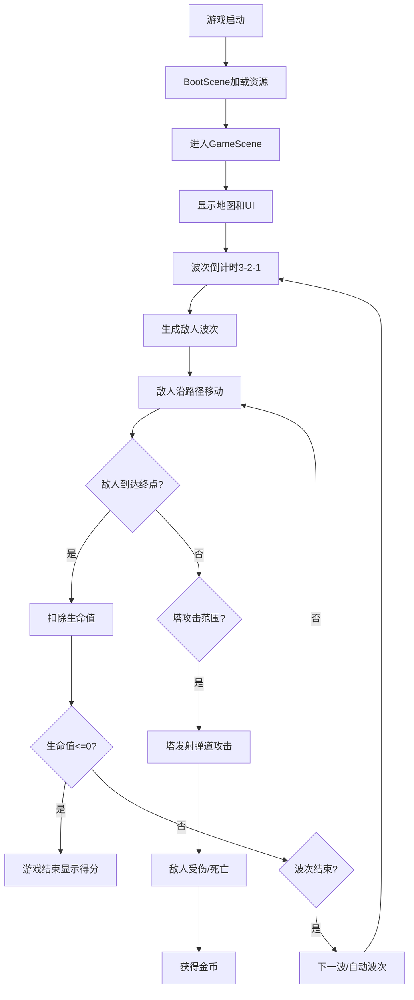

## 1. 产品概述

基于网格的塔防游戏，玩家通过在地图上放置各种防御塔来阻止一波波敌人到达终点。游戏采用深蓝紫色军事化管理主题，提供5种防御塔和3种敌人类型，支持塔升级、波次管理和迷你地图功能。

- 核心玩法：策略性放置防御塔，抵御敌人入侵
- 目标用户：喜欢策略塔防类游戏的休闲玩家
- 产品价值：提供紧张刺激的塔防策略体验，支持多类型塔组合和战术决策

## 2. 核心功能

### 2.1 功能模块

1. **游戏主场景**：8x6等距网格地图渲染、塔放置与升级、敌人波次管理、碰撞检测、UI显示
2. **防御塔系统**：5种塔类型（箭塔、炮塔、魔法塔、冰冻塔、电塔），3级升级系统，攻击范围可视化
3. **敌人系统**：3种敌人类型（普通、重装、快速），路径移动，血量状态，死亡效果
4. **波次管理**：自动波次生成，波次倒计时，波次控制按钮
5. **资源管理**：金币、生命值、得分管理，数字滚动动画
6. **迷你地图**：右上角简化视图，塔和敌人位置标记，拖拽平移主摄像头

### 2.2 功能详情

| 模块名称 | 功能描述 |
|---------|---------|
| 网格地图 | 8x6等距网格，深灰色路径瓷砖，浅绿色不可放置，浅黄色可放置 |
| 塔放置 | 鼠标悬停可放置区域黄光闪烁，半透明蓝色预放置轮廓，0.2秒缩放放置动画 |
| 塔升级 | 点击已放置塔弹出升级面板，最多3级，升级后外观变化，0.3秒脉冲缩放动画 |
| 敌人波次 | 每波10-15个敌人，自动生成，3秒倒计时闪烁淡出 |
| 敌人类型 | 普通（绿色低防高速）、重装（红色高防低速）、快速（蓝色低防极速） |
| 伤害系统 | 塔攻击对应颜色弹道，敌人闪红0.1秒+粒子破碎效果 |
| 状态栏 | 顶部显示波次、生命值、金币、得分，数字变化0.3秒滚动动画 |
| 迷你地图 | 右上角简化视图，5次/秒更新频率，拖拽0.2秒平滑平移 |
| 游戏结束 | 生命值归零触发，半透明黑色遮罩+红色"GAME OVER"放大淡入动画 |

## 3. 核心流程

## 4. 用户界面设计

### 4.1 设计风格

- **主题配色**：深蓝紫色军事化管理主题
- **背景**：深蓝到紫灰渐变
- **网格线**：白色半透明细线
- **字体**：像素风格字体
- **比例**：16:9适配（1440x900 到 1920x1080）

### 4.2 UI元素设计

| 元素 | 样式描述 |
|-----|---------|
| 塔放置区域悬停 | 微弱黄光闪烁效果 |
| 塔攻击 | 塔身闪烁+对应颜色弹道（火焰橙/冰冻蓝/雷电黄） |
| 敌人受伤 | 身体闪红0.1秒+粒子破碎效果 |
| 游戏结束文字 | 红色带白色描边，从中心放大淡入 |
| 数字变化 | 0.3秒滚动动画 |
| 倒计时 | 数字3-2-1闪烁淡出 |

### 4.3 响应式设计

- 桌面优先设计，适配1440x900到1920x1080分辨率
- 保持16:9宽高比
- Canvas全屏自适应

## 5. 性能要求

- 主循环稳定60fps
- 30个敌方单位+20个防御塔同时存在不卡顿
- 5个塔同时攻击时动画和粒子效果不掉帧
- 迷你地图更新频率≤5次/秒
