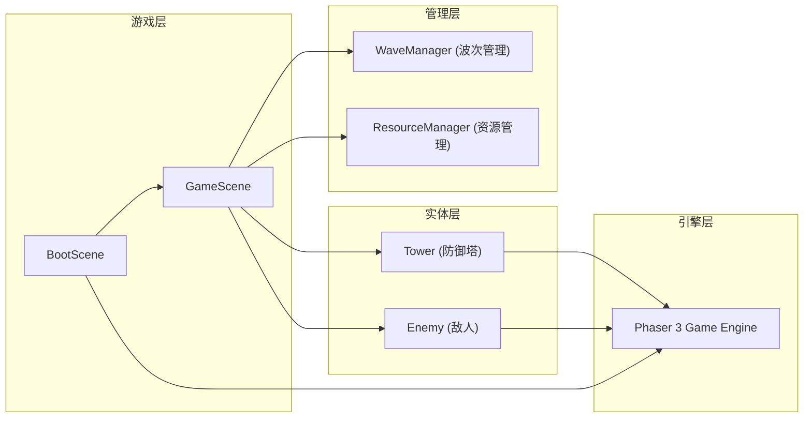

## 1. 架构设计



## 2. 技术描述

- **游戏引擎**：Phaser 3
- **编程语言**：TypeScript (严格模式)
- **构建工具**：Vite
- **模块解析**：bundler模式
- **无后端**：纯前端游戏

## 3. 项目结构

```
.
├── package.json
├── vite.config.js
├── tsconfig.json
├── index.html
└── src/
    ├── main.ts                  # 主入口，初始化Phaser配置
    ├── scenes/
    │   ├── BootScene.ts         # 启动场景，资源加载+进度条
    │   └── GameScene.ts         # 核心游戏场景
    ├── entities/
    │   ├── Tower.ts             # 防御塔类
    │   └── Enemy.ts             # 敌人类
    └── managers/
        ├── WaveManager.ts       # 波次管理器
        └── ResourceManager.ts   # 资源管理器
```

## 4. 核心类定义

### 4.1 Tower (防御塔)

```typescript
enum TowerType {
  ARROW = 'arrow',
  CANNON = 'cannon',
  MAGIC = 'magic',
  ICE = 'ice',
  ELECTRIC = 'electric'
}

interface TowerStats {
  damage: number;
  range: number;
  fireRate: number;
  cost: number;
  upgradeCost: number[];
}
```

### 4.2 Enemy (敌人)

```typescript
enum EnemyType {
  NORMAL = 'normal',
  HEAVY = 'heavy',
  FAST = 'fast'
}

interface EnemyStats {
  hp: number;
  speed: number;
  armor: number;
  reward: number;
  lifeDamage: number;
}
```

### 4.3 ResourceManager (资源管理器)

```typescript
interface GameResources {
  gold: number;
  lives: number;
  score: number;
  wave: number;
}
```

### 4.4 WaveManager (波次管理器)

```typescript
interface WaveConfig {
  enemyCount: number;
  enemyTypes: EnemyType[];
  spawnInterval: number;
}
```

## 5. 关键技术点

### 5.1 网格系统
- 8列x6行等距网格
- 预定义路径点数组
- 三种瓷砖类型：路径、不可放置、可放置
- 鼠标坐标→网格坐标转换

### 5.2 塔防战斗系统
- 塔攻击范围检测（圆形碰撞）
- 目标锁定（最近/最先）策略
- 弹道系统（速度、追踪、命中检测）
- 伤害计算：基础伤害 - 护甲减免

### 5.3 状态特效系统
- Tween动画：缩放、脉冲、淡入淡出
- 粒子系统：破碎、爆炸效果
- 闪烁效果：受伤、攻击反馈

### 5.4 性能优化
- 对象池复用敌人和弹道
- 迷你地图节流更新（≤5fps）
- 碰撞检测空间分区
- 渲染层分组优化

## 6. 运行方式

```bash
npm install
npm run dev
```
