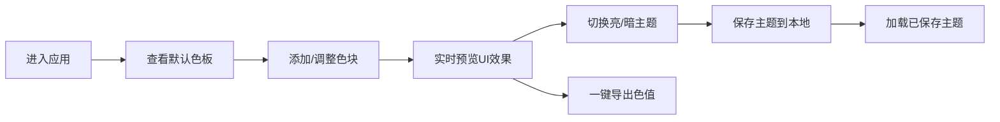

## 1. 产品概述

ColorPalette Studio 是一款面向设计师和开发者的在线配色方案构建工具，帮助用户快速创建、预览和分享个性化色彩组合，解决项目启动时反复手动调色和难以可视化预览的痛点。

- 核心价值：提供实时UI元素预览、主题保存与分享、一键导出色值的一体化配色工作流
- 目标用户：UI设计师、前端开发者、品牌设计人员

## 2. 核心特性

### 2.1 用户角色
| 角色 | 注册方式 | 核心权限 |
|------|----------|----------|
| 普通用户 | 无需注册 | 创建色板、预览效果、保存主题到本地、导出色值 |

### 2.2 功能模块
1. **色板管理面板**：添加色块、颜色选择、拖拽排序、一键导出
2. **UI预览面板**：按钮预览、卡片预览、文本预览、输入框预览
3. **主题系统**：亮色/暗色切换、主题保存、主题列表管理
4. **性能监控**：实时帧率显示

### 2.3 页面详情
| 页面名称 | 模块名称 | 功能描述 |
|----------|----------|----------|
| 主页面 | 色板管理面板 | 左侧30%宽度，支持添加最多12个圆形色块，颜色选择器，拖拽排序，一键导出剪贴板 |
| 主页面 | UI预览面板 | 右侧70%宽度，实时展示按钮、卡片、文本、输入框四种UI元素效果 |
| 主页面 | 主题切换 | 右上角开关，0.5秒渐变过渡，暗色模式下调好色块透明度 |
| 主页面 | 主题保存与列表 | 保存主题到localStorage，横向滚动展示已保存主题，点击加载 |
| 主页面 | 性能监控 | 右下角固定标签，显示当前帧率，500ms更新 |

## 3. 核心流程

用户打开应用 → 查看默认随机色板 → 点击"添加色块"增加颜色 → 点击色块调整颜色 → 拖拽色块调整顺序 → 实时查看右侧UI预览效果 → 切换亮/暗主题 → 点击"保存主题"命名并保存 → 点击"一键导出"复制色值

## 4. 用户界面设计

### 4.1 设计风格
- 主色调：专业简约风格，色板面板背景 #F8F9FA，预览区背景 #FFFFFF
- 组件风格：卡片式设计，圆角 12px，过渡动画 0.2s ease
- 字体：系统默认字体，清晰易读
- 交互：弹性动画、微交互动效、平滑过渡
- 视觉层次：左右分栏布局，清晰的功能分区

### 4.2 页面设计概览
| 页面名称 | 模块名称 | UI元素 |
|----------|----------|--------|
| 主页面 | 色板面板 | 圆形色块（48px直径）、颜色选择器、添加按钮、导出按钮、主题列表 |
| 主页面 | 预览面板 | 按钮组件、卡片组件、文本标题、输入框组件、主题切换开关 |
| 主页面 | 性能监控 | 固定右下角的小标签，实时帧率显示 |

### 4.3 响应式
- 桌面端优先设计
- 左右两栏布局（30% / 70%）
- 色板与预览区之间 1px 浅灰分隔线
- 最小宽度支持 1024px

### 4.4 动效设计
- 色块拖拽交换：0.25秒弹性动画
- 主题切换：0.5秒渐变过渡
- UI元素交互：0.2s ease 过渡
- 导出按钮：0.3秒图标翻转动画
- 颜色变更：实时无延迟响应
