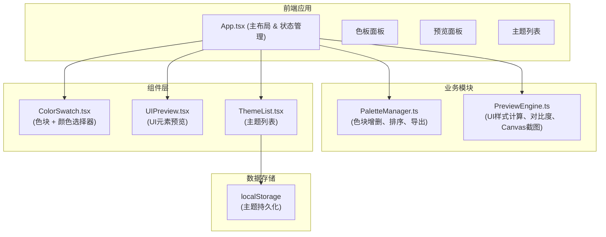

## 1. 架构设计



## 2. 技术描述

- **前端框架**：React@18 + TypeScript@5
- **构建工具**：Vite@5 + @vitejs/plugin-react@4
- **状态管理**：React Hooks (useState, useEffect, useCallback, useMemo)
- **样式方案**：内联样式 / CSS-in-JS (styled-components 或 emotion 可选，本项目使用原生 CSS 变量 + style)
- **UI组件**：原生实现，不依赖第三方UI库
- **颜色处理**：自研颜色工具函数（hex转rgb、亮度计算、对比度计算）
- **截图功能**：原生 Canvas API
- **数据持久化**：localStorage
- **性能监控**：requestAnimationFrame + performance.now

## 3. 目录结构

```
auto58/
├── package.json
├── vite.config.js
├── tsconfig.json
├── index.html
├── src/
│   ├── App.tsx              # 主布局组件，状态管理
│   ├── modules/
│   │   ├── palette/
│   │   │   └── PaletteManager.ts   # 色板管理模块
│   │   └── preview/
│   │       └── PreviewEngine.ts    # 预览引擎模块
│   ├── components/
│   │   ├── ColorSwatch.tsx  # 色块组件
│   │   ├── UIPreview.tsx    # UI预览组件
│   │   └── ThemeList.tsx    # 主题列表组件
│   └── styles/
│       └── global.css       # 全局样式
```

## 4. 核心数据模型

### 4.1 色块数据结构
```typescript
interface ColorSwatchData {
  id: string;
  hex: string;
}
```

### 4.2 主题数据结构
```typescript
interface Theme {
  id: string;
  name: string;
  colors: string[];
  createdAt: number;
}
```

### 4.3 UI预览样式结构
```typescript
interface UIPreviewStyles {
  button: {
    background: string;
    hoverBackground: string;
    activeBackground: string;
    textColor: string;
  };
  card: {
    background: string;
    borderColor: string;
    shadowColor: string;
  };
  text: {
    color: string;
    contrastRatio: number;
    hasWarning: boolean;
  };
  input: {
    borderColor: string;
    focusGlow: string;
    backgroundColor: string;
  };
}
```

## 5. 核心模块API

### 5.1 PaletteManager
```typescript
// 创建色板管理器
const createPaletteManager = (initialColors?: string[]) => {
  // 添加色块
  addColor(): ColorSwatchData;
  // 移除色块
  removeColor(id: string): void;
  // 更新颜色
  updateColor(id: string, hex: string): void;
  // 交换位置
  swapColors(index1: number, index2: number): void;
  // 获取所有颜色
  getColors(): ColorSwatchData[];
  // 导出为逗号分隔字符串
  exportToString(): string;
  // 复制到剪贴板
  copyToClipboard(): Promise<boolean>;
}
```

### 5.2 PreviewEngine
```typescript
// 计算UI预览样式
const calculateUIStyles = (
  colors: string[],
  isDarkMode: boolean
): UIPreviewStyles;

// 计算对比度
const getContrastRatio = (color1: string, color2: string): number;

// 调整颜色亮度
const adjustBrightness = (hex: string, percent: number): string;

// 生成Canvas截图
const generateScreenshot = (
  element: HTMLElement,
  colors: string[],
  isDarkMode: boolean
): string; // base64 data URL
```

## 6. 性能优化策略

### 6.1 渲染优化
- 使用 React.memo 包装子组件，避免不必要的重渲染
- 使用 useMemo 缓存颜色计算结果
- 使用 useCallback 缓存事件处理函数

### 6.2 动画优化
- 优先使用 CSS transform 和 opacity 动画
- 使用 will-change 提示浏览器优化
- 避免在动画中触发重排重绘

### 6.3 颜色计算优化
- 颜色转换函数缓存结果
- 对比度计算使用数学公式直接计算
- 避免在高频事件（如mousemove）中进行复杂计算

## 7. 性能指标要求

- 12个色块时，拖拽操作响应时间 < 50ms
- 颜色变更时预览更新 < 50ms
- 主题切换动画帧率 > 55fps
- 稳定运行帧率稳定在 55fps 以上
