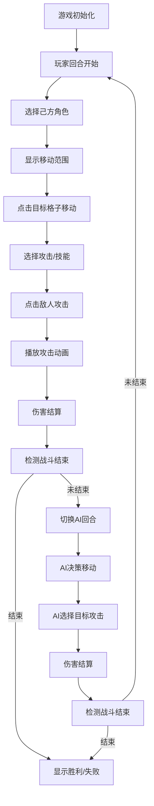

## 1. 产品概述

本项目是一个基于Canvas的回合制策略战斗小游戏，玩家控制不同职业角色在网格地图上与AI敌人进行策略对战。

- 主要目的：实现独立游戏demo的核心战斗系统，展示回合制策略游戏玩法
- 目标用户：独立游戏开发者、策略游戏爱好者
- 市场价值：为回合制策略游戏提供可复用的核心战斗框架

## 2. 核心特性

### 2.1 用户角色

| 角色 | 操作方式 | 核心权限 |
|------|----------|----------|
| 玩家 | 鼠标点击操作 | 控制己方角色移动、攻击、释放技能 |
| AI | 自动决策 | 控制敌方角色自动行动 |

### 2.2 功能模块

1. **战斗地图系统**：8x8网格地图生成、地形渲染、格子占用检测
2. **角色系统**：三职业角色（战士、法师、弓箭手）、属性管理、技能系统
3. **回合制战斗**：回合切换、移动范围高亮、攻击动画、伤害计算
4. **AI决策系统**：敌方自动寻路、目标选择、策略执行
5. **UI界面**：回合提示、角色详情面板、技能按钮、血条动画

### 2.3 页面详情

| 页面名称 | 模块名称 | 功能描述 |
|---------|----------|----------|
| 战斗主界面 | 网格地图 | 8x8网格绘制、地形显示、角色位置渲染 |
| 战斗主界面 | 回合提示条 | 显示当前回合归属、切换动画 |
| 战斗主界面 | 角色详情面板 | 显示选中角色属性、技能列表、冷却状态 |
| 战斗主界面 | 技能按钮区 | 技能图标展示、冷却倒计时、点击释放 |
| 战斗主界面 | 血条系统 | 生命值显示、颜色渐变、宽度变化动画 |

## 3. 核心流程

玩家选择角色 → 高亮移动范围 → 点击目标格子移动 → 选择技能/普攻 → 点击敌人攻击 → 攻击动画播放 → 伤害结算 → 切换AI回合 → AI决策执行 → 切换玩家回合

## 4. 用户界面设计

### 4.1 设计风格

- 主色调：深色主题 #1A1A2E（背景）、#16213E（面板）、#2C3E50（地图）
- 辅助色：#E74C3C（战士红）、#3498DB（法师蓝）、#2ECC71（弓箭手绿）、#BDC3C7（网格线）
- 按钮风格：圆角矩形、半透明背景、悬停高亮
- 字体：使用系统无衬线字体，标题16px加粗，正文14px
- 布局：游戏区域居中，左侧回合提示，右侧角色面板
- 动画：血条宽度变化0.3s、回合切换滑入0.3s、攻击位移0.2s、受击闪烁0.15s

### 4.2 页面设计概述

| 页面名称 | 模块名称 | UI元素 |
|---------|----------|--------|
| 战斗主界面 | 网格地图 | 8x8格子、普通地砖、障碍物、角色圆形头像、血条进度条 |
| 战斗主界面 | 回合提示条 | 渐变矩形、文字提示、水平滑入动画 |
| 战斗主界面 | 角色详情面板 | 半透明背景、圆角8px、头像、属性文本、技能图标列表 |
| 战斗主界面 | 技能按钮 | 图标、冷却遮罩、倒计时数字、灰化效果 |
| 战斗主界面 | 移动范围高亮 | 浅蓝色半透明覆盖层 |
| 战斗主界面 | 攻击效果 | 角色冲移动画、目标红色闪烁 |

### 4.3 响应式

- 桌面端优先设计，固定游戏区域尺寸（640x640像素地图）
- 整体界面居中显示，最小窗口尺寸1200x720
- Canvas自适应设备像素比，保证绘制清晰度

### 4.4 性能优化

- 帧率不低于30fps
- AI决策时间不超过0.5秒
- 动画使用requestAnimationFrame实现
- 仅在状态变化时重绘，避免不必要的渲染
