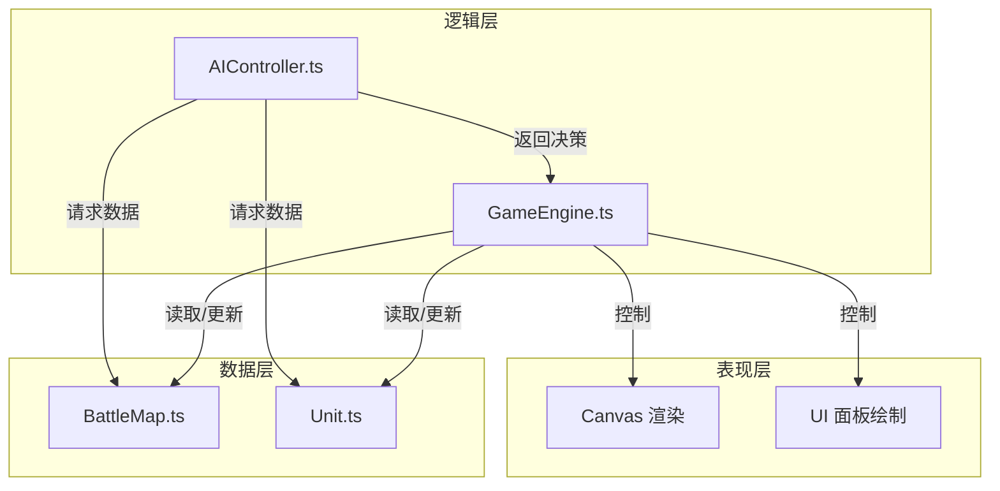
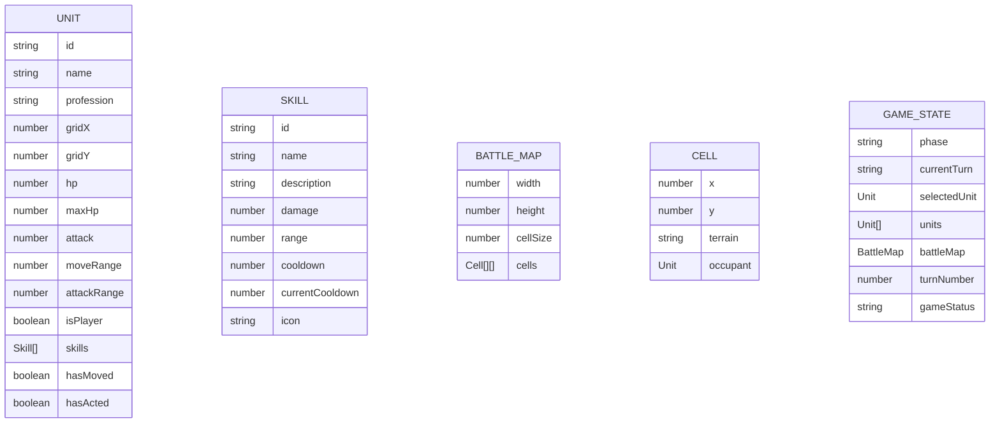

## 1. 架构设计



**文件调用关系与数据流向：**

1. **index.html** → 加载入口，创建Canvas元素，引入main.ts
2. **GameEngine.ts** → 核心引擎，接收用户输入，更新BattleMap和Unit状态，触发渲染
3. **BattleMap.ts** → 提供地图数据给GameEngine，处理格子占用和行走逻辑
4. **Unit.ts** → 接受GameEngine命令，处理自身状态，提供绘制方法
5. **AIController.ts** → 从GameEngine获取BattleMap和Unit数据，计算决策后返回给GameEngine

## 2. 技术描述

- 前端：TypeScript 5.x + Vite 5.x + Canvas 2D API
- 构建工具：Vite
- 无UI框架，使用原生Canvas绘制所有界面元素
- 无后端，纯前端实现

**技术选型理由：**
- TypeScript：类型安全，便于维护复杂的游戏状态
- Vite：快速开发体验，热更新支持
- Canvas 2D：高性能绘制，适合游戏场景，无需额外UI框架

## 3. 文件结构

```
auto61/
├── package.json          # 项目配置与依赖
├── vite.config.js        # Vite构建配置
├── tsconfig.json         # TypeScript配置
├── index.html            # 入口HTML
└── src/
    ├── main.ts           # 应用入口，初始化GameEngine
    ├── GameEngine.ts     # 核心游戏循环与状态管理
    ├── BattleMap.ts      # 网格地图生成与渲染
    ├── Unit.ts           # 角色实体定义与行为
    ├── AIController.ts   # AI决策模块
    └── types.ts          # 共享类型定义
```

## 4. 数据模型

### 4.1 数据模型定义



### 4.2 核心类型定义

```typescript
// 地形类型
type TerrainType = 'normal' | 'obstacle';

// 职业类型
type ProfessionType = 'warrior' | 'mage' | 'archer';

// 回合归属
type TurnOwner = 'player' | 'ai';

// 游戏阶段
type GamePhase = 'idle' | 'selectUnit' | 'selectMoveTarget' | 'selectAttackTarget' | 'aiThinking' | 'animating' | 'gameOver';

// 技能接口
interface Skill {
  id: string;
  name: string;
  description: string;
  damage: number;
  range: number;
  cooldown: number;
  currentCooldown: number;
  icon: string;
  ignoreObstacle?: boolean;
  selfDamagePercent?: number;
}

// 角色接口
interface Unit {
  id: string;
  name: string;
  profession: ProfessionType;
  gridX: number;
  gridY: number;
  hp: number;
  maxHp: number;
  attack: number;
  moveRange: number;
  attackRange: number;
  isPlayer: boolean;
  skills: Skill[];
  hasMoved: boolean;
  hasActed: boolean;
  color: string;
  // 动画状态
  isAttacking: boolean;
  attackProgress: number;
  isHurt: boolean;
  hurtProgress: number;
  displayHp: number;
  hpAnimProgress: number;
}

// 格子接口
interface Cell {
  x: number;
  y: number;
  terrain: TerrainType;
  occupant: Unit | null;
}

// 地图接口
interface BattleMapData {
  width: number;
  height: number;
  cellSize: number;
  cells: Cell[][];
}

// AI决策结果
interface AIDecision {
  unitId: string;
  action: 'move' | 'attack' | 'skill' | 'end';
  targetX?: number;
  targetY?: number;
  targetUnitId?: string;
  skillId?: string;
}

// 游戏状态
interface GameState {
  phase: GamePhase;
  currentTurn: TurnOwner;
  selectedUnit: Unit | null;
  selectedSkill: Skill | null;
  units: Unit[];
  battleMap: BattleMapData;
  turnNumber: number;
  gameStatus: 'playing' | 'victory' | 'defeat';
  moveableCells: { x: number; y: number }[];
  attackableUnits: string[];
}
```

### 4.3 初始化数据

**角色初始配置：**

| 职业 | 生命值 | 攻击力 | 移动范围 | 攻击范围 | 技能 |
|------|--------|--------|----------|----------|------|
| 战士 | 100 | 20-25 | 3 | 1 | 狂击：2倍伤害，自身损血10%，冷却2回合 |
| 法师 | 100 | 15-18 | 4 | 3 | 火球：攻击3格外敌人，伤害15，冷却2回合 |
| 弓箭手 | 100 | 18-22 | 5 | 4 | 精准射击：无视障碍物，伤害18，冷却2回合 |

**地图配置：**
- 尺寸：8x8格子
- 格子大小：80x80像素
- 障碍物：随机分布8-10个，避开初始部署区域
- 玩家部署区：左侧两列（x=0,1）
- AI部署区：右侧两列（x=6,7）

## 5. 核心算法

### 5.1 移动范围计算（BFS）

```
输入：Unit unit, BattleMap map
输出：可移动格子列表

1. 初始化队列，将unit当前位置加入
2. 初始化visited集合记录已访问格子
3. 初始化distance字典记录格子距离
4. distance[unit位置] = 0
5. while 队列不为空:
   6. 取出队首格子 current
   7. if distance[current] >= unit.moveRange: 跳过
   8. 遍历上下左右四个方向:
      9. if 邻居在地图范围内 且 未被访问 且 地形不是障碍物 且 无其他角色:
         10. 标记已访问
         11. distance[邻居] = distance[current] + 1
         12. 邻居加入队列
         13. 加入结果列表
14. 返回结果列表
```

### 5.2 AI决策算法

```
输入：Unit aiUnit, Unit[] playerUnits, BattleMap map
输出：AIDecision

1. 计算所有玩家单位与aiUnit的距离
2. 按距离升序、血量升序排序目标
3. 选择优先级最高的目标 target
4. if aiUnit在攻击范围内能攻击到target:
   5. if 有可用技能: 返回使用技能决策
   6. else: 返回普通攻击决策
7. else:
   8. 计算可移动范围内所有格子
   9. 对每个格子计算到target的距离
   10. 选择距离target最近的格子
   11. 返回移动到该格子的决策
```

### 5.3 伤害计算

```
输入：Unit attacker, Unit defender, Skill? skill
输出：number damage

1. if skill存在:
   2. baseDamage = skill.damage
   3. if skill.selfDamagePercent: attacker.hp -= attacker.maxHp * selfDamagePercent
4. else:
   5. baseDamage = attacker.attack
6. 随机浮动 ±10%
7. finalDamage = Math.round(baseDamage * (0.9 + Math.random() * 0.2))
8. defender.hp = Math.max(0, defender.hp - finalDamage)
9. return finalDamage
```

## 6. 性能优化策略

1. **渲染优化**：使用双Canvas分层（背景层+动态层），背景层仅在地图变化时重绘
2. **动画优化**：所有动画使用requestAnimationFrame，基于时间增量计算
3. **碰撞检测**：使用网格坐标直接查找，避免遍历所有单位
4. **AI优化**：限制AI决策时间，使用Set而非数组进行可达性检查
5. **状态管理**：使用不可变更新模式，仅在状态变化时触发重渲染
