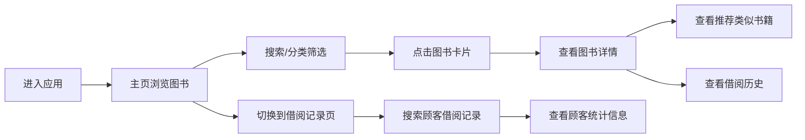

## 1. 产品概述

小型独立书店数字化管理系统，帮助书店经营者管理图书库存、跟踪顾客借阅历史、生成个性化阅读推荐，解决缺乏数字化工具导致的库存管理混乱、顾客偏好洞察不足、新书推送被动等问题。

- 目标用户：独立书店经营者、店员
- 核心价值：提升库存管理效率、增强顾客粘性、通过智能推荐促进借阅/销售

## 2. 核心功能

### 2.1 用户角色

| 角色 | 注册方式 | 核心权限 |
|------|----------|----------|
| 书店管理员 | 系统内置账号 | 图书管理、借阅记录管理、查看推荐、全部功能 |

### 2.2 功能模块

1. **主页（图书浏览）**：图书卡片网格展示、搜索过滤、分类筛选、图书详情面板、个性化推荐栏
2. **借阅记录页**：借阅记录表格、顾客搜索、顾客统计面板、借阅状态管理

### 2.3 页面详情

| 页面名称 | 模块名称 | 功能描述 |
|----------|----------|----------|
| 主页 | 顶部搜索栏 | 支持书名/作者/ISBN模糊搜索，0.2秒防抖实时过滤 |
| 主页 | 左侧导航栏 | 分类筛选（文学、社科、科普、少儿），选中状态带绿色下划线 |
| 主页 | 图书卡片网格 | 每行4张卡片，展示封面、书名、作者、ISBN、库存量，点击打开详情 |
| 主页 | 图书详情面板 | 从右侧滑入，展示完整信息、借阅历史简表、推荐类似书籍按钮 |
| 主页 | 为你推荐区 | 横向滚动推荐卡片，基于当前浏览图书标签生成，悬停放大效果 |
| 借阅记录页 | 搜索栏 | 按顾客姓名或会员号搜索借阅记录 |
| 借阅记录页 | 借阅记录表 | 表格展示借阅详情，状态用彩色标签（在借/已还/逾期），行悬停高亮 |
| 借阅记录页 | 顾客统计面板 | 深色卡片展示总借阅数、当前在借数、常借类别 |

## 3. 核心流程

## 4. 用户界面设计

### 4.1 设计风格

- **主色调**：米白背景 `#F4F1EA`，深灰文字 `#2D3436`
- **辅助色**：
  - 绿色主按钮 `#2A9D8F`
  - 红色危险按钮 `#E76F51`
  - 橙色状态标签 `#F4A261`
  - 绿色状态标签 `#2A9D8F`
  - 红色状态标签 `#E76F51`
  - 米色占位/边框 `#E8D8C8`
- **卡片风格**：白色背景 `#FFFFFF`，4px 圆角，米色边框 `#E8D8C8`
- **按钮风格**：圆角矩形，绿色主按钮、红色危险按钮
- **导航栏**：左侧固定 250px 宽，深色背景 `#264653`，白色文字，激活项带绿色下划线
- **字体**：中文阅读友好的无衬线字体，清晰易读
- **动效**：所有交互带 0.2-0.35 秒 CSS 过渡动画，滑入、渐隐渐现、悬停放大等效果

### 4.2 页面设计概览

| 页面名称 | 模块名称 | UI 元素 |
|----------|----------|---------|
| 主页 | 搜索栏 | 顶部居中，圆角输入框，输入时0.2秒防抖 |
| 主页 | 分类导航 | 左侧深色导航栏，4个分类，选中带下划线动画 |
| 主页 | 图书网格 | 4列网格布局，卡片悬停微动效，点击右滑详情 |
| 主页 | 详情面板 | 右侧滑入0.35s ease-out，借阅历史表格，推荐按钮 |
| 主页 | 推荐栏 | 底部横向滚动，卡片180x250px，悬停放大阴影 |
| 借阅记录页 | 搜索栏 | 顶部搜索框，支持姓名/会员号搜索 |
| 借阅记录页 | 记录表 | 表格布局，状态彩色标签，行悬停高亮 |
| 借阅记录页 | 统计面板 | 右侧深色圆角卡片，白色文字统计数据 |

### 4.3 响应式设计

- **桌面优先**：768px 以上正常显示，左侧固定导航栏
- **窄屏适配**：768px 以下导航栏折叠为汉堡菜单
- **触控优化**：移动端按钮和点击区域适当放大

### 4.4 性能指标

- 页面初始加载时间 < 2秒
- 搜索过滤响应 < 50ms
- 推荐计算响应 < 200ms
