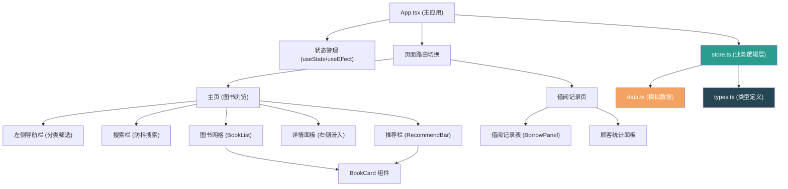
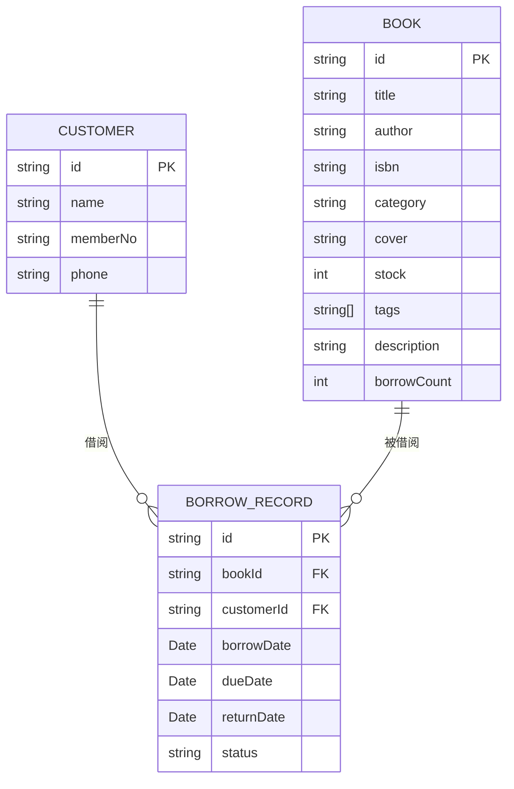

## 1. 架构设计



## 2. 技术选型说明

- **前端框架**：React 18 + TypeScript 5
- **构建工具**：Vite 5（快速冷启动、热更新）
- **状态管理**：React Hooks (useState, useEffect, useMemo) + 纯 TS 业务逻辑模块
- **样式方案**：CSS Modules / 内联样式，CSS 变量管理主题色
- **唯一 ID**：uuid 库生成
- **数据层**：前端 Mock 数据，无后端依赖
- **包管理**：npm

## 3. 文件结构定义

```
project/
├── package.json
├── vite.config.js
├── tsconfig.json
├── index.html
├── src/
│   ├── main.tsx          # 入口文件，挂载 App
│   ├── App.tsx           # 主应用组件，管理全局状态和页面切换
│   ├── types.ts          # 类型定义 (Book, Customer, BorrowRecord)
│   ├── data.ts           # 模拟数据 (图书、顾客、借阅记录)
│   ├── store.ts          # 业务逻辑层 (CRUD、搜索、推荐算法)
│   └── components/
│       ├── BookCard.tsx      # 单个图书卡片组件
│       ├── BookList.tsx      # 图书列表网格组件
│       ├── BorrowPanel.tsx   # 借阅记录管理组件
│       └── RecommendBar.tsx  # 个性化推荐栏组件
```

## 4. 数据模型

### 4.1 实体关系图



### 4.2 类型定义

```typescript
interface Book {
  id: string;
  title: string;
  author: string;
  isbn: string;
  category: '文学' | '社科' | '科普' | '少儿';
  cover?: string;
  stock: number;
  tags: string[];
  description: string;
  borrowCount: number;
}

interface Customer {
  id: string;
  name: string;
  memberNo: string;
  phone: string;
}

interface BorrowRecord {
  id: string;
  bookId: string;
  customerId: string;
  borrowDate: string;
  dueDate: string;
  returnDate?: string;
  status: 'borrowing' | 'returned' | 'overdue';
}
```

## 5. 核心业务逻辑

### 5.1 搜索过滤函数

- **输入**：图书列表、搜索关键词、分类筛选
- **输出**：过滤后的图书列表
- **逻辑**：书名/作者/ISBN 模糊匹配，分类精确匹配
- **性能**：使用 useMemo 缓存结果，< 50ms 响应

### 5.2 推荐算法

- **输入**：当前图书标签、全部图书列表
- **输出**：3 本推荐图书
- **逻辑**：
  1. 基于标签相似度（共同标签数量排序）
  2. 结合借阅热度（borrowCount 加权）
  3. 排除当前图书本身
- **性能**：< 200ms 计算响应

### 5.3 借阅记录管理

- 新增借阅记录（扣减库存）
- 归还图书（增加库存，更新状态）
- 按顾客筛选借阅记录
- 统计顾客借阅数据（总数、在借数、常借类别）

## 6. 性能优化策略

1. **防抖搜索**：useEffect + setTimeout 实现 200ms 防抖
2. **列表虚拟化**：当前数据量小可不用，预留扩展空间
3. **Memo 优化**：useMemo 缓存过滤和推荐结果
4. **CSS 动画**：使用 transform 和 opacity 实现 GPU 加速
5. **代码分割**：Vite 原生支持按需加载
