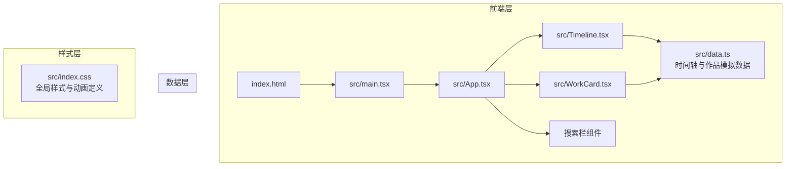
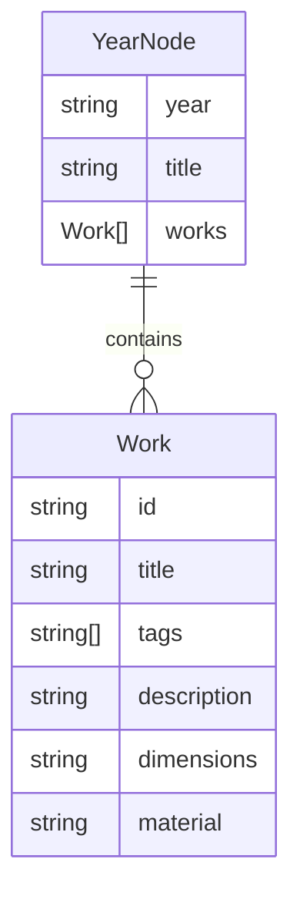

## 1. 架构设计



## 2. 技术说明

- 前端：React@18 + TypeScript + Vite
- 初始化工具：vite-init（react-ts模板）
- 状态管理：React useState（项目规模小，无需zustand）
- 样式方案：CSS Modules + 全局CSS变量（无Tailwind，按需求使用纯CSS实现精细动画控制）
- 后端：无（纯前端，数据为本地模拟）
- 数据库：无（使用src/data.ts模拟数据）

## 3. 路由定义

| 路由 | 用途 |
|------|------|
| / | 单页应用，时间轴浏览页 |

## 4. 数据模型

### 4.1 数据模型定义



### 4.2 数据定义

```typescript
interface Work {
  id: string;
  title: string;
  tags: string[];
  description: string;
  dimensions: string;
  material: string;
}

interface YearNode {
  year: string;
  title: string;
  works: Work[];
}
```

## 5. 文件结构与调用关系

```
├── package.json          # 依赖配置（react, react-dom, typescript, vite, uuid, @types/*）
├── vite.config.js        # Vite基础配置，根路径'/'
├── tsconfig.json         # 严格模式，jsx: react-jsx
├── index.html            # 入口HTML，含root挂载点，引入全局样式
├── src/
│   ├── main.tsx          # React入口，渲染App组件
│   ├── data.ts           # 模拟数据：YearNode[] → 被Timeline.tsx和App.tsx导入
│   ├── App.tsx           # 主组件：管理activeYear状态，组合Timeline+WorkCard+搜索栏
│   │                     #   ← 导入 data.ts 获取全部数据
│   │                     #   → 传递 years + setActiveYear 给 Timeline.tsx
│   │                     #   → 传递 works + activeYear 给 WorkCard.tsx
│   ├── Timeline.tsx      # 时间轴组件：渲染年份节点，监听滚动/点击
│   │                     #   ← 接收 years 数据 + setActiveYear 回调
│   │                     #   → 点击节点时调用 setActiveYear(year)
│   ├── WorkCard.tsx      # 作品卡片组件：翻转效果，正反面展示
│   │                     #   ← 接收 works 数组 + activeYear
│   │                     #   → 翻转状态由自身 useState 管理
│   └── index.css         # 全局样式：CSS变量、动画keyframes、响应式
```

### 数据流向

1. **data.ts** → 导出 `timelineData: YearNode[]`
2. **App.tsx** → 导入 `timelineData`，管理 `activeYear` 状态和 `searchQuery` 状态
3. **App.tsx** → 将 `years` 数据和 `setActiveYear` 回调传递给 `Timeline.tsx`
4. **App.tsx** → 根据 `activeYear` 过滤 `works`，再根据 `searchQuery` 进一步过滤，将结果传给 `WorkCard.tsx`
5. **Timeline.tsx** → 用户点击节点 → 调用 `setActiveYear(year)` → 触发 App.tsx 重新渲染
6. **WorkCard.tsx** → 接收过滤后的 `works`，渲染卡片网格，翻转状态自行管理
