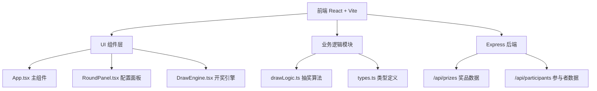

## 1. 架构设计



## 2. 技术描述

- **前端**：React@18 + TypeScript + Vite
- **后端**：Express@4（模拟数据服务）
- **状态管理**：React useState/useReducer（局部状态管理）
- **样式方案**：纯CSS + CSS变量（不使用Tailwind，按用户需求自定义样式）
- **图标**：内联SVG图标
- **动画**：CSS动画 + requestAnimationFrame（高性能动画）
- **唯一ID**：uuid库

## 3. 文件结构

```
├── package.json
├── vite.config.js
├── tsconfig.json
├── index.html
├── server/
│   └── index.js          (Express后端模拟数据)
└── src/
    ├── App.tsx           (主组件，管理全局状态和抽奖流程)
    ├── components/
    │   ├── RoundPanel.tsx    (活动配置面板)
    │   └── DrawEngine.tsx    (核心开奖组件与动画)
    └── business/
        ├── types.ts       (共用类型定义)
        └── drawLogic.ts   (业务逻辑模块：抽奖算法、名单管理、历史记录)
```

## 4. API 定义

### 4.1 获取奖品预设列表

```typescript
// GET /api/prizes
interface Prize {
  id: string;
  name: string;
  imageUrl: string;
}

// Response: Prize[] (不少于10种奖品)
```

### 4.2 获取参与者预设名单

```typescript
// GET /api/participants
interface Participant {
  id: string;
  name: string;
  weight?: number;
}

// Response: Participant[] (不少于20个虚拟姓名)
```

## 5. 数据模型

### 5.1 核心类型定义

```typescript
// 奖品
interface Prize {
  id: string;
  name: string;
  quantity: number;
  imageUrl: string;
}

// 参与者
interface Participant {
  id: string;
  name: string;
  weight?: number; // 加权随机模式使用
}

// 抽奖模式
type DrawMode = 'roulette' | 'list' | 'weighted';

// 抽奖轮次
interface DrawRound {
  id: string;
  name: string;
  mode: DrawMode;
  prizes: Prize[];
  participants: Participant[];
  createdAt: number;
}

// 开奖结果
interface DrawResult {
  id: string;
  roundId: string;
  roundName: string;
  prize: Prize;
  winner: Participant;
  drawTime: number;
}
```

### 5.2 业务逻辑模块函数

```typescript
// 验证参与名单
function validateParticipants(participants: Participant[], mode: DrawMode): boolean;

// 轮盘随机抽奖算法
function rouletteDraw(participants: Participant[], prizes: Prize[]): DrawResult | null;

// List随机抽奖算法
function listDraw(participants: Participant[], prizes: Prize[]): DrawResult | null;

// 加权随机抽奖算法
function weightedDraw(participants: Participant[], prizes: Prize[]): DrawResult | null;

// 根据模式执行抽奖
function executeDraw(
  mode: DrawMode,
  participants: Participant[],
  prizes: Prize[],
  roundId: string,
  roundName: string
): DrawResult | null;

// 添加中奖历史记录
function addDrawHistory(history: DrawResult[], result: DrawResult): DrawResult[];

// 按轮次分组获取历史记录
function getHistoryByRound(history: DrawResult[]): Record<string, DrawResult[]>;
```

## 6. 性能要求

- **抽奖算法执行时间**：不超过50ms
- **动画帧率**：不低于45fps（使用CSS transform和opacity确保GPU加速）
- **响应式适配**：768px断点，支持移动端
