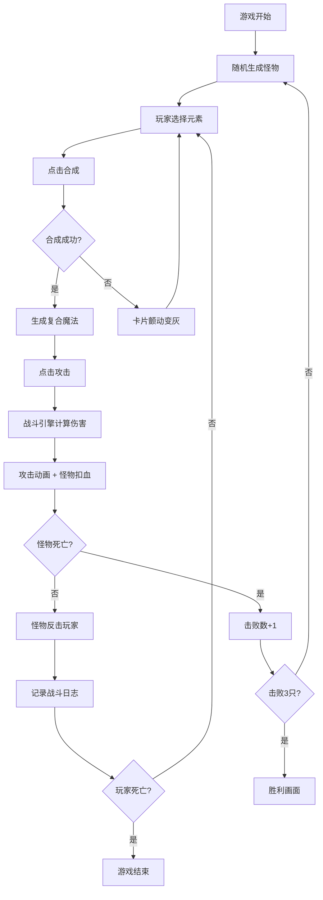

## 1. 产品概述

元素魔法组合与怪物战斗模拟应用是一款用于验证核心玩法的快速原型游戏。玩家通过组合火、水、风、土四种基础元素合成复合魔法，击败随机生成的元素怪物。游戏采用回合制战斗机制，包含属性克制、抗性系统与战斗日志记录。

- 核心目标：验证元素合成 + 属性克制的核心玩法乐趣
- 目标用户：游戏策划、玩法设计师、原型测试玩家
- 产品价值：快速迭代玩法验证，低成本测试战斗平衡性

## 2. 核心功能

### 2.1 用户角色

| 角色 | 注册方式 | 核心权限 |
|------|----------|----------|
| 玩家 | 无需注册，直接进入 | 选择元素、合成魔法、攻击怪物、查看战斗日志 |

### 2.2 功能模块

1. **元素选择与合成区**：四元素卡片选择、合成按钮、成功/失败动画反馈
2. **怪物面板**：像素风怪物图标、血量进度条、抗性/弱点图标
3. **战斗系统**：回合制伤害计算、属性克制、攻击动画、怪物反击
4. **战斗日志**：可滚动历史记录、玩家/怪物操作区分样式、清除功能
5. **胜负判定**：回合计数、击败怪物统计、胜利画面与魔法组合展示

### 2.3 页面详情

| 页面名称 | 模块名称 | 功能描述 |
|----------|----------|----------|
| 主战斗页面 | 元素合成区 | 4种基础元素卡片、选中状态、合成按钮、合成动画 |
| 主战斗页面 | 怪物面板 | 像素怪物图标、血量条(绿→黄→红渐变)、抗性弱点图标 |
| 主战斗页面 | 玩家状态 | 玩家血量条、回合计数、击败怪物数 |
| 主战斗页面 | 战斗日志 | 可滚动日志区、玩家灰底白字/怪物红底白字、清除按钮 |
| 主战斗页面 | 胜利画面 | 金色文字渐入、粒子特效、使用过的魔法组合列表 |

## 3. 核心流程

玩家进入游戏 → 系统随机生成第一只怪物 → 玩家选择2-3个基础元素 → 点击合成按钮 → 合成引擎判断配方 → 成功则生成复合魔法 / 失败则颤动反馈 → 玩家点击攻击 → 战斗引擎计算伤害(克制×1.5 / 抵抗×0.5) → 攻击动画播放 → 怪物扣血 → 怪物反击玩家 → 回合结束日志记录 → 循环直到怪物血量归零 → 生成下一只怪物 → 击败3只怪物 → 胜利画面

## 4. 用户界面设计

### 4.1 设计风格

- **主色调**：深灰黑背景 #0B0C10，青蓝点缀 #45A29E，亮青高亮 #66FCF1
- **元素色**：火 #FF4500、水 #1E90FF、风 #98FB98、土 #D2691E
- **按钮风格**：圆角渐变（#45A29E → #66FCF1），悬停亮度提升 + 放大 1.05 倍
- **字体**：奇幻风格标题字体 + 易读正文字体
- **布局风格**：暗黑奇幻风，磨砂玻璃卡片容器，半透明效果
- **视觉特效**：光效动画、粒子特效、血量流动光效

### 4.2 页面设计概述

| 页面名称 | 模块名称 | UI 元素 |
|----------|----------|----------|
| 主战斗页 | 元素合成区 | 4张圆角元素卡片、选中金色边框上浮、磨砂玻璃容器、合成按钮 |
| 主战斗页 | 怪物面板 | 像素风怪物图标、血量渐变条 + 流动光效、抗性/弱点箭头图标 |
| 主战斗页 | 战斗日志 | 固定 200px 高度、滚动区域、左右对齐样式区分、清除按钮 |
| 主战斗页 | 胜利画面 | 全屏金色 #FFD700 文字渐入、粒子特效、魔法组合列表 |

### 4.3 响应式

- 桌面端优先（768px 以上）
- 768px 以下：元素选择栏改为横向滚动
- 整体布局自适应，怪物面板在小屏下移至底部

### 4.4 性能约束

- 战斗动画帧率 ≥ 30fps，移动端 60fps
- 回合伤害计算响应时间 < 100ms
- 日志超过 50 条自动截断保留最后 50 条
