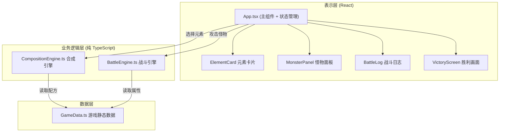

## 1. 架构设计



## 2. 技术描述

- **前端框架**：React 18 + TypeScript
- **构建工具**：Vite 5 + @vitejs/plugin-react
- **状态管理**：React useState/useReducer（轻量级，无需 zustand）
- **样式方案**：CSS Modules / 内联样式（游戏 UI 以 CSS 动画为主）
- **唯一标识**：uuid 库生成日志 ID
- **无后端**：纯前端游戏，数据全部静态定义

## 3. 路由定义

| 路由 | 用途 |
|------|------|
| / | 主战斗页面（单页应用，无路由） |

## 4. 数据模型

### 4.1 核心类型定义

```typescript
// 基础元素类型
type ElementType = 'fire' | 'water' | 'wind' | 'earth' | 'dark' | 'light';

// 复合魔法
interface MagicSpell {
  id: string;
  name: string;
  elements: ElementType[];
  damage: number;
  element: ElementType; // 主属性
  effect?: string;
}

// 怪物
interface Monster {
  id: string;
  name: string;
  element: ElementType;
  maxHp: number;
  currentHp: number;
  attack: number;
  resistances: ElementType[]; // 抗性元素
  weaknesses: ElementType[];  // 弱点元素
}

// 战斗日志条目
interface BattleLogEntry {
  id: string;
  type: 'player' | 'monster' | 'system';
  message: string;
  turn: number;
}

// 合成配方
interface Recipe {
  elements: ElementType[];
  result: MagicSpell;
}
```

### 4.2 合成配方表（GameData.ts）

| 配方元素 | 合成结果 | 主属性 | 基础伤害 |
|----------|----------|--------|----------|
| 火 + 火 | 烈焰冲击 | fire | 30 |
| 水 + 水 | 潮汐涌动 | water | 28 |
| 风 + 风 | 狂风斩 | wind | 25 |
| 土 + 土 | 岩石崩塌 | earth | 35 |
| 火 + 水 | 蒸汽爆发 | fire | 32 |
| 火 + 风 | 火焰龙卷 | fire | 35 |
| 火 + 土 | 熔岩喷射 | fire | 40 |
| 水 + 风 | 冰霜风暴 | water | 30 |
| 水 + 土 | 泥沼陷阱 | water | 28 |
| 风 + 土 | 沙尘暴 | wind | 33 |
| 火 + 水 + 风 | 元素风暴 | light | 50 |
| 火 + 土 + 水 | 创世熔岩 | earth | 55 |
| 火 + 风 + 土 | 灭世烈焰 | fire | 60 |
| 水 + 风 + 土 | 自然之怒 | water | 48 |

## 5. 模块职责与调用关系

### 5.1 CompositionEngine.ts

- **输入**：`ElementType[]`（玩家选择的元素列表，2-3个）
- **输出**：`{ success: boolean; spell?: MagicSpell; message?: string }`
- **逻辑**：将输入元素排序后与配方表匹配，返回合成结果
- **依赖**：GameData.ts（配方表）

### 5.2 BattleEngine.ts

- **输入**：`Monster`（怪物状态）、`MagicSpell`（使用的魔法）
- **输出**：`{ damage: number; isCritical: boolean; isResisted: boolean; effectId: string }`
- **逻辑**：
  1. 检查魔法属性是否在怪物弱点列表中 → 伤害 × 1.5
  2. 检查魔法属性是否在怪物抗性列表中 → 伤害 × 0.5
  3. 返回最终伤害值和特效类型
- **依赖**：GameData.ts（怪物属性表）

### 5.3 GameData.ts

- **职责**：静态数据中心，集中管理所有游戏配置
- **导出**：`recipes` 配方数组、`monsterTemplates` 怪物模板数组、`elementInfo` 元素信息映射
- **被依赖**：CompositionEngine.ts、BattleEngine.ts、App.tsx

### 5.4 App.tsx

- **职责**：状态管理 + UI 渲染 + 事件调度
- **状态**：玩家血量、选中元素、当前魔法、当前怪物、回合数、击败数、战斗日志、游戏状态
- **核心方法**：
  - `handleSelectElement(element)` - 选择/取消元素
  - `handleCompose()` - 调用合成引擎
  - `handleAttack()` - 调用战斗引擎
  - `spawnMonster()` - 随机生成怪物
  - `addLogEntry(type, message)` - 添加日志
- **依赖**：CompositionEngine、BattleEngine、GameData

## 6. 性能优化

1. **日志截断**：超过 50 条自动保留最后 50 条
2. **React 优化**：使用 `useCallback` 和 `useMemo` 避免不必要重渲染
3. **动画优化**：优先使用 CSS transform/opacity 动画（GPU 加速）
4. **内存管理**：组件卸载时清理动画定时器
5. **伤害计算**：纯同步计算，确保 < 100ms 响应

## 7. 文件结构

```
src/
├── main.tsx              # React 入口
├── App.tsx               # 主组件
├── App.css               # 全局样式
├── engine/
│   ├── CompositionEngine.ts  # 合成引擎
│   └── BattleEngine.ts       # 战斗引擎
├── data/
│   └── GameData.ts           # 游戏静态数据
└── components/
    ├── ElementCard.tsx       # 元素卡片组件
    ├── MonsterPanel.tsx      # 怪物面板组件
    ├── BattleLog.tsx         # 战斗日志组件
    └── VictoryScreen.tsx     # 胜利画面组件
```
