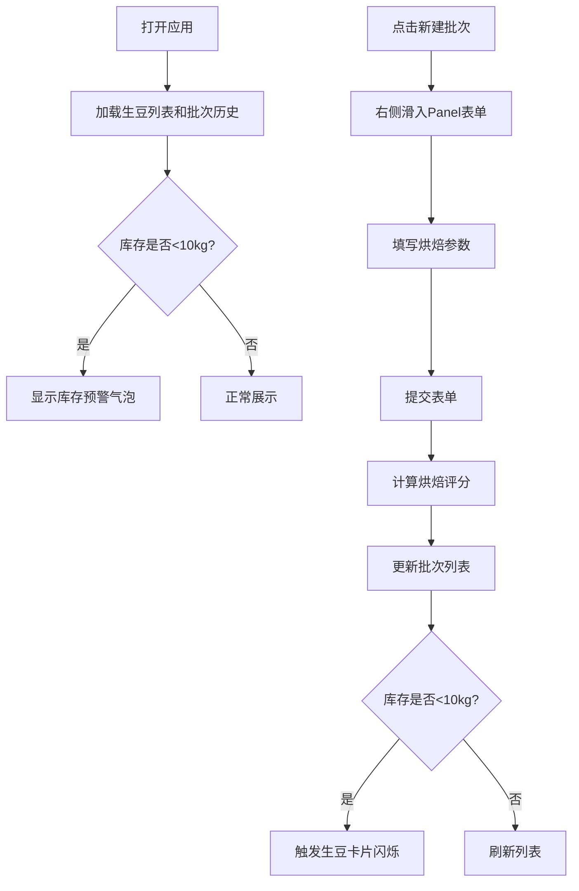

## 1. 产品概述

本应用是为小型咖啡烘焙工坊设计的生豆库存管理与烘焙批次追踪系统。烘焙师可记录生豆信息、创建烘焙批次、追踪烘焙曲线参数，并通过筛选排序功能浏览历史数据。

- 解决烘焙工坊生豆库存管理混乱、烘焙批次缺乏系统化记录的痛点
- 目标用户为专业咖啡烘焙师及工坊管理者
- 产品价值在于提升烘焙流程标准化程度，保障咖啡品质稳定性

## 2. 核心功能

### 2.1 用户角色

| 角色 | 注册方式 | 核心权限 |
|------|----------|----------|
| 烘焙师 | 系统内置 | 生豆管理、批次创建、数据浏览、统计查看 |

### 2.2 功能模块

1. **生豆库存看板**：横向滚动卡片轮播展示生豆列表，库存预警提示
2. **烘焙批次创建**：右侧滑入Panel表单，关联生豆记录烘焙参数
3. **批次历史列表**：时间倒序展示，支持多维度筛选排序
4. **烘焙评分统计**：基于曲线参数自动评分，可视化数据图表
5. **库存预警通知**：低库存自动告警，气泡通知+闪烁提示

### 2.3 页面详情

| 页面名称 | 模块名称 | 功能描述 |
|---------|----------|----------|
| 主应用页面 | 生豆库存看板 | 横向滚动卡片展示生豆信息，卡片包含产区标签、处理法、剩余库存、新建批次按钮 |
| 主应用页面 | 批次创建Panel | 右侧滑入表单，选择生豆、填写烘焙日期、烘焙度、风味备注、烘焙曲线参数 |
| 主应用页面 | 批次历史列表 | 按时间倒序排列，支持烘焙度多选、日期范围筛选，展示生豆名、日期、烘焙度Badge、风味评分 |
| 主应用页面 | 统计图表区 | Recharts折线图展示月度批次数量、各烘焙度平均评分 |
| 全局 | 库存预警通知 | 右上角固定气泡提示库存不足，生豆卡片重量红色闪烁 |

## 3. 核心流程

用户打开应用后，顶部展示生豆库存卡片，下方展示烘焙批次历史列表。用户可点击生豆卡片的"新建批次"按钮或侧栏加号，打开右侧滑入表单填写烘焙参数。提交后批次自动更新至列表，系统根据烘焙曲线计算评分。当生豆库存低于10kg时触发预警通知。

## 4. 用户界面设计

### 4.1 设计风格

- **主色调**：#FDF5E6 古色白背景，#FAEBD7 主面板，#3E2723 文字颜色
- **咖啡色系**：#4A3728 深咖色，#8B5E3C 驼色，#D2B48C 淡金色，#8B4513 焦棕色，#CD853F 秘鲁色
- **强调色**：#FF4500 橙红色（预警），#FFD700 金色（评分星星），#E8D5B7 浅烘色
- **按钮风格**：圆角8px，卡片悬浮阴影0 2px 8px rgba(0,0,0,0.1)，悬浮时加深至0 4px 16px
- **字体**：标题使用 'Playfair Display' 衬线字体，正文使用 'Lato' 无衬线字体，体现咖啡文化质感
- **布局**：左侧固定300px侧栏，右侧自适应主区域；移动端汉堡菜单折叠

### 4.2 页面设计概述

| 页面名称 | 模块名称 | UI元素 |
|---------|----------|--------|
| 主应用页面 | 生豆库存看板 | 横向滚动容器，渐变背景卡片，#D2B48C标签，库存低于10kg时#FF4500闪烁，展开详情面板 |
| 主应用页面 | 批次创建Panel | 0.3秒cubic-bezier滑入动画，圆角胶囊单选按钮（选中#8B4513白底），渐变滑块轨道（#D2B48C到#8B4513） |
| 主应用页面 | 批次历史列表 | 行高60px，#F5F0E8悬停背景，颜色Badge区分烘焙度，#FFD700星星评分，0.2秒过渡动画 |
| 主应用页面 | 统计图表区 | Recharts折线图，#A0522D和#8B4513折线颜色，评分>8时发光动画 |
| 全局 | 库存预警通知 | #FF4500红底白字气泡，bounce 0.4s弹性动画，固定右上角 |

### 4.3 响应式设计

- **桌面端**（>768px）：左侧300px固定侧栏，右侧主区域自适应
- **移动端**（≤768px）：侧栏折叠为汉堡菜单，点击展开全屏覆盖，卡片调整为单列布局
- **触摸优化**：按钮最小高度44px，滑动手势支持横向滚动卡片

## 5. 性能要求

- 筛选搜索响应时间 ≤ 200ms
- 列表滚动保持 60fps
- 批次提交后列表更新 ≤ 50ms
- 动画过渡时长 0.2-0.4s，使用ease-out曲线
