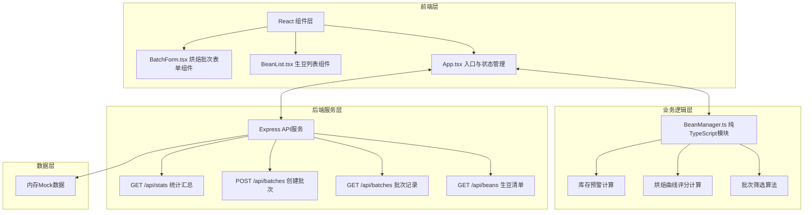
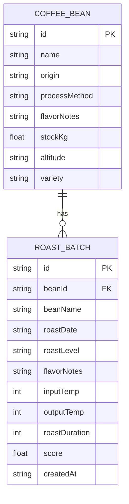
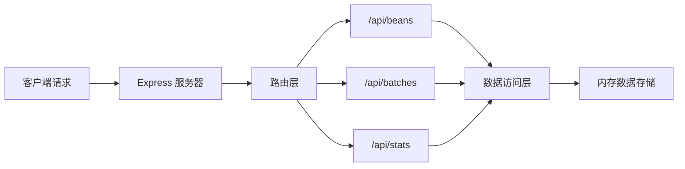

## 1. 架构设计



## 2. 技术栈说明

- **前端框架**：React 18 + TypeScript + Vite 5
- **状态管理**：React useState/useReducer 内置方案
- **图表库**：Recharts 2.x
- **UI样式**：纯CSS + CSS变量，不使用Tailwind（按用户指定）
- **后端**：Express 4.x
- **唯一ID**：uuid 9.x
- **构建工具**：Vite 5 带 @vitejs/plugin-react
- **初始化工具**：vite-init react-express-ts 模板

## 3. 目录结构

```
auto21/
├── package.json
├── vite.config.js
├── tsconfig.json
├── index.html
├── src/
│   ├── App.tsx                    # 应用入口，路由布局，全局状态
│   ├── beans/
│   │   └── BeanManager.ts         # 业务逻辑模块
│   ├── components/
│   │   ├── BeanList.tsx           # 生豆列表组件
│   │   ├── BatchForm.tsx          # 烘焙批次表单组件
│   │   ├── BatchList.tsx          # 批次历史列表组件
│   │   ├── Sidebar.tsx            # 左侧导航栏组件
│   │   ├── StatsCharts.tsx        # 统计图表组件
│   │   └── InventoryAlert.tsx     # 库存预警通知组件
│   ├── types/
│   │   └── index.ts               # 共享类型定义
│   ├── api/
│   │   └── client.ts              # API客户端封装
│   └── styles/
│       ├── variables.css          # CSS变量定义
│       └── animations.css         # 动画关键帧定义
├── api/
│   ├── server.ts                  # Express服务器入口
│   ├── routes/
│   │   ├── beans.ts               # 生豆路由
│   │   ├── batches.ts             # 批次路由
│   │   └── stats.ts               # 统计路由
│   └── data/
│       └── mockData.ts            # Mock数据
└── .trae/
    └── documents/
        ├── PRD.md
        └── tech-arch.md
```

## 4. 路由定义

| 路由 | 用途 |
|------|------|
| / | 主应用页面（单页应用，前端无路由切换） |
| GET /api/beans | 获取生豆清单 |
| GET /api/batches | 获取所有批次记录 |
| POST /api/batches | 创建新烘焙批次 |
| GET /api/stats | 获取统计汇总数据 |

## 5. API 定义

### 5.1 类型定义

```typescript
// 生豆信息
interface CoffeeBean {
  id: string;
  name: string;
  origin: string;
  processMethod: string;
  flavorNotes: string[];
  stockKg: number;
  altitude: string;
  variety: string;
}

// 烘焙度类型
type RoastLevel = 'light' | 'medium' | 'dark';

// 烘焙批次
interface RoastBatch {
  id: string;
  beanId: string;
  beanName: string;
  roastDate: string;
  roastLevel: RoastLevel;
  flavorNotes: string;
  inputTemp: number;
  outputTemp: number;
  roastDuration: number;
  score: number;
  createdAt: string;
}

// 库存预警
interface InventoryAlert {
  beanId: string;
  beanName: string;
  currentStock: number;
  threshold: number;
}

// 统计数据
interface StatsData {
  monthlyBatches: { month: string; count: number }[];
  roastLevelAvgScores: { level: string; avgScore: number }[];
}
```

### 5.2 接口定义

**GET /api/beans**
- 响应：`CoffeeBean[]`

**GET /api/batches**
- 响应：`RoastBatch[]`

**POST /api/batches**
- 请求体：
  ```typescript
  {
    beanId: string;
    roastDate: string;
    roastLevel: RoastLevel;
    flavorNotes: string;
    inputTemp: number;
    outputTemp: number;
    roastDuration: number;
  }
  ```
- 响应：`RoastBatch`

**GET /api/stats**
- 响应：`StatsData`

## 6. 数据模型



## 7. 核心业务逻辑

### 7.1 烘焙评分算法

位于 `BeanManager.ts` 的 `calculateRoastScore` 方法：

- **温差评分**：入豆出豆温差在 60-100℃ 区间得分最高
- **温度稳定性**：温度范围合理性（180-240℃入豆，100-140℃出豆）
- **烘焙度匹配**：温度参数与所选烘焙度的匹配程度
- 总分 0-10，四舍五入到整数

### 7.2 批次筛选逻辑

位于 `BeanManager.ts` 的 `filterBatches` 方法：

- 支持按烘焙度多选筛选
- 支持按日期范围筛选
- 支持按生豆名称搜索
- 返回按时间倒序排列的结果

### 7.3 库存预警计算

位于 `BeanManager.ts` 的 `getInventoryAlerts` 方法：

- 阈值：10kg
- 返回所有库存低于阈值的生豆预警信息

## 8. 性能优化策略

1. **列表虚拟化**：批次列表使用 `useMemo` 缓存筛选结果
2. **防抖处理**：搜索输入使用 100ms 防抖
3. **CSS 优化**：使用 `transform` 和 `opacity` 实现 GPU 加速动画
4. **批量更新**：状态更新使用 `ReactDOM.flushSync` 保证 50ms 内更新
5. **内存优化**：图表数据懒加载，组件卸载时清理事件监听

## 9. 服务端架构


