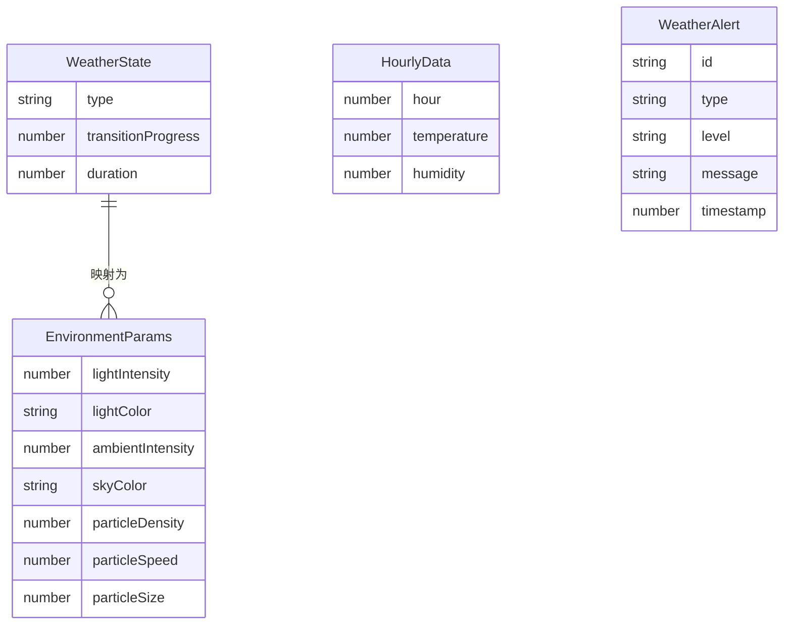

## 1. 架构设计

```mermaid
flowchart TB
    subgraph "前端 (React + Three.js)"
        "main.tsx" --> "Scene.tsx"
        "main.tsx" --> "WeatherPanel"
        "main.tsx" --> "ControlPanel"
        "main.tsx" --> "AlertBanner"
        "Scene.tsx" --> "ParticleSystems"
        "Scene.tsx" --> "InteractiveObjects"
    end

    subgraph "业务逻辑 (纯TypeScript)"
        "weatherStateMachine.ts" --> "环境映射输出"
        "environmentMapper.ts" --> "环境映射输出"
    end

    subgraph "后端 (Express)"
        "server.ts" --> "/api/weather/history"
        "server.ts" --> "/api/weather/alerts"
    end

    "weatherStateMachine.ts" --> "Scene.tsx"
    "environmentMapper.ts" --> "Scene.tsx"
    "后端 (Express)" --> "WeatherPanel"
```

### 数据流向
1. **天气状态机** → 输出目标天气类型和过渡参数 → 传递给Scene和UI
2. **环境映射模块** → 接收天气类型 → 计算光照强度/粒子密度/物体响应参数 → 输出至Scene
3. **Express后端** → 接收前端请求 → 返回历史天气数据和预警列表 → 供UI组件展示
4. **Scene.tsx** → 接收天气参数 → 应用光照/粒子 → 渲染场景元素并反馈交互

## 2. 技术说明
- 前端：React 18 + TypeScript + Vite + Three.js + @react-three/fiber + @react-three/drei
- 初始化工具：vite-init (react-express-ts模板)
- 后端：Express 4 + TypeScript
- 数据库：无，使用模拟数据
- 状态管理：Zustand
- 样式：CSS Modules + CSS变量

## 3. 路由定义
| 路由 | 用途 |
|------|------|
| / | 主场景页面，3D天气场景+气象面板+控制面板 |

## 4. API定义

### 4.1 获取历史天气数据
- **GET** `/api/weather/history`
- 响应：
```typescript
interface HourlyData {
  hour: number;
  temperature: number;
  humidity: number;
}

interface WeatherHistoryResponse {
  data: HourlyData[];
}
```

### 4.2 获取异常天气预警
- **GET** `/api/weather/alerts`
- 响应：
```typescript
interface WeatherAlert {
  id: string;
  type: string;
  level: "red" | "orange" | "yellow" | "blue";
  message: string;
  timestamp: number;
}

interface WeatherAlertsResponse {
  alerts: WeatherAlert[];
}
```

## 5. 服务端架构图

```mermaid
flowchart LR
    "Express Router" --> "WeatherController"
    "WeatherController" --> "MockDataService"
    "MockDataService" --> "模拟数据生成"
```

## 6. 数据模型

### 6.1 数据模型定义



### 6.2 文件结构与调用关系

```
project/
├── package.json
├── vite.config.js
├── tsconfig.json
├── index.html
├── src/
│   ├── main.tsx                    # React挂载入口
│   ├── store/
│   │   └── weatherStore.ts         # Zustand全局状态
│   ├── components/
│   │   ├── Scene.tsx               # 3D场景渲染组件
│   │   ├── WeatherPanel.tsx        # 气象数据面板
│   │   ├── ControlPanel.tsx        # 控制面板
│   │   ├── AlertBanner.tsx         # 预警横幅
│   │   └── Chart.tsx               # 折线图组件
│   └── logic/
│       ├── weatherStateMachine.ts  # 天气状态机
│       └── environmentMapper.ts    # 环境映射
└── server/
    └── server.ts                   # Express后端
```
