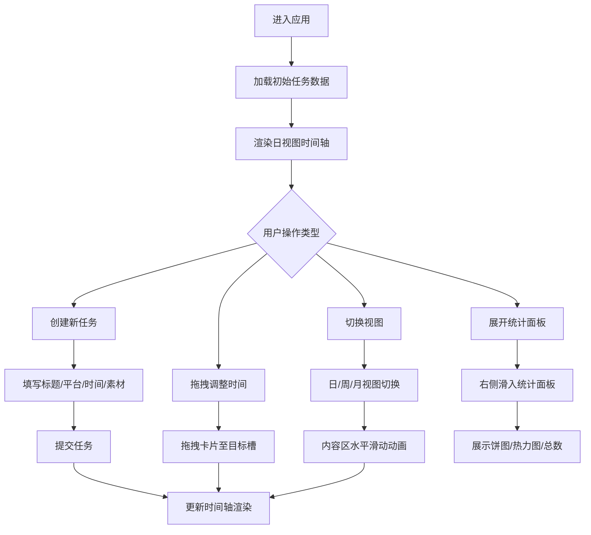

## 1. 产品概述

跨平台内容发布计划管理工具，帮助视频UP主、播客主播、图文博主高效管理多平台内容发布日程，解决因各平台内容格式各异、发布时间分散导致的漏发或重复发布问题。通过直观的时间轴可视化、拖拽式任务调整和多维度数据统计，提升内容创作者的发布效率和规划能力。

## 2. 核心功能

### 2.1 用户角色
| 角色 | 核心权限 |
|------|----------|
| 内容创作者 | 创建/编辑/删除发布任务，查看时间轴规划，查看发布统计数据 |

### 2.2 功能模块
1. **主应用页**：左侧任务创建面板、中央时间轴视图、右侧统计面板、顶部导航栏与视图切换
2. **任务创建模块**：内容标题输入、平台多选标签、日期时间选择器、素材拖拽上传
3. **时间轴视图模块**：日视图/周视图/月视图切换、任务卡片渲染、横向拖拽调整时间
4. **统计分析模块**：本周发布总数、各平台发布占比环形饼图、未来7天任务密度热力图
5. **响应式适配模块**：移动端抽屉式面板、浮动统计按钮

### 2.3 页面详情
| 页面名称 | 模块名称 | 功能描述 |
|-----------|-------------|---------------------|
| 主应用页 | 左侧任务创建面板 | 输入内容标题、多选平台标签、选择发布时间、拖拽上传素材 |
| 主应用页 | 日期时间选择器 | 弹出面板淡入缩放0.3s动画，月份切换上下滑动过渡 |
| 主应用页 | 素材上传区 | 拖拽上传图片/视频，缩略图脉冲占位加载效果 |
| 主应用页 | 时间轴(日视图) | 垂直虚线时间线(#E8E8E8)，15分钟刻度，卡片左框着色，悬停上移效果 |
| 主应用页 | 时间轴(周视图) | 7列展示周一到周日，当天列浅黄底色(#FFF9E6) |
| 主应用页 | 时间轴(月视图) | 日历网格展示，任务日高亮，数量气泡在日期右上角 |
| 主应用页 | 卡片拖拽 | 跟随鼠标80%不透明度+0.5度旋转，目标槽高亮淡蓝(#4A90D9) |
| 主应用页 | 视图切换按钮组 | 选中深蓝灰(#2C3E50)白底，水平滑动切换0.3s动画 |
| 主应用页 | 统计面板 | 右侧滑入/滑出0.2s ease-out，含总数/饼图/热力图 |

## 3. 核心流程

### 3.1 创建发布任务流程
用户在左侧面板填写标题 → 选择目标平台（多选） → 点击时间输入框弹出选择器 → 选择日期和时间 → 拖拽或点击上传素材文件 → 点击提交按钮 → 任务卡片出现在时间轴对应时间点

### 3.2 调整发布时间流程
用户鼠标悬停在任务卡片上 → 按住并横向拖拽 → 目标时间槽高亮显示 → 卡片跟随鼠标移动（半透明+微旋转） → 释放鼠标 → 任务更新到新时间位置

### 3.3 查看不同时间粒度流程
用户点击顶部视图切换按钮（日/周/月） → 内容区域水平滑动过渡 → 展示对应视图的时间规划

### 3.4 主流程图

## 4. 用户界面设计

### 4.1 设计风格
- **整体风格**：清爽高效商务风，强调信息密度与可读性
- **主背景色**：#FAFBFC 浅灰白色
- **品牌色体系**：
  - B站粉色：#FB7299
  - 小红书红色：#FF2442
  - 抖音黑色：#010101
  - 微信公众号绿色：#07C160
- **中性色**：
  - 导航栏：#FFFFFF（52px高，#E1E4E8底边）
  - 左侧面板：#F7F9FC 浅灰蓝（280px宽，8px圆角）
  - 选中视图按钮：#2C3E50 深蓝灰背景 + 白字
  - 未选中按钮：浅灰背景 + 深灰文字
  - 时间轴线：#E8E8E8 浅灰虚线
  - 卡片阴影：0 2px 8px rgba(0,0,0,0.06)，边框色#E8ECF0
  - 拖拽目标高亮：#4A90D9 淡蓝背景
  - 热力图渐变：#FFE4B5 → #FF6347
- **按钮交互**：点击时transform: scale(0.97) 0.1s缩水反馈
- **卡片悬停**：上移4px + #F0F0F0底色 + 0.2s ease-out过渡
- **字体**：Inter或系统无衬线字体，正文16px，标题20px/600字重

### 4.2 页面设计概览
| 页面名称 | 模块名称 | UI元素与动画 |
|-----------|-------------|-------------|
| 主应用页 | 顶部导航栏 | 52px高度，白底#E1E4E8底边，左侧Logo，中部视图切换按钮组，右侧统计入口 |
| 主应用页 | 左侧任务面板 | 280px宽#F7F9FC背景8px圆角，表单字段按垂直排列，各输入控件带适当间距 |
| 主应用页 | 平台选择标签 | 各品牌色圆角方块标签，选中态有实心填充+勾选效果 |
| 主应用页 | 时间选择器弹窗 | 淡入缩放0.3s弹出，月份切换上下滑动过渡，日历网格+时间滚轮 |
| 主应用页 | 素材上传区 | 虚线边框拖拽区域，缩略图网格排列，加载时脉冲动画占位 |
| 主应用页 | 日视图时间轴 | 左侧垂直#E8E8E8虚线+15分钟刻度文字，右侧按时间分组的任务卡片列表 |
| 主应用页 | 任务卡片 | 左框4px宽平台色条，标题+平台标签+素材缩略图，悬停上移+底色过渡 |
| 主应用页 | 周视图网格 | 7列等宽布局，列头显示星期+日期，当天列#FFF9E6底色，各列内嵌垂直时间卡片 |
| 主应用页 | 月视图日历 | 7列多行日期网格，有任务的日期高亮+右上角数量气泡，周一行标签 |
| 主应用页 | 统计面板 | 右侧滑入/滑出0.2s ease-out，包含统计标题+三个数据模块 |
| 主应用页 | 环形饼图 | 四段彩色环形对应四平台，悬停显示平台名+百分比，中心显示总数 |
| 主应用页 | 任务热力图 | 7天横向色条，颜色深浅映射任务密度，悬停显示具体数量 |

### 4.3 响应式设计
- **桌面端（>768px）**：左侧固定280px面板 + 中央自适应时间轴 + 右侧可展开统计面板（展开时中央区缩小）
- **移动端（≤768px）**：
  - 左侧面板变为全屏模态抽屉，从左侧滑入0.3s动画
  - 时间轴区域全宽显示
  - 统计面板收起为浮动按钮固定在右下角，点击展开模态
  - 卡片和输入控件尺寸适当缩小，保证触控友好

### 4.4 性能指标
- 时间轴滚动帧率稳定≥55fps
- 日视图初始加载50个卡片首屏渲染≤800ms
- 视图切换动画流畅无卡顿
- 拖拽操作响应延迟<16ms
