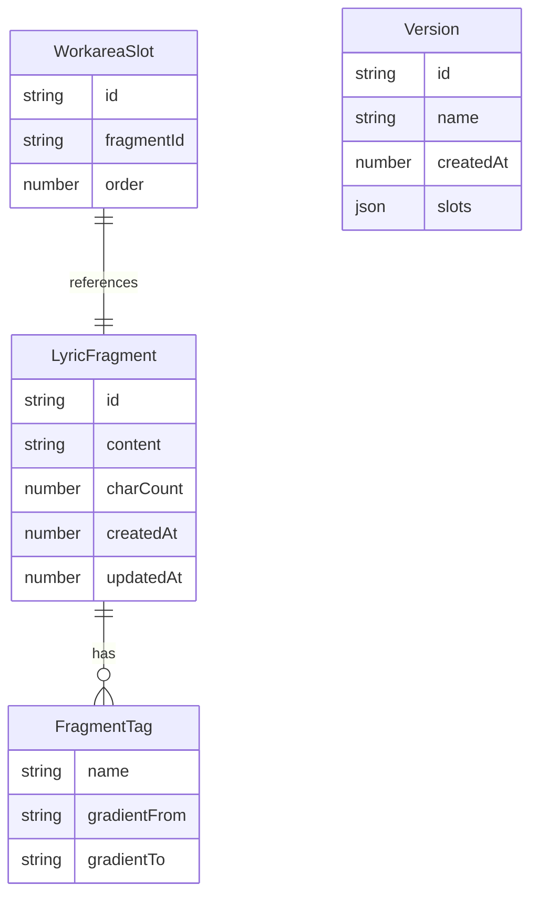

## 1. 架构设计

```mermaid
flowchart TB
    "前端 React + TypeScript + Vite" --> "状态管理 Zustand"
    "状态管理 Zustand" --> "业务逻辑层 businessLogic.ts"
    "业务逻辑层 businessLogic.ts" --> "本地存储 localStorage"
    "前端 React + TypeScript + Vite" --> "UI组件层"
    "UI组件层" --> "LyricPool.tsx 歌词池"
    "UI组件层" --> "Workarea.tsx 创作工作区"
    "UI组件层" --> "App.tsx 三栏布局+输入面板+版本历史"
```

纯前端项目，无后端服务，数据持久化使用 localStorage。

## 2. 技术说明

- 前端：React 18 + TypeScript + Vite
- 初始化工具：vite-init（react-ts 模板）
- 状态管理：Zustand（轻量级状态管理，符合项目规模）
- 拖拽：HTML5 原生 Drag & Drop API + Touch 事件兼容
- 样式：CSS Modules + CSS Variables（主题色管理）
- 后端：无
- 数据库：无，使用 localStorage 持久化
- 性能优化：虚拟列表（react-window 或自实现）处理200+卡片滚动

## 3. 路由定义

| 路由 | 用途 |
|------|------|
| / | 主页面，包含三栏布局的所有功能模块 |

单页应用，无路由切换。

## 4. 数据模型

### 4.1 数据模型定义



### 4.2 数据定义

```typescript
interface LyricFragment {
  id: string;
  content: string;
  charCount: number;
  tags: string[];
  createdAt: number;
  updatedAt: number;
}

interface WorkareaSlot {
  id: string;
  fragmentId: string;
  order: number;
}

interface Version {
  id: string;
  name: string;
  createdAt: number;
  slots: WorkareaSlot[];
  fragments: Record<string, LyricFragment>;
}

interface AppState {
  fragments: LyricFragment[];
  workareaSlots: WorkareaSlot[];
  versions: Version[];
  songTitle: string;
  activeVersionId: string | null;
}
```

## 5. 文件结构

```
├── package.json
├── vite.config.js
├── tsconfig.json
├── index.html
├── src/
│   ├── main.tsx
│   ├── App.tsx
│   ├── businessLogic.ts
│   ├── LyricPool.tsx
│   ├── Workarea.tsx
│   ├── store.ts          (Zustand状态管理)
│   └── styles/
│       └── global.css
```

## 6. 关键技术决策

- **拖拽实现**：使用 HTML5 原生 Drag & Drop API，搭配 CSS transform 实现拖拽视觉反馈，同时监听 touch 事件兼容移动端
- **虚拟列表**：歌词池中卡片超过一定数量时启用虚拟滚动，仅渲染可视区域卡片，保证200+卡片时40fps以上
- **版本管理**：每次"生成草稿"时深拷贝当前工作区状态（片段排列和内容快照），存入版本数组
- **状态持久化**：Zustand 的 middleware 持久化到 localStorage，刷新页面不丢失数据
- **抖动动画**：使用 CSS @keyframes shake 动画，配合 React state 控制触发时机
