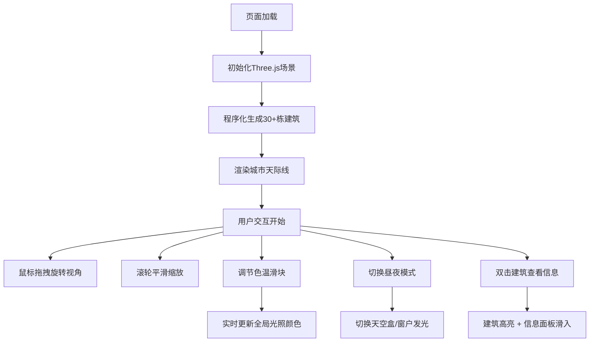

## 1. 产品概述
三维城市天际线实时生成与交互浏览系统，让用户在浏览器中观察由程序化生成的高楼大厦组成的未来科幻城市，支持自由旋转视角和动态灯光氛围切换。
- 目标用户：对3D可视化、程序化生成、城市规划感兴趣的技术爱好者和设计师
- 产品价值：展示WebGL实时渲染能力，提供沉浸式的城市浏览体验

## 2. 核心功能

### 2.1 用户角色
| 角色 | 注册方式 | 核心权限 |
|------|---------|---------|
| 访客用户 | 无需注册 | 浏览城市、调整环境参数、查看建筑信息 |

### 2.2 功能模块
1. **城市生成模块**：程序化生成30+栋随机建筑，合并几何体优化性能
2. **交互控制模块**：OrbitControls视角控制、滚轮平滑缩放、双击建筑选择
3. **环境控制模块**：色温滑块调节、昼夜模式切换、动态灯光效果
4. **信息展示模块**：建筑信息面板、控制面板、航空警示灯动画

### 2.3 页面详情
| 页面名称 | 模块名称 | 功能描述 |
|---------|---------|---------|
| 主场景页面 | 3D城市渲染 | 实时渲染城市天际线，支持360度旋转浏览 |
| 主场景页面 | 控制面板 | 左上角半透明面板，色温调节滑块、昼夜切换按钮 |
| 主场景页面 | 信息面板 | 右侧滑入面板，显示选中建筑的详细信息 |

## 3. 核心流程
用户打开页面 → 自动生成随机城市天际线 → 按住鼠标左键拖拽旋转视角 → 滚轮缩放查看细节 → 调节色温滑块改变灯光氛围 → 点击昼夜切换按钮切换白天/夜晚模式 → 双击任意建筑查看详细信息 → 继续探索城市

## 4. 用户界面设计

### 4.1 设计风格
- **主色调**：深空蓝 #0f0f23，深灰蓝 #1a1a2e，霓虹青 #00D2D3，霓虹红 #FF6B6B，暖橙 #FF9F43
- **UI风格**：暗色科幻风格，磨砂玻璃效果，圆角6px，微动效过渡
- **字体**：使用 'Orbitron' 或 'Space Mono' 等科幻风格字体作为标题，'Inter' 作为正文字体
- **动效**：所有交互元素带有0.1-0.3秒过渡动画，按钮按压缩放0.95，面板滑入ease-out

### 4.2 页面设计概述
| 页面名称 | 模块名称 | UI元素 |
|---------|---------|--------|
| 主场景页面 | 3D城市场景 | 程序化生成的建筑群、深灰色网格地面、红色脉冲航空警示灯、可旋转相机 |
| 主场景页面 | 控制面板 | 半透明背景#1a1a2e 80%透明度、色温滑块（带#00D2D3跟随线）、昼夜切换按钮 |
| 主场景页面 | 信息面板 | 右侧滑入动画0.3秒、磨砂玻璃backdrop-filter: blur(10px)、建筑编号/高度/楼层/窗户数量 |

### 4.3 响应性
- 桌面端优先设计，全屏3D场景铺满浏览器窗口
- UI控件采用固定定位，适配不同屏幕尺寸
- 触控设备支持手势旋转和缩放

### 4.4 3D场景指导
- **环境与氛围**：深空蓝背景，白天明亮全局光，夜晚深蓝渐变天空盒
- **光照设置**：AmbientLight环境光 + DirectionalLight平行光，色温从#FF9F43到#00D2D3可调
- **相机设置**：PerspectiveCamera，fov 60度，OrbitControls控制，enableDamping开启阻尼
- **构图与焦点**：城市中心区域建筑较高，向外逐渐降低，形成自然天际线
- **交互与动画**：建筑顶部红色脉冲光点2秒周期，强度0.2-1.0渐变，夜晚窗户随机发光
- **后处理效果**：轻微辉光效果增强霓虹感，FXAA抗锯齿
- **性能优化**：合并几何体，使用BufferGeometry，窗户采用Points粒子系统

## 5. 性能指标
- 30+栋建筑，2000+个窗户粒子
- 帧率保持30FPS以上
- 几何体合并优化减少Draw Call
