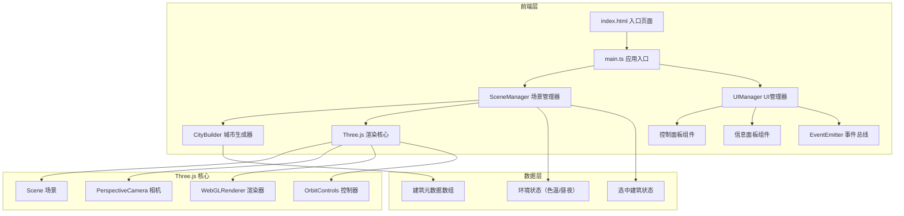

## 1. 架构设计



## 2. 技术描述
- **前端框架**：TypeScript + Three.js + Vite（原生Three.js，无React/Vue）
- **3D渲染**：Three.js r160+，使用BufferGeometry和InstancedMesh优化性能
- **事件系统**：自定义EventEmitter实现模块间通信
- **样式方案**：原生CSS + CSS变量，实现暗色科幻风格
- **性能优化**：合并几何体、LOD策略、Points粒子系统

## 3. 项目目录结构
| 路径 | 职责说明 |
|------|---------|
| `/package.json` | 项目依赖配置（three, typescript, vite, @types/three, @types/node） |
| `/index.html` | 入口HTML页面，全屏布局，背景色#0f0f23 |
| `/vite.config.js` | Vite构建配置，资源路径设置 |
| `/tsconfig.json` | TypeScript配置，严格模式，target ES2020 |
| `/src/main.ts` | 应用入口，初始化Three.js核心组件，挂载OrbitControls |
| `/src/cityBuilder.ts` | 城市生成器，批量生成随机建筑，合并几何体，附加元数据 |
| `/src/sceneManager.ts` | 场景管理器，处理环境更新、昼夜切换、建筑高亮、窗户粒子 |
| `/src/uiManager.ts` | UI管理器，创建控制面板和信息面板，事件绑定与分发 |
| `/src/types.ts` | TypeScript类型定义（建筑数据、环境状态等） |
| `/src/utils/eventEmitter.ts` | 事件发射器，实现模块间解耦通信 |

## 4. 核心类型定义

### 4.1 建筑数据类型
```typescript
interface BuildingMetadata {
  id: number;
  width: number;
  depth: number;
  height: number;
  position: { x: number; z: number };
  floors: number;
  windowsCount: number;
  litWindows: number;
  beaconLight: THREE.PointLight;
}

interface BuildingMesh extends THREE.Mesh {
  userData: {
    buildingId: number;
    metadata: BuildingMetadata;
  };
}
```

### 4.2 环境状态类型
```typescript
interface EnvironmentState {
  colorTemperature: number; // 0-1, 0=暖色#FF9F43, 1=冷色#00D2D3
  isNight: boolean;
  ambientColor: THREE.Color;
  directionalColor: THREE.Color;
}

interface BuildingSelectedEvent {
  buildingId: number;
  metadata: BuildingMetadata;
}
```

## 5. 事件总线定义
| 事件名称 | 触发时机 | 数据载荷 |
|---------|---------|---------|
| `environment:colorTempChange` | 色温滑块拖动时 | `{ value: number }` |
| `environment:dayNightToggle` | 昼夜切换按钮点击时 | `{ isNight: boolean }` |
| `building:selected` | 双击建筑时 | `BuildingSelectedEvent` |
| `building:deselected` | 点击空白区域时 | 无 |

## 6. 性能优化策略
1. **几何体合并**：使用`BufferGeometryUtils.mergeGeometries`合并静态建筑几何体，减少Draw Call
2. **窗户粒子系统**：使用`THREE.Points`批量渲染2000+个窗户光点，而非单独Mesh
3. **元数据分离**：建筑元数据存储在userData中，不参与渲染循环计算
4. **阻尼平滑**：OrbitControls开启enableDamping，相机运动平滑自然
5. **按需更新**：仅在状态变化时更新材质和灯光，避免每帧重建
6. **像素比率限制**：设置renderer.setPixelRatio(Math.min(window.devicePixelRatio, 2))

## 7. 模块接口定义

### 7.1 CityBuilder
```typescript
class CityBuilder {
  constructor(scene: THREE.Scene);
  generateBuildings(count: number): BuildingMesh[];
  getBuildingMeshes(): BuildingMesh[];
  getBuildingMetadata(): BuildingMetadata[];
  createGround(): THREE.Mesh;
  createBeaconLights(): THREE.PointLight[];
}
```

### 7.2 SceneManager
```typescript
class SceneManager {
  constructor(
    scene: THREE.Scene,
    camera: THREE.PerspectiveCamera,
    renderer: THREE.WebGLRenderer,
    eventEmitter: EventEmitter
  );
  setColorTemperature(value: number): void;
  toggleDayNight(isNight: boolean): void;
  highlightBuilding(buildingId: number): void;
  clearHighlight(): void;
  update(delta: number): void; // 动画更新（脉冲灯等）
}
```

### 7.3 UIManager
```typescript
class UIManager {
  constructor(eventEmitter: EventEmitter);
  createControlPanel(): HTMLElement;
  createInfoPanel(): HTMLElement;
  showBuildingInfo(metadata: BuildingMetadata): void;
  hideBuildingInfo(): void;
  updateColorTemperatureUI(value: number): void;
  updateDayNightUI(isNight: boolean): void;
}
```

## 8. 构建与部署
- **开发命令**：`npm run dev` 启动Vite开发服务器
- **构建命令**：`npm run build` 生成生产环境代码
- **预览命令**：`npm run preview` 预览生产构建结果
- **输出目录**：`dist/`
