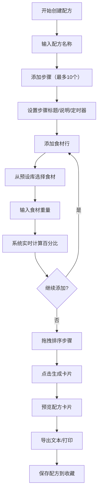

## 1. 产品概述

在线烘焙配方编辑器与标准化工具，为烘焙教学平台提供可视化配方编辑、自动食材比例计算和标准配方卡生成功能。目标用户为烘焙教师和爱好者，解决手工计算食材比例繁琐、配方格式不统一的问题。

产品价值：提供专业级烘焙配方管理，通过自动化计算和标准化输出提升配方创作效率，支持A4打印友好的配方卡片导出。

---

## 2. 核心功能

### 2.1 用户角色
| 角色 | 注册方式 | 核心权限 |
|------|----------|----------|
| 普通用户 | 无需注册（本地使用） | 创建编辑配方、计算比例、导出配方卡、保存收藏 |

### 2.2 功能模块
1. **配方编辑器**：多步骤管理、食材添加、步骤说明、定时器设置
2. **比例计算器**：实时总重量计算、食材百分比计算、可视化进度条
3. **配方卡片**：预览模式、文本导出、打印友好布局
4. **预设食材库**：15种常用食材、搜索过滤、高亮匹配
5. **配方管理**：保存配方、加载模板、收藏列表

### 2.3 页面详情
| 页面名称 | 模块名称 | 功能描述 |
|----------|----------|----------|
| 主编辑页 | 顶部导航栏 | 标题展示、暖棕色风格 |
| 主编辑页 | 步骤编辑区 | 步骤卡片列表、拖拽排序、食材行管理 |
| 主编辑页 | 右侧边栏 | 预设食材库搜索、已保存配方列表 |
| 主编辑页 | 底部操作栏 | 添加步骤按钮、生成卡片按钮 |
| 卡片预览页 | 配方卡片 | A4比例布局、步骤详情、百分比表格、导出按钮 |

---

## 3. 核心流程

用户创建配方流程：输入配方名称 → 添加步骤（每个步骤设置标题、说明、定时器）→ 为步骤添加食材（从预设库选择，输入重量）→ 系统实时计算百分比 → 拖拽调整步骤顺序 → 点击生成卡片预览 → 导出文本或打印。

---

## 4. 用户界面设计

### 4.1 设计风格
- **主色调**：米白色 #FFF8DC（背景）、深棕色 #8B4513（导航/强调）、金色 #FFD700（点缀/按钮）
- **辅助色**：#D2691E（边框分隔）、#F5DEB3（步骤分隔线）、#2E8B57（百分比文字/成功提示）
- **按钮风格**：圆角8px，深棕色按钮配白色文字，金色按钮配深棕色文字，点击缩放效果0.1秒
- **字体**：标题使用具有烘焙感的衬线字体，正文使用清晰易读的无衬线字体
- **布局风格**：卡片式布局，左右分栏（70%编辑区 / 30%边栏），步骤卡片带圆形序号徽章
- **图标风格**：温暖烘焙主题emoji，如 🍞、🥐、🧁、⏱️、📝

### 4.2 页面设计概述
| 页面名称 | 模块名称 | UI元素 |
|----------|----------|--------|
| 主编辑页 | 顶部导航栏 | 深棕底色、金色标题文字、面包图标装饰 |
| 主编辑页 | 步骤卡片 | 米白底色、虚线分隔、圆形序号徽章、放大拖拽效果 |
| 主编辑页 | 食材行 | 下拉选择框、重量输入、渐变色百分比进度条 |
| 主编辑页 | 右侧边栏 | 食材搜索框、配方收藏卡片（悬停上抬效果） |
| 主编辑页 | 底部操作栏 | 固定定位、添加步骤按钮、生成卡片按钮 |
| 卡片预览页 | 配方卡片 | A4比例、淡米色背景、深棕边框、淡入动画0.5秒 |

### 4.3 响应式
- 桌面端（≥768px）：左右分栏布局，编辑区70%，边栏30%
- 移动端（<768px）：上下堆叠布局，宽度100%适配
- 触摸优化：按钮最小高度44px，输入框足够大便于触控

### 4.4 动画效果
- 新增步骤：从顶部滑入0.4秒 ease-out
- 删除步骤：向左缩回消失0.3秒
- 拖拽排序：放大1.05倍，0.2秒 ease-out 弹簧效果
- 进度条：宽度动画0.3秒 ease-out，颜色渐变
- 卡片切换：淡入效果0.5秒
- 保存成功：绿色对勾缩放出现0.5秒，浮动提示上移1秒后消失
- 定时器完成：#FF4500 闪烁提示
