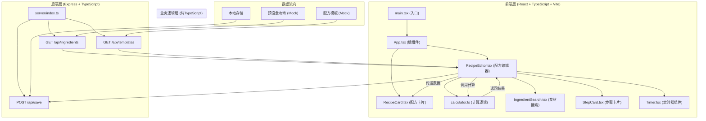
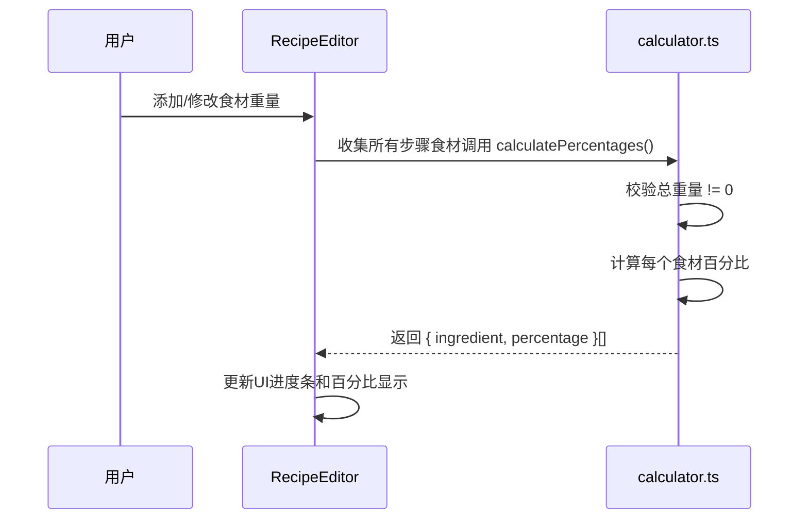
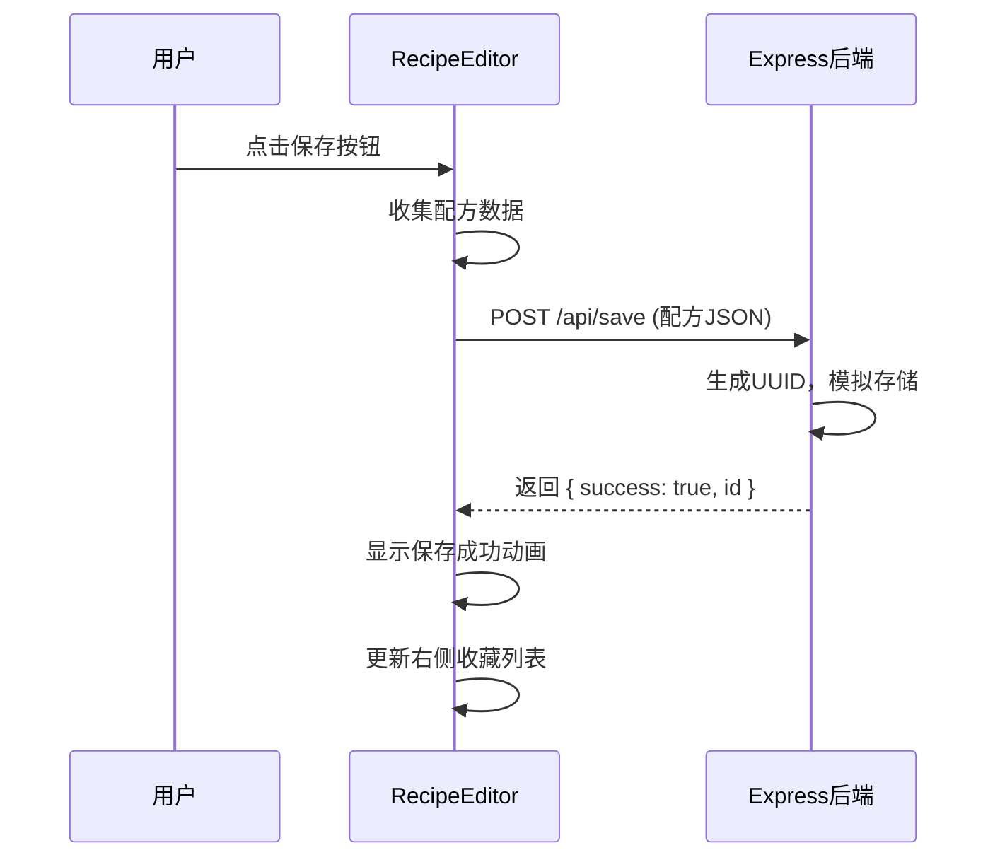
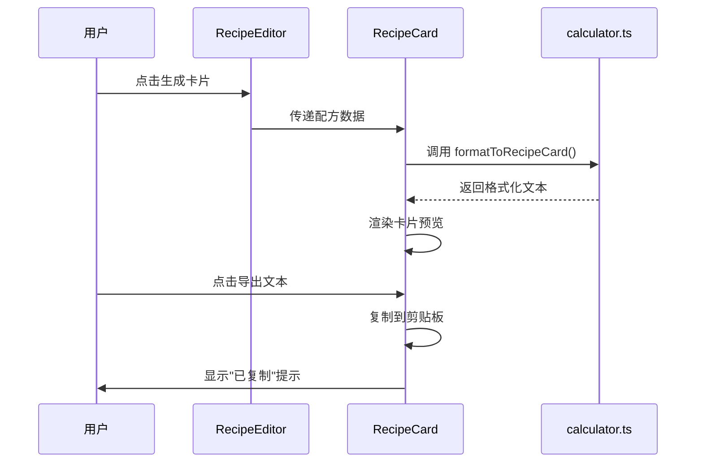

## 1. 架构设计



---

## 2. 技术描述

- **前端框架**：React 18 + TypeScript 5 + Vite 5
- **初始化工具**：Vite 内置 React 模板
- **样式方案**：CSS Modules + 内联样式（动画使用 CSS keyframes）
- **状态管理**：React useState/useReducer（本地状态，无需 Redux）
- **拖拽库**：原生 HTML5 Drag and Drop API（避免额外依赖）
- **后端**：Express 4 + TypeScript
- **HTTP 客户端**：原生 fetch API
- **唯一ID**：uuid 库
- **CORS**：cors 中间件（后端）+ Vite 代理（开发环境）
- **Mock 数据**：后端内置静态数据，无需数据库

---

## 3. 文件结构与调用关系

```
auto34/
├── package.json                 # 依赖配置
├── vite.config.js               # Vite配置，路径别名，API代理
├── tsconfig.json                # TypeScript配置
├── index.html                   # HTML入口
├── src/
│   ├── main.tsx                 # React入口，加载初始数据
│   │   └── 调用: App.tsx
│   ├── App.tsx                  # 根组件，管理视图切换
│   │   ├── 调用: RecipeEditor.tsx
│   │   └── 调用: RecipeCard.tsx
│   ├── components/
│   │   ├── RecipeEditor.tsx     # 核心编辑器
│   │   │   ├── 调用: calculator.ts (calculatePercentages)
│   │   │   ├── 调用: StepCard.tsx
│   │   │   ├── 调用: IngredientSearch.tsx
│   │   │   ├── 调用: Timer.tsx
│   │   │   └── API: GET /api/ingredients, POST /api/save
│   │   ├── RecipeCard.tsx       # 配方卡片展示
│   │   │   └── 调用: calculator.ts (formatToRecipeCard)
│   │   ├── StepCard.tsx         # 步骤卡片组件
│   │   │   ├── 调用: IngredientSearch.tsx
│   │   │   └── 调用: Timer.tsx
│   │   ├── IngredientSearch.tsx # 食材搜索下拉框
│   │   │   └── 调用: 防抖搜索函数
│   │   └── Timer.tsx            # 定时器组件
│   ├── lib/
│   │   ├── calculator.ts        # 纯业务逻辑（无依赖）
│   │   │   ├── calculatePercentages()
│   │   │   └── formatToRecipeCard()
│   │   └── types.ts             # TypeScript类型定义
│   └── styles/
│       └── global.css           # 全局样式和动画
└── server/
    ├── index.ts                 # Express入口
    │   ├── GET /api/ingredients
    │   ├── GET /api/templates
    │   └── POST /api/save
    └── data/
        ├── ingredients.ts       # 预设食材数据
        └── templates.ts         # 配方模板数据
```

---

## 4. 类型定义

```typescript
// src/lib/types.ts

export interface Ingredient {
  id: string;
  name: string;
  weight: number;
  temperature?: number;
  time?: number;
  percentage?: number;
}

export interface RecipeStep {
  id: string;
  title: string;
  description: string;
  timerHours: number;
  timerMinutes: number;
  ingredients: Ingredient[];
}

export interface Recipe {
  id?: string;
  name: string;
  steps: RecipeStep[];
  totalWeight: number;
  createdAt?: string;
}

export interface PresetIngredient {
  name: string;
  density: number;
  unit: string;
  category: string;
}

export interface RecipeTemplate {
  id: string;
  name: string;
  steps: RecipeStep[];
  stepCount: number;
}
```

---

## 5. API 定义

### 5.1 GET /api/ingredients

**描述**：获取预设食材列表

**响应格式**：
```typescript
interface IngredientsResponse {
  success: boolean;
  data: PresetIngredient[];
}
```

**响应示例**：
```json
{
  "success": true,
  "data": [
    { "name": "面粉", "density": 0.52, "unit": "g", "category": "粉类" },
    { "name": "细砂糖", "density": 0.85, "unit": "g", "category": "糖类" },
    ...
  ]
}
```

### 5.2 GET /api/templates

**描述**：获取配方模板列表

**响应格式**：
```typescript
interface TemplatesResponse {
  success: boolean;
  data: RecipeTemplate[];
}
```

### 5.3 POST /api/save

**描述**：保存配方

**请求格式**：
```typescript
interface SaveRecipeRequest {
  name: string;
  steps: RecipeStep[];
  totalWeight: number;
  ingredientPercentages: { name: string; percentage: number }[];
}
```

**响应格式**：
```typescript
interface SaveRecipeResponse {
  success: boolean;
  message: string;
  id: string;
}
```

---

## 6. 核心数据流

### 6.1 食材比例计算流



### 6.2 配方保存流



### 6.3 配方卡片生成流



---

## 7. 性能约束实现方案

| 约束 | 实现方案 |
|------|----------|
| 百分比计算 ≤ 50ms | 纯函数计算，O(n) 复杂度，使用 useMemo 缓存 |
| 拖拽响应 ≤ 100ms | 原生 HTML5 Drag API，避免 React 重渲染，使用 CSS transform |
| 食材加载 ≤ 200ms | 本地 Mock 数据，无网络延迟，后端直接返回 |
| 搜索防抖 | 200ms lodash-style 防抖函数，避免频繁过滤 |

---

## 8. 路由定义

| 视图 | 触发方式 | 描述 |
|------|----------|------|
| 编辑器视图 | 默认 | 主编辑界面，左右分栏 |
| 卡片预览 | 点击"生成卡片" | 全屏配方卡片预览 |
