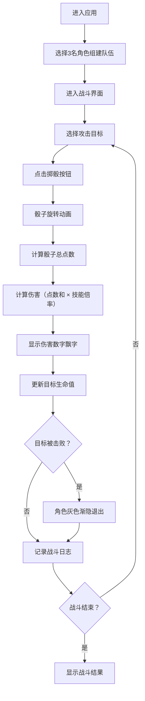

## 1. 产品概述

战术推演工具是一款模拟桌游骰子对战与角色技能释放的策略游戏工具，解决策略游戏中不同骰子组合与角色技能之间的伤害结算复杂、难以直观预览效果的问题。

- 主要用途：帮助桌游玩家和策略游戏爱好者进行战斗模拟、战术推演和伤害计算
- 目标用户：桌游爱好者、策略游戏玩家、游戏设计师
- 产品价值：提供直观的可视化战斗界面，简化复杂的伤害结算流程，提升策略规划效率

## 2. 核心功能

### 2.1 用户角色
| 角色 | 注册方式 | 核心权限 |
|------|----------|----------|
| 普通用户 | 无需注册，直接使用 | 组建队伍、进行战斗模拟、查看战斗日志 |

### 2.2 功能模块
1. **队伍组建页**：角色池展示、角色选择、队伍确认
2. **战斗主界面**：敌我阵营展示、角色状态显示、攻击目标选择
3. **骰子投掷系统**：5个六面骰子、旋转动画、点数计算
4. **伤害结算系统**：技能威力计算、伤害数字飘字、角色击败效果
5. **战斗日志系统**：行动记录、时间倒序展示、高亮最新记录

### 2.3 页面详情
| 页面名称 | 模块名称 | 功能描述 |
|-----------|-------------|---------------------|
| 战斗主界面 | 角色卡片 | 深色主题卡片，点击缩放效果，金色边框闪烁 |
| 战斗主界面 | 生命值条 | 渐变色彩展示，实时更新生命值 |
| 战斗主界面 | 目标选择 | 点击我方角色作为攻击目标，圆形光环脉动效果 |
| 战斗主界面 | 骰子区域 | 毛玻璃背景，5个骰子旋转动画，磨砂质感 |
| 战斗主界面 | 战斗日志 | 右侧面板，倒序显示，滑入动画，高亮最新 |
| 战斗主界面 | 控制按钮 | 掷骰按钮，悬停效果，平滑过渡 |

## 3. 核心流程

用户从预设角色池中选择3名角色组建队伍，进入战斗界面后，选择攻击目标，点击掷骰按钮投掷5个骰子，系统根据骰子总点数和当前角色技能威力计算伤害，对目标造成伤害并更新生命值，战斗过程记录在日志面板中，直到一方角色全部被击败。

## 4. 用户界面设计

### 4.1 设计风格
- **主色调**：深色主题 #2C3E50
- **辅助色**：金色高亮 #F1C40F
- **危险色**：红色 #E74C3C
- **成功色**：绿色 #2ECC71
- **信息色**：蓝色 #3498DB
- **文字色**：浅色 #ECF0F1
- **次要文字**：浅灰色 #BDC3C7
- **按钮风格**：圆角矩形，悬停时颜色变亮，平滑过渡0.2秒
- **字体**：使用现代无衬线字体，标题加粗，正文清晰可读
- **布局风格**：左右分栏（小于768px垂直排列），毛玻璃效果，精致阴影
- **动画风格**：流畅的CSS动画，60fps帧率，微交互反馈

### 4.2 页面设计概述
| 页面名称 | 模块名称 | UI元素 |
|-----------|-------------|-------------|
| 战斗主界面 | 角色卡片 | 背景#2C3E50，文字#ECF0F1，点击缩放1.05（0.2s），金色边框#F1C40F闪烁 |
| 战斗主界面 | 生命值条 | 渐变从#E74C3C到#2ECC71，宽度随生命值变化 |
| 战斗主界面 | 目标光环 | 圆形#F39C12，脉动周期1.5秒 |
| 战斗主界面 | 骰子区域 | 毛玻璃背景backdrop-filter: blur(8px)，骰子#34495E磨砂质感，点数#FFFFFF，旋转动画1秒 |
| 战斗主界面 | 伤害数字 | 红色24px加粗，飘落动画0.6秒 |
| 战斗主界面 | 战斗日志 | 右侧可滚动面板，条目#BDC3C7，最新#3498DB，滑入动画0.3秒 |
| 战斗主界面 | 击败效果 | 灰色半透明，渐隐退出0.5秒 |

### 4.3 响应式设计
- **桌面端（>768px）**：左右分栏布局，左侧我方阵营，中间战斗区域，右侧敌方阵营和日志
- **移动端（≤768px）**：垂直排列，上方我方阵营，中间战斗区域，下方敌方阵营和日志
- **触摸优化**：增大点击区域，按钮最小高度44px，支持触摸滑动查看日志

### 4.4 性能要求
- 骰子动画帧率达到60fps
- 战斗日志渲染不超过100ms
- 所有动画使用CSS transform和opacity属性以获得最佳性能
- 使用will-change优化动画性能
