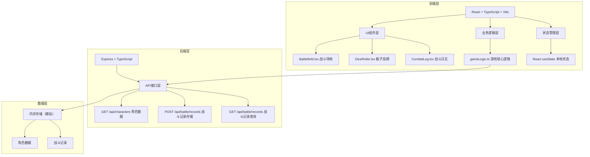
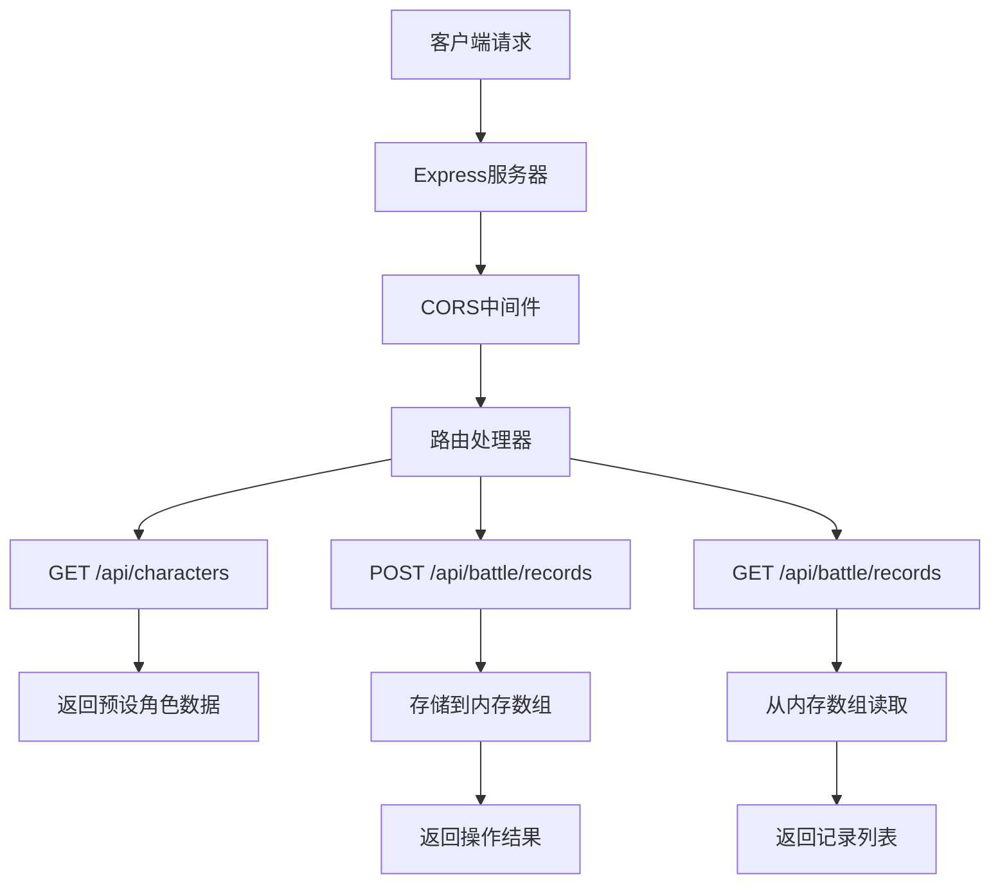
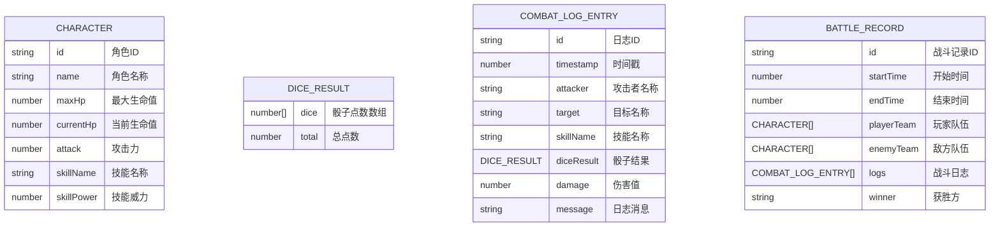

## 1. 架构设计



## 2. 技术描述

- **前端**：React@18 + TypeScript + Vite@5
- **初始化工具**：Vite
- **后端**：Express@4 + TypeScript
- **状态管理**：React useState（本地组件状态）
- **数据存储**：内存模拟（无需数据库）
- **代码规范**：strict模式，target ES2020

## 3. 路由定义

| 路由 | 用途 |
|-------|---------|
| / | 主应用页面，包含队伍选择和战斗界面 |

## 4. API 定义

### 类型定义
```typescript
interface Character {
  id: string;
  name: string;
  maxHp: number;
  currentHp: number;
  attack: number;
  skillName: string;
  skillPower: number;
  avatar?: string;
}

interface DiceResult {
  dice: number[];
  total: number;
}

interface CombatLogEntry {
  id: string;
  timestamp: number;
  attacker: string;
  target: string;
  skillName: string;
  diceResult: DiceResult;
  damage: number;
  message: string;
}

interface BattleRecord {
  id: string;
  startTime: number;
  endTime: number;
  playerTeam: Character[];
  enemyTeam: Character[];
  logs: CombatLogEntry[];
  winner: 'player' | 'enemy';
}
```

### API 接口

#### GET /api/characters
- 描述：获取预设角色池数据
- 请求参数：无
- 响应：`Character[]` 角色列表

#### POST /api/battle/records
- 描述：存储战斗记录
- 请求体：`BattleRecord` 战斗记录对象
- 响应：`{ success: boolean; recordId: string }`

#### GET /api/battle/records
- 描述：获取历史战斗记录
- 请求参数：无
- 响应：`BattleRecord[]` 战斗记录列表

## 5. 服务器架构图



## 6. 数据模型

### 6.1 数据模型定义



### 6.2 初始数据

预设角色池数据（6个角色供选择）：

```typescript
const presetCharacters: Character[] = [
  {
    id: 'warrior',
    name: '狂战士',
    maxHp: 120,
    currentHp: 120,
    attack: 15,
    skillName: '重击',
    skillPower: 1.5,
  },
  {
    id: 'mage',
    name: '火焰法师',
    maxHp: 80,
    currentHp: 80,
    attack: 10,
    skillName: '火球术',
    skillPower: 2.0,
  },
  {
    id: 'archer',
    name: '精灵射手',
    maxHp: 90,
    currentHp: 90,
    attack: 12,
    skillName: '穿透箭',
    skillPower: 1.8,
  },
  {
    id: 'healer',
    name: '神圣牧师',
    maxHp: 70,
    currentHp: 70,
    attack: 8,
    skillName: '圣光打击',
    skillPower: 1.2,
  },
  {
    id: 'rogue',
    name: '暗影刺客',
    maxHp: 85,
    currentHp: 85,
    attack: 18,
    skillName: '背刺',
    skillPower: 2.2,
  },
  {
    id: 'knight',
    name: '圣骑士',
    maxHp: 150,
    currentHp: 150,
    attack: 10,
    skillName: '审判',
    skillPower: 1.4,
  },
];
```
