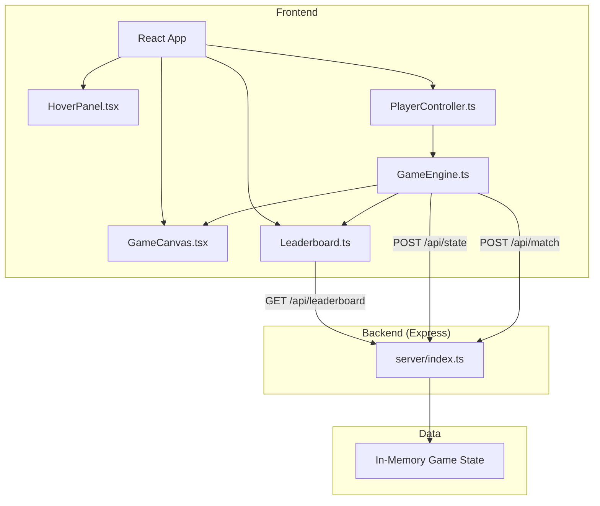
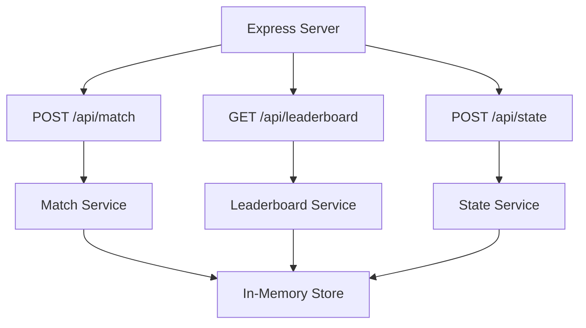
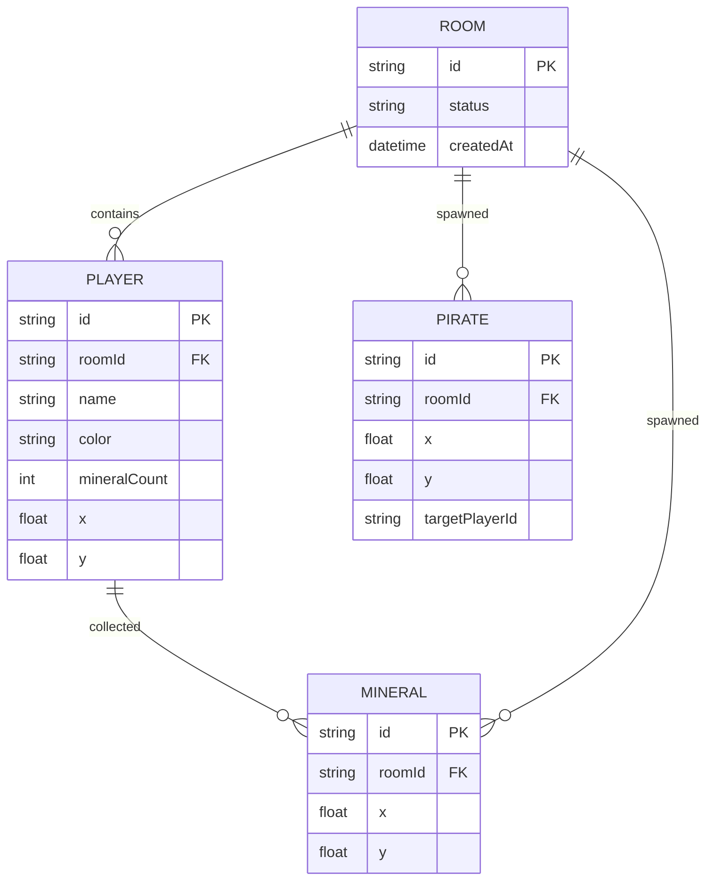

## 1. 架构设计



## 2. 技术描述

- 前端：React@18 + TypeScript + Vite
- 游戏渲染：Canvas 2D API
- 后端：Express@4 + TypeScript
- 状态管理：React useState/useRef + 自定义GameEngine类
- 通信：Fetch API 与 Express 后端交互
- 物理引擎：自定义2D物理模拟（加速度、惯性、摩擦力、碰撞检测）
- 碰撞优化：空间哈希（32x32网格）

## 3. 项目结构

```
auto43/
├── package.json
├── vite.config.js
├── tsconfig.json
├── index.html
├── src/
│   ├── game/
│   │   └── GameEngine.ts          # 游戏主循环、物理引擎、碰撞检测
│   ├── player/
│   │   ├── PlayerController.ts    # 键盘事件处理
│   │   └── Leaderboard.ts         # 排行榜逻辑
│   ├── ui/
│   │   ├── GameCanvas.tsx         # Canvas 2D渲染
│   │   └── HoverPanel.tsx         # 悬停提示
│   ├── App.tsx
│   └── main.tsx
└── server/
    └── index.ts                   # Express后端API
```

## 4. API 定义

### 类型定义

```typescript
interface Player {
  id: string;
  name: string;
  x: number;
  y: number;
  vx: number;
  vy: number;
  mineralCount: number;
  color: string;
  speedBonus: number;
}

interface Mineral {
  id: string;
  x: number;
  y: number;
  opacity: number;
}

interface Pirate {
  id: string;
  x: number;
  y: number;
  targetPlayerId: string;
  angle: number;
}

interface LeaderboardEntry {
  playerId: string;
  name: string;
  mineralCount: number;
}
```

### POST /api/match
创建房间并分配玩家

**Request:**
```json
{
  "playerNames": ["玩家1", "玩家2", "玩家3"]
}
```

**Response:**
```json
{
  "roomId": "uuid",
  "players": [
    {"id": "uuid", "name": "玩家1", "color": "#FF6B6B"},
    {"id": "uuid", "name": "玩家2", "color": "#4ECDC4"},
    {"id": "uuid", "name": "玩家3", "color": "#FFE66D"}
  ]
}
```

### GET /api/leaderboard
返回Top10排行榜

**Response:**
```json
[
  {"playerId": "uuid", "name": "玩家1", "mineralCount": 25},
  {"playerId": "uuid", "name": "玩家2", "mineralCount": 18},
  {"playerId": "uuid", "name": "玩家3", "mineralCount": 12}
]
```

### POST /api/state
更新游戏状态

**Request:**
```json
{
  "roomId": "uuid",
  "players": [
    {"id": "uuid", "mineralCount": 25},
    {"id": "uuid", "mineralCount": 18}
  ]
}
```

**Response:**
```json
{"success": true}
```

## 5. 游戏常量

| 常量名称 | 值 | 说明 |
|----------|-----|------|
| MAP_WIDTH | 1200 | 地图宽度 |
| MAP_HEIGHT | 800 | 地图高度 |
| ACCELERATION | 0.05 | 飞船加速度 |
| MAX_SPEED | 5 | 最大速度像素/帧 |
| FRICTION | 0.98 | 每帧摩擦力 |
| BOUNCE_DAMPING | 0.7 | 边界碰撞速度衰减 |
| PICKUP_RANGE | 16 | 矿物拾取范围 |
| MINERAL_SPAWN_INTERVAL | 1500 | 矿物生成间隔ms |
| MINERAL_SPAWN_COUNT | 5 | 每批生成数量 |
| PIRATE_SPAWN_INTERVAL | 5000 | 海盗生成间隔ms |
| PIRATE_SPEED | 3 | 海盗速度 |
| PIRATE_ATTACK_RANGE | 30 | 海盗攻击范围 |
| WIN_MINERALS | 30 | 获胜所需矿物数 |
| GRID_SIZE | 32 | 空间哈希网格大小 |
| SPEED_BONUS_PER_3 | 0.02 | 每3个矿物速度加成 |
| MAX_SPEED_BONUS_MULTIPLIER | 1.5 | 最大速度加成倍数 |

## 6. 服务器架构



## 7. 数据模型

### 7.1 数据模型定义



### 7.2 内存数据结构

```typescript
interface RoomState {
  id: string;
  players: PlayerState[];
  status: 'waiting' | 'playing' | 'finished';
}

interface PlayerState {
  id: string;
  name: string;
  mineralCount: number;
  color: string;
}
```
