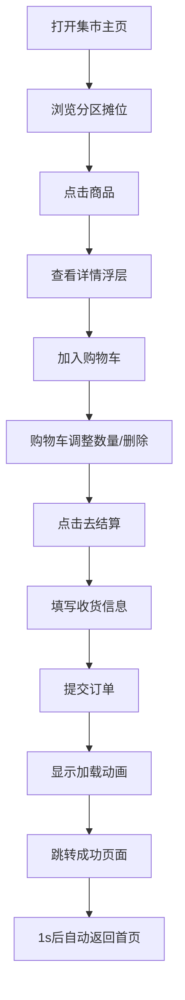

## 1. 产品概述

在线虚拟美食集市是一个浏览器端的电商模拟应用，让用户像逛菜市场一样浏览按类型分区的摊位（蔬果、烘焙、熟食、甜点），选购商品并完成订单。

- 核心目标：打造沉浸式的虚拟集市购物体验，涵盖浏览、选品、加购、结算全流程
- 目标用户：对在线购物体验感兴趣的普通用户
- 市场价值：展示前端交互设计能力与全栈开发能力的综合性演示项目

## 2. 核心功能

### 2.1 功能模块

1. **集市主页**：分区导航栏、摊位卡片网格、商品详情浮层、固定购物车面板
2. **结算页面**：订单明细表格、收货信息表单、提交加载动画
3. **订单成功页面**：成功状态动画、订单号展示、自动返回首页

### 2.2 页面详情

| 页面名称 | 模块名称 | 功能描述 |
|---------|---------|---------|
| 集市主页 | 分区导航栏 | 网格布局展示4个分区色块，点击平滑滚动到对应区域 |
| 集市主页 | 摊位卡片 | 圆角渐变卡片，展示摊位信息、商品、已售热度标签 |
| 集市主页 | 商品详情浮层 | 弹出大图、简介、加入购物车按钮（含微交互动画） |
| 集市主页 | 购物车面板 | 右侧固定，展示商品列表、数量增减、删除、总价、去结算按钮（呼吸动效） |
| 结算页面 | 订单明细表格 | 隔行变色展示商品、数量、单价、小计、总计（含优惠） |
| 结算页面 | 收货信息表单 | 姓名、电话、地址输入框，聚焦高亮边框 |
| 结算页面 | 提交逻辑 | 加载旋转动画 → 跳转成功页 |
| 订单成功页面 | 成功状态 | 绿色渐变背景、旋转扩散圆环、订单号、1秒后自动返回 |

## 3. 核心流程

用户打开集市主页 → 浏览分区摊位 → 点击商品查看详情 → 加入购物车 → 购物车调整数量 → 点击去结算 → 填写收货信息 → 提交订单 → 显示成功页 → 自动返回集市

## 4. 用户界面设计

### 4.1 设计风格

- **主色调**：蔬果绿#27AE60、烘焙橙#F39C12、熟食红#E74C3C、甜点紫#9B59B6
- **强调色**：购物车蓝#3498DB、悬停蓝#2980B9、热度金#F1C40F
- **背景色**：卡片白渐变白→#F8F9FA、购物车#2C3E50、成功页绿渐变#2ECC71→#27AE60
- **按钮风格**：圆角矩形，点击scale(0.95)收缩反馈，0.1s过渡
- **字体**：系统默认无衬线字体，白色/深色文字高对比度
- **布局风格**：桌面端左侧主内容网格 + 右侧320px固定购物车面板
- **图标风格**：CSS绘制的简笔画白色图标，置于分区色块顶部

### 4.2 页面设计概述

| 页面名称 | 模块名称 | UI元素 |
|---------|---------|--------|
| 集市主页 | 分区导航栏 | 4个矩形色块（指定颜色），白色CSS图标，0.5s平滑滚动 |
| 集市主页 | 摊位卡片 | 圆角矩形渐变背景，右下角热度标签（#F1C40F背景，#2C3E50字色） |
| 集市主页 | 商品浮层 | #FFFFFF背景16px圆角，0 4px 12px rgba(0,0,0,0.1)阴影 |
| 集市主页 | 购物车面板 | #2C3E50背景#ECF0F1字色，320px宽度，商品项高度0.2s过渡，非空时按钮呼吸光晕 |
| 结算页面 | 订单表格 | #34495E表头背景白字，隔行#F2F4F4背景 |
| 结算页面 | 表单输入 | 聚焦时边框#3498DB，0.2s过渡，加载旋转动画0.8s一圈半 |
| 成功页面 | 状态展示 | 绿渐变背景，旋转扩散圆环动画1s，中央订单号 |

### 4.3 响应式

- 桌面优先设计，主内容区自适应，购物车面板固定320px右侧
- 性能要求：首屏渲染≤1.5s，浮层弹出延迟<200ms

### 4.4 优惠规则

- 满100元减10元（10%满减优惠），在结算页展示折扣金额
