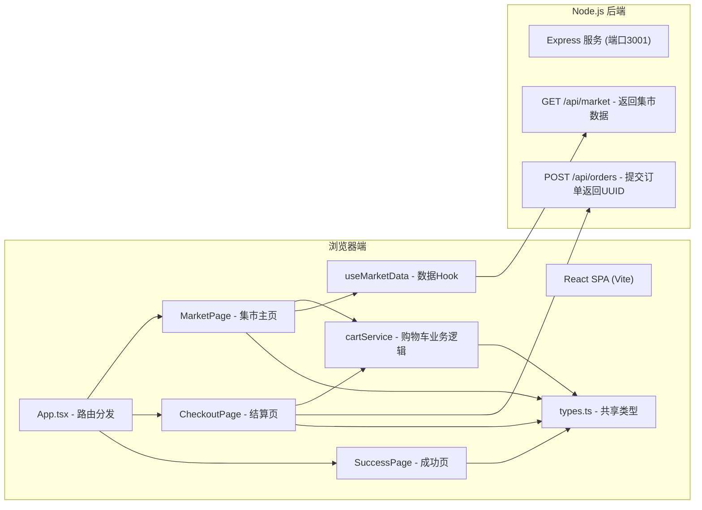
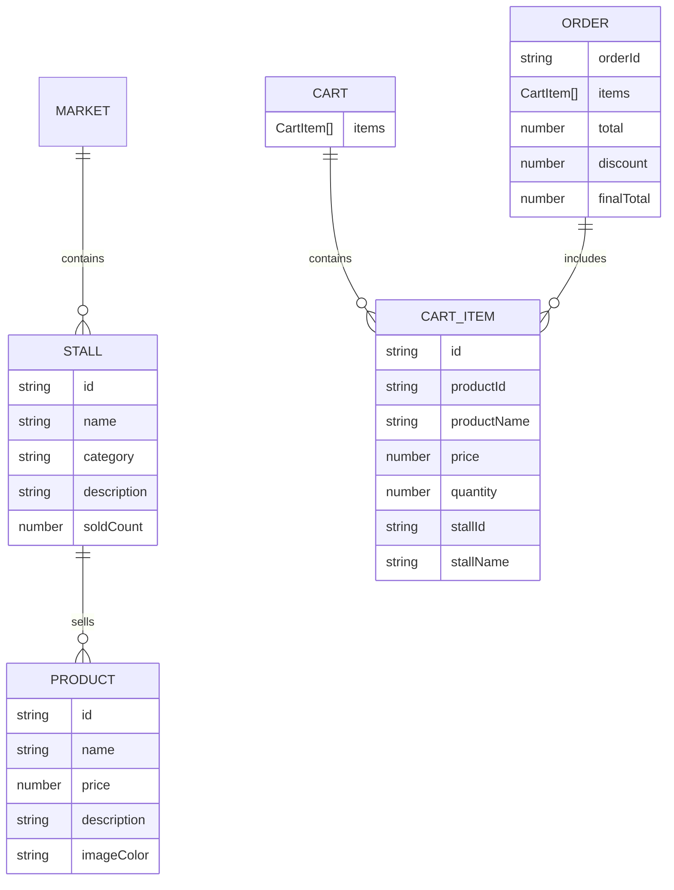

## 1. 架构设计



## 2. 技术说明

- **前端框架**: React 18 + TypeScript + Vite 5
- **前端路由**: 使用 React 简单路由状态（无需额外路由库，基于useState切换页面）
- **前端构建工具**: Vite，配置 /api 代理到 localhost:3001
- **样式方案**: 纯 CSS + CSS Modules（或内联style），不使用UI组件库
- **后端框架**: Express 4，端口3001
- **跨域处理**: cors 中间件 + Vite dev proxy
- **订单ID生成**: uuid (v4)
- **数据**: 内存 Mock 数据，无数据库

## 3. 页面路由定义

| 路由（逻辑页面） | 用途 |
|----------------|------|
| / (home) | 集市主页，展示分区、摊位卡片、购物车面板 |
| /checkout | 结算页面，展示订单明细和收货表单 |
| /success | 订单成功页，展示订单号和成功动画 |

## 4. API 定义

### GET /api/market

**Response**:
```typescript
interface MarketResponse {
  stalls: Stall[];
}
```

### POST /api/orders

**Request**:
```typescript
interface OrderRequest {
  items: CartItem[];
  total: number;
  discount: number;
  finalTotal: number;
  shippingInfo: {
    name: string;
    phone: string;
    address: string;
  };
}
```

**Response**:
```typescript
interface OrderResponse {
  orderId: string;
  success: boolean;
}
```

## 5. 数据模型



## 6. 项目文件结构

```
auto64/
├── package.json
├── index.html
├── vite.config.js
├── tsconfig.json
├── server/
│   └── server.ts
└── src/
    ├── App.tsx
    ├── types.ts
    ├── cart/
    │   └── cartService.ts
    ├── data/
    │   └── useMarketData.ts
    └── pages/
        ├── MarketPage.tsx
        ├── CheckoutPage.tsx
        └── SuccessPage.tsx
```

## 7. 核心业务逻辑

### 购物车服务 cartService.ts（纯TS模块）

- `addItem(cart, product, stall): Cart` - 添加商品，数量+1
- `removeItem(cart, productId): Cart` - 删除指定商品
- `updateQuantity(cart, productId, quantity): Cart` - 更新数量（校验≥0，=0则删除）
- `calculateTotal(cart): { total, discount, finalTotal }` - 计算总价及10%满减（满100减10）
- `getItemCount(cart): number` - 获取商品总件数

### 优惠规则

- 订单满100元立减10元（10%折扣，取整至元）
- 不满100元无优惠
