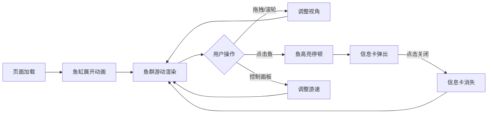

## 1. 产品概述

数字水族箱是一款面向海洋馆游客的3D互动科普应用，通过沉浸式三维模拟让游客在触摸屏上观察热带鱼群游动，点击鱼身获取科普知识，增强游客互动体验与海洋生物认知。

- 核心价值：将传统静态展示转化为动态互动体验，提升海洋馆科普教育趣味性
- 目标用户：海洋馆游客、家庭观众、学生群体
- 市场定位：科普教育类互动展示系统，可部署于触摸屏终端或网页端

## 2. 核心 Features

### 2.1 用户角色
| 角色 | 使用方式 | 核心权限 |
|------|----------|----------|
| 游客 | 触摸屏交互 | 观察鱼群、点击查看科普信息、调整游速 |

### 2.2 Feature Module
1. **3D水族箱场景**：动态水体、珊瑚群、海草、半透明玻璃鱼缸
2. **鱼群模拟系统**：30条鱼分5种，各具形态、颜色和游动模式
3. **交互科普系统**：点击鱼身显示信息卡，包含鱼种科普知识
4. **控制面板**：单鱼加速、全群速度调节
5. **相机控制系统**：拖拽旋转、滚轮缩放、右键平移

### 2.3 Page Details
| 页面名称 | 模块名称 | Feature 描述 |
|----------|----------|--------------|
| 主界面 | 3D水族箱场景 | 深度渐变蓝色背景，珊瑚海草装饰，玻璃鱼缸容器 |
| 主界面 | 鱼群游动模拟 | 30条鱼5种模型，正弦波游动路径，身体摆动动画 |
| 主界面 | 信息卡弹窗 | 点击鱼显示鱼种名、食性、趣闻，半透明毛玻璃效果 |
| 主界面 | UI控制面板 | 右下角固定面板，单鱼加速按钮+全群速度滑块 |
| 主界面 | 相机控制 | OrbitControls支持旋转、缩放、平移 |

## 3. 核心流程

用户进入界面后，首先看到加载动画，鱼缸从中心向外扩散展开。随后30条热带鱼在珊瑚海草间自然游动。用户可通过鼠标拖拽旋转视角、滚轮缩放观察细节。当点击任意一条鱼时，该鱼短暂停顿高亮，同时左上角弹出信息卡展示科普内容。用户可通过右下角控制面板调整单条或全部鱼的游动速度。点击卡片外区域或关闭按钮可关闭信息卡。

## 4. 用户界面设计

### 4.1 设计风格
- **主色调**：深蓝到紫色渐变背景（#0B3D91 → #6B4EAD），营造深海沉浸感
- **点缀色**：珊瑚暖色（#FF6B6B #FFD93D #6BCB77）形成冷暖对比
- **鱼群颜色**：5种鲜明色彩（#FF6B6B #4ECDC4 #FFD93D #6BCB77 #7C4DFF）
- **UI元素**：统一圆角8px，阴影#000 30% 0px 4px
- **玻璃效果**：半透明毛玻璃，背景透明度20%-90%
- **字体**：选用现代无衬线字体，标题加粗，正文清晰易读
- **动效**：所有交互带过渡动画，弹性缓动曲线增强质感

### 4.2 Page Design Overview
| 页面名称 | 模块名称 | UI Elements |
|----------|----------|-------------|
| 主界面 | 3D水族箱 | 渐变背景、珊瑚群、摇摆海草、玻璃鱼缸、30条游动的鱼 |
| 主界面 | 信息卡 | 左上角定位，#1E3A5F 90%透明度，圆角16px，0.3s淡入上浮10px |
| 主界面 | 控制面板 | 右下角固定，毛玻璃效果，#FFFFFF 20%混合，圆角12px，白边1px |
| 主界面 | 加载动画 | 中心圆点向外扩散，0.4s弹性ease-out |

### 4.3 Responsiveness
- Desktop-first设计，最小宽度800px
- 纵向高度自适应，3D场景充满视口
- 控制面板固定右下角，信息卡固定左上角
- 触摸屏操作优化：点击区域放大，滑动手势支持

### 4.4 3D Scene Guidance
- **环境**：深度渐变蓝色水体（#87CEEB → #0B3D91），营造水下氛围
- **光照**：上方主光源模拟水面光照，底部补光增强珊瑚色彩
- **相机**：PerspectiveCamera，初始视角略微俯视，覆盖整个鱼缸
- **构图**：鱼群为视觉中心，珊瑚海草点缀底部，玻璃边框限定空间
- **交互**：点击鱼身触发高亮停顿，Raycaster精确拾取
- **后处理**：轻微辉光效果增强鱼身高亮，水体雾化模拟水下景深
- **性能**：30条鱼使用Geometry实例化，目标帧率≥30fps

## 5. 性能与交互约束
- 点击反馈延迟 ≤ 100ms
- 30条鱼同时显示帧率 ≥ 30fps
- 游速滑块响应延迟 ≤ 50ms
- 内存占用 ≤ 500MB
