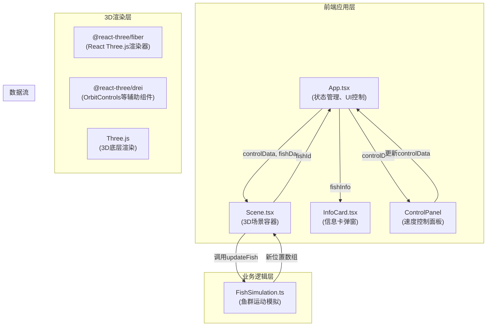
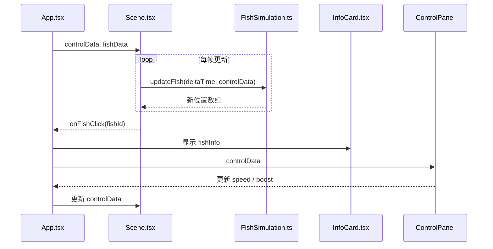

## 1. 架构设计



## 2. 技术栈说明

- **前端框架**：React@18 + TypeScript@5
- **构建工具**：Vite@5 + @vitejs/plugin-react@4
- **3D渲染**：Three.js@0.160 + @react-three/fiber@8 + @react-three/drei@9
- **类型定义**：@types/three + @types/react + @types/react-dom
- **样式方案**：CSS-in-JS (styled-components / inline style)
- **状态管理**：React useState / useRef 本地状态

## 3. 项目结构

```
auto66/
├── index.html                 # 入口HTML
├── package.json               # 依赖配置
├── vite.config.js             # Vite构建配置
├── tsconfig.json              # TypeScript配置
├── src/
│   ├── App.tsx                # 主应用组件
│   ├── Scene.tsx              # 3D场景容器
│   ├── FishSimulation.ts      # 鱼群模拟逻辑
│   ├── InfoCard.tsx           # 信息卡组件
│   ├── main.tsx               # 应用入口
│   └── index.css              # 全局样式
└── .trae/documents/
    ├── PRD_数字水族箱.md
    └── TECH_ARCH_数字水族箱.md
```

## 4. 核心数据流

### 4.1 数据流图



### 4.2 文件调用关系

| 模块 | 依赖 | 输出 | 说明 |
|------|------|------|------|
| App.tsx | Scene.tsx, InfoCard.tsx | controlData, fishData | 状态管理中心，协调所有组件 |
| Scene.tsx | FishSimulation.ts, three.js | 3D场景渲染, fishId点击事件 | 接收控制参数，调用模拟层，触发交互 |
| FishSimulation.ts | 无外部依赖 | 鱼位置数组 | 纯TypeScript逻辑，计算鱼群运动 |
| InfoCard.tsx | 无外部依赖 | 关闭事件 | 展示科普信息 |

## 5. 数据模型定义

### 5.1 Fish数据结构

```typescript
interface Fish {
  id: number;
  type: number;          // 0-4 对应5种鱼
  color: string;
  name: string;
  diet: string;
  funFact: string;
  position: { x: number; y: number; z: number };
  rotation: { x: number; y: number; z: number };
  speed: number;
  baseSpeed: number;
  pathOffset: number;    // 游动路径随机偏移
  wavePhase: number;     // 身体摆动相位
  isPaused: boolean;
  isBoosted: boolean;
  boostEndTime: number;
}

interface FishType {
  name: string;
  color: string;
  shape: 'triangle' | 'circle' | 'streamline' | 'flat' | 'long';
  diet: string;
  funFact: string;
}

interface ControlData {
  globalSpeed: number;   // 0.5 - 3.0
  boostedFishId: number | null;
}
```

### 5.2 5种鱼类预设数据

```typescript
const FISH_TYPES: FishType[] = [
  {
    name: '小丑鱼',
    color: '#FF6B6B',
    shape: 'triangle',
    diet: '杂食',
    funFact: '小丑鱼会变性，最强壮的母鱼是首领'
  },
  {
    name: '蓝倒吊',
    color: '#4ECDC4',
    shape: 'flat',
    diet: '草食',
    funFact: '蓝倒吊尾部有尖锐毒刺，用于防御天敌'
  },
  {
    name: '蝴蝶鱼',
    color: '#FFD93D',
    shape: 'circle',
    diet: '肉食',
    funFact: '蝴蝶鱼通常成对生活，对伴侣忠贞不渝'
  },
  {
    name: '霓虹灯鱼',
    color: '#6BCB77',
    shape: 'streamline',
    diet: '杂食',
    funFact: '霓虹灯鱼身体侧面有闪亮的蓝色条纹，如霓虹灯光'
  },
  {
    name: '神仙鱼',
    color: '#7C4DFF',
    shape: 'long',
    diet: '肉食',
    funFact: '神仙鱼背鳍和臀鳍很长，游动姿态优雅如天使'
  }
];
```

## 6. 核心算法

### 6.1 鱼群游动算法

```
位置更新公式：
X(t) = centerX + radius * cos(ω*t + offset) * speedMultiplier
Y(t) = baseY + amplitude * sin(2*ω*t + offset) * waveMultiplier
Z(t) = centerZ + radius * sin(ω*t + offset) * speedMultiplier

身体摆动：
tailWag = sin(t * 10 + phase) * 0.3
```

### 6.2 碰撞检测与边界处理

```
鱼缸边界：x ∈ [-8, 8], y ∈ [-3, 4], z ∈ [-5, 5]
当鱼接近边界时，通过调整转向角度使其自然回避
```

## 7. 性能优化策略

1. **对象池**：30条鱼在初始化时一次性创建，避免运行时GC
2. **Geometry复用**：同类型鱼共享Geometry实例
3. **矩阵更新**：使用Matrix4手动更新变换，减少React重渲染
4. **useFrame**：在@react-three/fiber的useFrame中更新，与渲染同步
5. **Raycaster优化**：仅检测鱼群Mesh，忽略场景其他元素
6. **requestAnimationFrame**：所有动画基于RAF，确保平滑

## 8. 构建与部署

- **开发启动**：`npm run dev` → http://localhost:5173
- **生产构建**：`npm run build` → dist/ 目录
- **类型检查**：`tsc --noEmit`
- **依赖安装**：`npm install`

