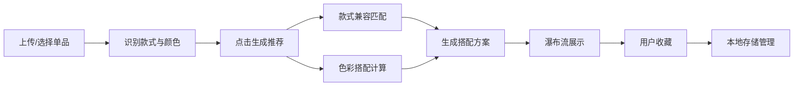

## 1. 产品概述

古着衣物款式识别与穿搭风格推荐系统，帮助用户快速识别衣物款式与颜色，并基于季节、场合提供个性化穿搭方案，支持收藏管理。

- 核心价值：解决用户穿搭难题，通过智能算法提供专业搭配建议
- 目标用户：时尚爱好者、古着收藏者、日常穿搭需求用户
- 市场定位：轻量级穿搭辅助工具，兼具实用性与趣味性

## 2. 核心功能

### 2.1 用户角色

| 角色 | 注册方式 | 核心权限 |
|------|----------|----------|
| 普通用户 | 无需注册，本地存储 | 上传图片、浏览单品、生成推荐、收藏搭配 |

### 2.2 功能模块

1. **主页**：拖拽上传区域、精选单品卡片网格
2. **单品详情页**：大图展示、属性标签、生成推荐按钮
3. **推荐方案页**：瀑布流搭配展示、一键收藏
4. **收藏抽屉**：收藏列表管理、取消收藏

### 2.3 页面详情

| 页面名称 | 模块名称 | 功能描述 |
|----------|----------|----------|
| 主页 | 拖拽上传区 | 支持拖拽/点击上传衣物照片，实时预览 |
| 主页 | 单品卡片网格 | 2列展示12张精选单品，点击进入详情 |
| 详情页 | 属性面板 | 展示款式、颜色、季节、场合标签 |
| 详情页 | 生成推荐 | 基于单品属性计算6-8套搭配方案 |
| 推荐页 | 瀑布流卡片 | 展示搭配方案，支持悬停动效 |
| 推荐页 | 收藏按钮 | 心形按钮，点击收藏/取消 |
| 收藏抽屉 | 收藏列表 | 半屏滑入展示，支持取消收藏 |

## 3. 核心流程

用户上传衣物照片或选择单品 → 系统识别款式与颜色 → 点击生成推荐 → 基于款式兼容规则和色彩搭配算法计算搭配方案 → 瀑布流展示结果 → 用户收藏喜欢的搭配 → 收藏抽屉管理

## 4. 用户界面设计

### 4.1 设计风格

- 主色调：米色 #F5F0E1（背景）、深灰色 #2C3E50（文字）
- 强调色：橙色 #E67E22（按钮点缀）、蓝色 #3498DB（标签）、红色 #E74C3C（收藏）、绿色 #2ECC71（季节/场合）
- 圆角风格：统一使用 8px 圆角
- 字体：使用 Playfair Display（标题）+ Lato（正文），提升复古时尚感
- 动效风格：优雅的微交互动画，过渡时间 0.15s-0.5s

### 4.2 页面设计概述

| 页面名称 | 模块名称 | UI 元素 |
|----------|----------|---------|
| 主页 | 拖拽上传区 | 400x200px，虚线边框 #BDC3C7，背景 #F4F6F7，拖入时实线 #3498DB + 0.3s 蓝色脉冲光效 |
| 主页 | 单品卡片 | 200x200px，圆角 8px，悬停 scale(1.03) + 阴影 4px #D5D8DC |
| 详情页 | 大图展示 | 600x600px，0.5s 淡入动画 |
| 详情页 | 属性标签 | 款式胶囊标签 #3498DB，颜色色块 #E74C3C，季节/场合 #2ECC71，点击 0.15s 缩放反馈 |
| 详情页 | 生成推荐按钮 | 渐变 #3498DB → #2980B9，240x48px，悬停亮度+15% 右移 4px |
| 推荐页 | 瀑布流卡片 | CSS columns 布局，悬停 translateY -8px + 加深阴影 |
| 推荐页 | 收藏按钮 | 心形，点击填充 #E74C3C + 0.3s 弹跳动画 |
| 收藏抽屉 | 抽屉面板 | 右侧滑入 0.4s ease-out，半屏宽度 |

### 4.3 响应式

- 桌面端优先设计，1280px 以上最佳体验
- 移动端自适应，卡片网格调整为 1 列
- 触摸设备优化，确保点击区域 ≥ 44x44px

### 4.4 性能指标

- 首次加载时间 ≤ 2s
- 图片懒加载使用 IntersectionObserver
- 推荐计算响应时间 ≤ 500ms（客户端完成）
