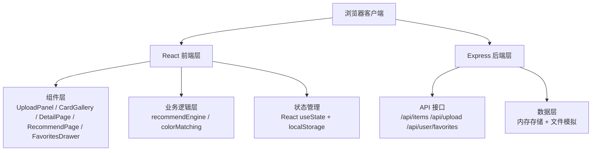
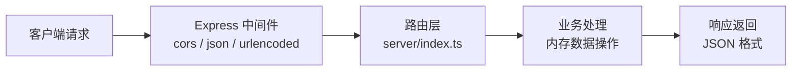
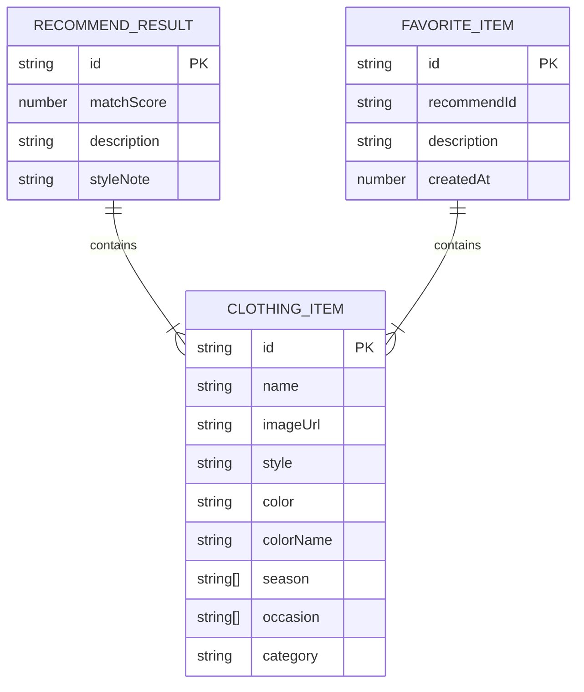

## 1. 架构设计



## 2. 技术描述

- 前端：React 18 + TypeScript + Vite
- 构建工具：Vite 5
- 后端：Express 4 + TypeScript
- 样式：原生 CSS + CSS Variables
- 图标：Lucide React
- HTTP 客户端：Axios
- 状态：React Hooks + localStorage
- 开发服务器端口：3000

## 3. 路由定义

| 路由 | 用途 |
|------|------|
| / | 主页（上传区 + 单品卡片） |
| /detail/:id | 单品详情页 |
| /recommend | 推荐方案页 |

## 4. API 定义

### 类型定义

```typescript
interface ClothingItem {
  id: string;
  name: string;
  imageUrl: string;
  style: string;      // 款式：风衣、马甲、阔腿裤等
  color: string;      // 颜色值：#E74C3C
  colorName: string;  // 颜色名称：红色
  season: string[];   // 季节：春、夏、秋、冬
  occasion: string[]; // 场合：日常、职场、约会等
  category: 'top' | 'bottom' | 'outer' | 'dress' | 'accessory';
}

interface RecommendResult {
  id: string;
  items: ClothingItem[];
  matchScore: number;
  description: string;
  styleNote: string;
}

interface FavoriteItem {
  id: string;
  recommendId: string;
  items: ClothingItem[];
  description: string;
  createdAt: number;
}
```

### 接口列表

| 方法 | 路径 | 描述 | 请求 | 响应 |
|------|------|------|------|------|
| GET | /api/items | 获取单品列表 | - | `ClothingItem[]` |
| GET | /api/items/:id | 获取单品详情 | - | `ClothingItem` |
| POST | /api/upload | 上传图片 | `FormData(file)` | `{ id: string; imageUrl: string }` |
| GET | /api/user/favorites | 获取收藏列表 | - | `FavoriteItem[]` |
| POST | /api/user/favorites | 添加收藏 | `FavoriteItem` | `{ success: boolean }` |
| DELETE | /api/user/favorites/:id | 删除收藏 | - | `{ success: boolean }` |

## 5. 服务器架构图



## 6. 数据模型

### 6.1 数据模型定义



### 6.2 初始数据

- 12 条精选古着单品模拟数据
- 包含 5 大类：上装、下装、外套、连衣裙、配饰
- 覆盖四季和多场合标签

## 7. 核心模块设计

### 7.1 colorMatching.ts - 色彩搭配模块

```typescript
// HSL 色轮配色算法
function rgbToHsl(r: number, g: number, b: number): [number, number, number]
function hslToRgb(h: number, s: number, l: number): [number, number, number]
function getComplementaryColor(hex: string): string  // 互补色
function getAnalogousColors(hex: string): string[]   // 邻近色
function calculateColorMatch(colors: string[]): number  // 配色评分 0-1
function recommendColorPalette(baseColor: string, count: number): string[]
```

### 7.2 recommendEngine.ts - 推荐引擎模块

```typescript
// 款式兼容规则表
const STYLE_COMPATIBILITY: Record<string, Record<string, number>>

// 缓存机制
const recommendationCache: Map<string, { result: RecommendResult[]; timestamp: number }>

// 核心函数
function generateRecommendations(
  item: ClothingItem,
  allItems: ClothingItem[],
  options?: { season?: string; occasion?: string }
): RecommendResult[]
```

### 7.3 性能优化策略

1. **缓存机制**：基于单品 ID + 选项生成缓存键，5分钟内复用结果
2. **剪枝策略**：
   - 优先匹配同季节/场合单品
   - 过滤低兼容度（<0.5）组合
   - 限制候选池大小（最多 30 件）
3. **懒加载**：IntersectionObserver 实现图片懒加载
4. **代码分割**：业务逻辑与 UI 组件分离
