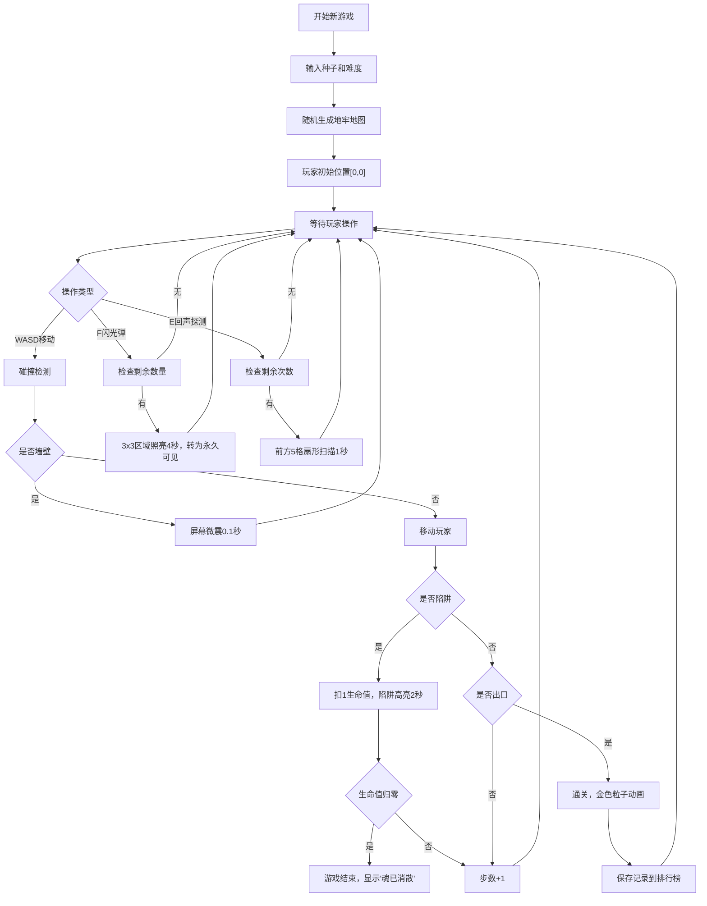

## 1. 产品概述

暗影地牢是一款多人合作魂系风格的地牢探险游戏，玩家在完全黑暗的网格地牢中借助有限的闪光弹和回声定位技能，探测地形与机关，避开陷阱抵达出口。游戏侧重策略性资源管理与紧张刺激的探索体验，核心机制为"暗影视觉与陷阱感知"。

- **核心玩法**：在黑暗地牢中通过感知技能探索，避开陷阱，抵达出口
- **目标用户**：喜欢魂系游戏、策略探索类游戏的玩家
- **产品价值**：提供独特的黑暗探索体验，考验玩家的资源管理和空间记忆能力

## 2. 核心功能

### 2.1 用户角色

| 角色 | 注册方式 | 核心权限 |
|------|----------|----------|
| 玩家 | 本地游玩，输入昵称 | 进行游戏、使用技能、保存存档、查看排行榜 |

### 2.2 功能模块

1. **游戏主界面**：地牢Canvas绘制、玩家控制、感知效果渲染
2. **状态面板**：显示层数、步数、闪光弹数量、生命值
3. **地图生成系统**：随机生成地牢地图、墙壁、陷阱、出口
4. **感知技能系统**：闪光弹（3x3照亮4秒）、回声探测（前方扇形扫描1秒）
5. **碰撞与伤害系统**：墙壁碰撞、陷阱伤害、生命值管理
6. **存档与排行榜**：保存通关记录、展示前10名排行

### 2.3 页面详情

| 页面名称 | 模块名称 | 功能描述 |
|----------|----------|----------|
| 游戏主界面 | 地牢Canvas | 绘制网格地图、玩家、陷阱、感知效果，处理键盘输入 |
| 游戏主界面 | 状态面板 | 显示游戏状态数据，生命值条带抖动动画 |
| 游戏主界面 | 操作提示 | 显示WASD移动、F闪光弹、E回声探测的操作说明 |
| 通关界面 | 庆祝动画 | 金色粒子动画，显示通关步数和层数 |
| 游戏结束界面 | 死亡动画 | "魂已消散"红色渐入文字 |
| 排行榜面板 | 排行列表 | 按步数升序显示前10名玩家记录 |

## 3. 核心流程

## 4. 用户界面设计

### 4.1 设计风格

- **主色调**：暗黑系，背景#0B0C10，文字#E0E0E0
- **强调色**：
  - 闪光弹效果：暖黄色#FFFACD渐变
  - 回声扫描：冷蓝色#00BFFF脉冲光晕
  - 陷阱警示：红色#FF4444闪光
  - 出口传送：绿色闪烁#00FF00
- **按钮样式**：尖锐边框，哥特风格，无圆角
- **字体**：Google Fonts - Cinzel Decorative（哥特风格）
- **布局风格**：全屏Canvas居中（占70%区域），左右状态面板
- **视觉风格**：像素风暗黑魂系，使用Canvas绘制

### 4.2 页面设计概述

| 页面名称 | 模块名称 | UI元素 |
|----------|----------|--------|
| 游戏主界面 | 地牢Canvas | 10-15格网格，未探明#000000，永久可见#2C3E50，玩家白色箭头#FFFFFF，陷阱红色菱形#E74C3C，出口绿色闪烁 |
| 游戏主界面 | 状态面板 | 半透明深色背景#1A1A2E，白色文字，红色生命值条（损失时0.3秒抖动） |
| 游戏主界面 | 操作提示 | 右侧面板显示按键说明，哥特字体 |
| 通关界面 | 庆祝效果 | 金色#FFD700粒子动画，显示步数和层数 |
| 游戏结束界面 | 死亡效果 | "魂已消散"红色文字渐入动画 |
| 排行榜面板 | 排行列表 | 半透明面板，按步数升序排列前10名 |

### 4.3 响应式设计

- 桌面端优先设计
- Canvas尺寸根据窗口大小等比缩放，最小尺寸500x500
- 状态面板在小屏幕下转为上下布局
- 键盘操作支持，触屏设备可考虑虚拟按键（可选）

### 4.4 动画与视觉反馈

- **移动操作**：0.1秒按键反馈（颜色闪烁）
- **墙壁碰撞**：屏幕微震动画0.1秒
- **陷阱触发**：陷阱位置高亮2秒，生命值条抖动0.3秒
- **闪光弹**：半透明淡黄#FFFFE0覆盖，4秒后转为永久可见
- **回声探测**：蓝色边框脉冲线，1秒后消失
- **出口到达**：金色#FFD700庆祝粒子动画
- **游戏结束**：红色文字渐入动画

### 4.5 性能要求

- 游戏循环帧率稳定60FPS
- Canvas重绘开销不超过2ms
- 感知技能状态更新延迟不超过50ms
