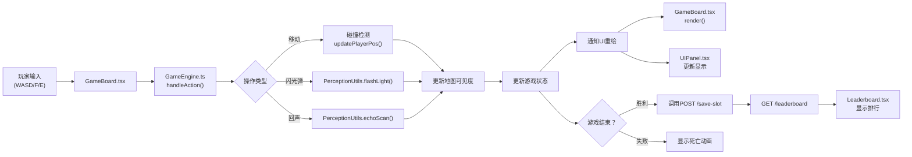
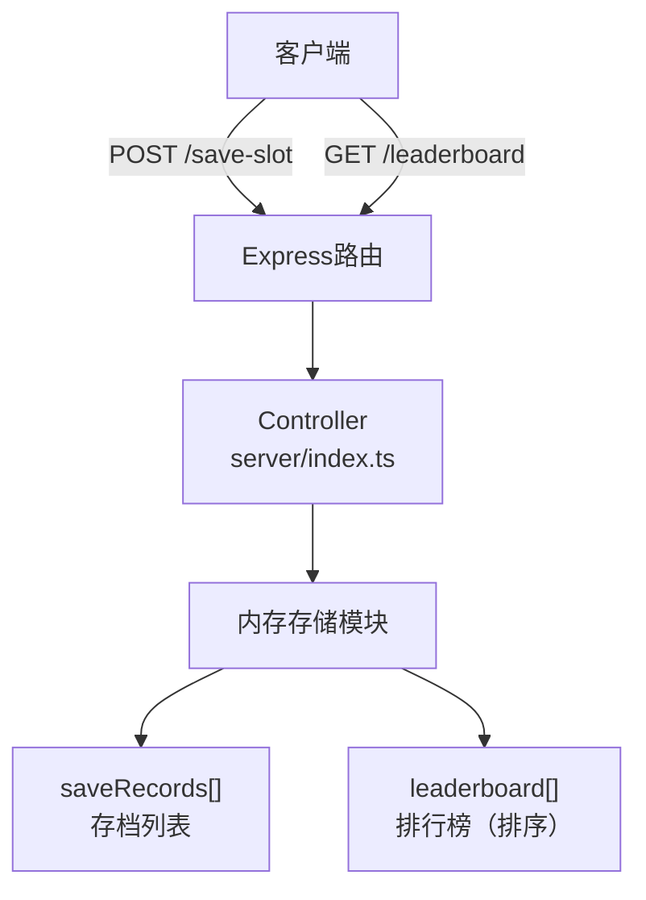
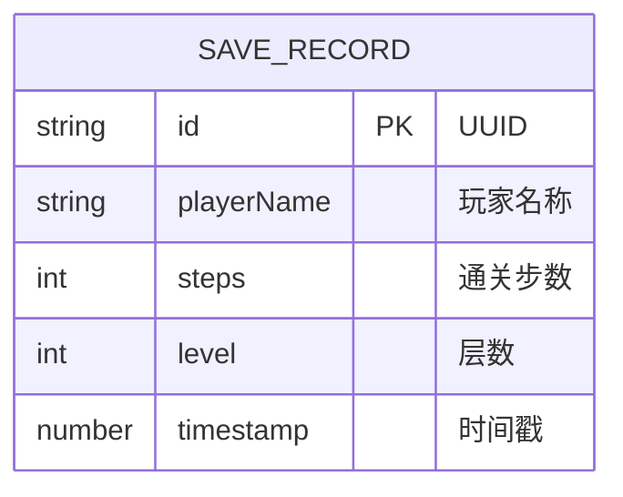

## 1. 架构设计


## 2. 技术描述

### 2.1 技术栈

- **前端框架**：React 18 + TypeScript
- **构建工具**：Vite 5.x
- **后端服务**：Express 4.x
- **语言**：TypeScript (严格模式，目标ES2020)
- **样式**：原生CSS + CSS Variables（无Tailwind，需求未指定）
- **渲染**：HTML5 Canvas 2D
- **图标**：lucide-react（UI图标）

### 2.2 项目结构

```
auto72/
├── .trae/documents/          # 项目文档
│   ├── PRD.md               # 产品需求文档
│   └── TechnicalArchitecture.md  # 技术架构文档
├── src/
│   ├── game/                # 游戏逻辑模块（纯TypeScript）
│   │   ├── types.ts         # 类型定义
│   │   ├── MapGenerator.ts  # 地牢地图生成器
│   │   ├── PerceptionUtils.ts  # 感知工具模块
│   │   └── GameEngine.ts    # 核心游戏循环
│   ├── ui/                  # UI组件（React + TypeScript）
│   │   ├── GameBoard.tsx    # 游戏主绘制组件（Canvas）
│   │   ├── UIPanel.tsx      # 状态面板组件
│   │   └── Leaderboard.tsx  # 排行榜组件
│   ├── App.tsx              # 主应用组件
│   ├── main.tsx             # 应用入口
│   └── index.css            # 全局样式
├── server/
│   └── index.ts             # Express服务器
├── index.html               # 入口HTML
├── vite.config.js           # Vite配置
├── tsconfig.json            # TypeScript配置
├── package.json             # 项目依赖
└── README.md                # 项目说明
```

### 2.3 模块职责与调用关系

| 模块 | 文件路径 | 职责 | 被谁调用 | 调用谁 |
|------|----------|------|----------|--------|
| 类型定义 | [src/game/types.ts](file:///d:/VersionFastPro/tasks/auto72/src/game/types.ts) | 定义所有数据类型、枚举、接口 | 所有game模块、UI模块 | 无 |
| 地图生成 | [src/game/MapGenerator.ts](file:///d:/VersionFastPro/tasks/auto72/src/game/MapGenerator.ts) | 随机生成地牢地图、墙壁、陷阱、出口 | GameEngine | 无 |
| 感知工具 | [src/game/PerceptionUtils.ts](file:///d:/VersionFastPro/tasks/auto72/src/game/PerceptionUtils.ts) | 计算闪光弹、回声探测的可见格子 | GameEngine | 无 |
| 游戏引擎 | [src/game/GameEngine.ts](file:///d:/VersionFastPro/tasks/auto72/src/game/GameEngine.ts) | 核心游戏循环、状态管理、碰撞检测、技能处理 | App.tsx, GameBoard, UIPanel | MapGenerator, PerceptionUtils |
| 游戏画布 | [src/ui/GameBoard.tsx](file:///d:/VersionFastPro/tasks/auto72/src/ui/GameBoard.tsx) | Canvas绘制、键盘输入处理、动画渲染 | App.tsx | GameEngine |
| 状态面板 | [src/ui/UIPanel.tsx](file:///d:/VersionFastPro/tasks/auto72/src/ui/UIPanel.tsx) | 显示生命值、步数、技能数量 | App.tsx | GameEngine |
| 排行榜 | [src/ui/Leaderboard.tsx](file:///d:/VersionFastPro/tasks/auto72/src/ui/Leaderboard.tsx) | 显示通关排行 | App.tsx | 后端API |
| 主应用 | [src/App.tsx](file:///d:/VersionFastPro/tasks/auto72/src/App.tsx) | 组件组合、游戏流程控制、后端通信 | main.tsx | GameEngine, GameBoard, UIPanel, Leaderboard |
| 后端服务 | [server/index.ts](file:///d:/VersionFastPro/tasks/auto72/server/index.ts) | 提供存档和排行榜API | 前端fetch | 内存存储 |

## 3. 核心数据流向



## 4. API定义

### 4.1 类型定义

```typescript
// 存档记录
interface SaveRecord {
  id: string;
  playerName: string;
  steps: number;
  level: number;
  timestamp: number;
}

// 排行榜记录
interface LeaderboardEntry {
  rank: number;
  playerName: string;
  steps: number;
  level: number;
  timestamp: number;
}

// 游戏状态
interface GameState {
  player: { x: number; y: number; direction: Direction };
  health: number;
  maxHealth: number;
  steps: number;
  level: number;
  flashbangs: number;
  echoScans: number;
  mapSize: number;
  gameStatus: 'playing' | 'won' | 'lost';
}

// 地图格子类型
enum CellType {
  EMPTY = 0,
  WALL = 1,
  TRAP_SPIKE = 2,
  TRAP_ROCK = 3,
  TRAP_POISON = 4,
  EXIT = 5,
}

// 玩家方向
enum Direction {
  UP = 'up',
  DOWN = 'down',
  LEFT = 'left',
  RIGHT = 'right',
}
```

### 4.2 接口定义

| 方法 | 路径 | 请求体 | 响应 | 说明 |
|------|------|--------|------|------|
| POST | `/save-slot` | `{ playerName: string; steps: number; level: number }` | `{ success: boolean; message: string }` | 保存通关记录 |
| GET | `/leaderboard` | 无 | `{ data: LeaderboardEntry[] }` | 获取前10名排行（按步数升序） |

## 5. 服务器架构



## 6. 数据模型

### 6.1 数据模型定义



### 6.2 内存存储结构

```typescript
// 服务器内存中的数据结构
interface ServerState {
  saveRecords: SaveRecord[];
  leaderboard: LeaderboardEntry[];
}

// 初始状态
const serverState: ServerState = {
  saveRecords: [],
  leaderboard: [],
};
```

## 7. 性能优化策略

### 7.1 Canvas渲染优化

- 使用离屏Canvas（OffscreenCanvas）预渲染静态元素
- 脏矩形渲染：仅重绘变化区域
- 动画帧合并：使用requestAnimationFrame统一渲染
- 网格缓存：预计算每个格子的像素坐标

### 7.2 游戏循环优化

- 固定时间步长（16.67ms = 60FPS）
- 状态更新与渲染分离
- 使用Set存储可见格子，O(1)查询
- 定时器清理：组件卸载时清除所有定时器

### 7.3 内存管理

- 及时清除过期的感知效果定时器
- 组件卸载时取消订阅和事件监听
- Canvas绘制路径复用，避免频繁创建对象

## 8. 开发与构建

### 8.1 依赖安装

```bash
npm install
```

### 8.2 开发启动

```bash
npm run dev    # 启动Vite开发服务器
npm run server # 启动Express后端
```

### 8.3 生产构建

```bash
npm run build
npm run preview
```
