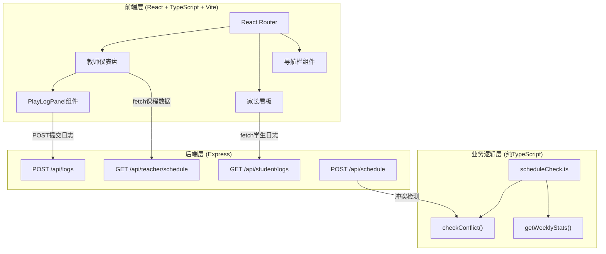
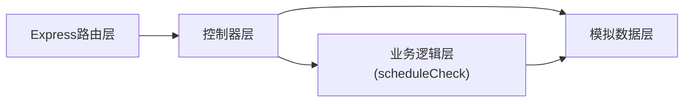
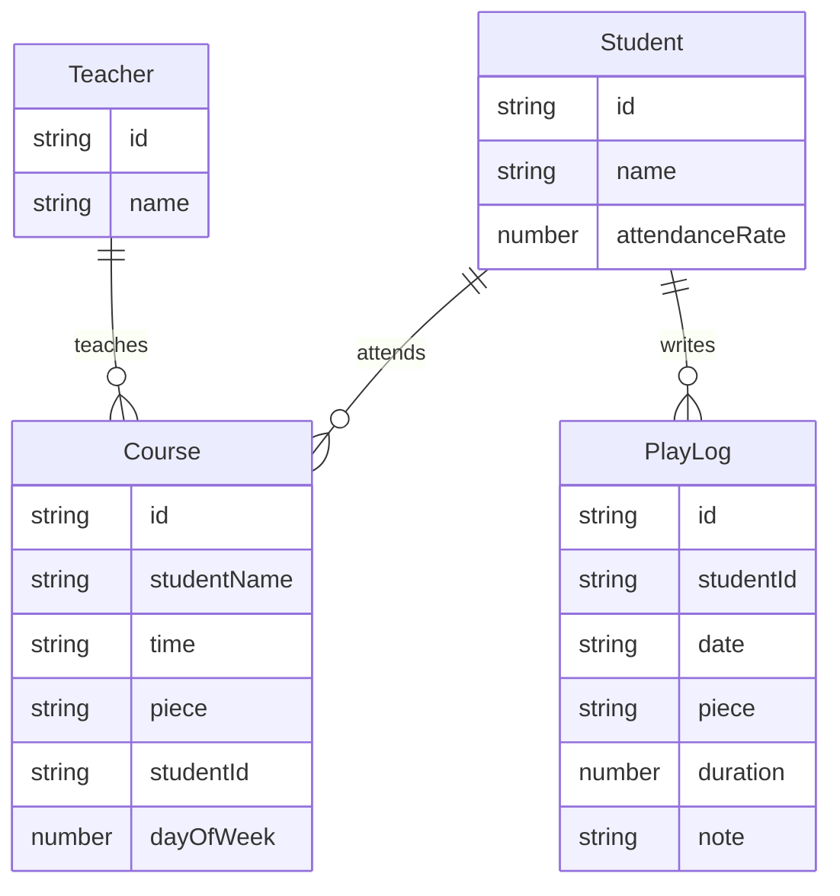

## 1. 架构设计



## 2. 技术说明

- 前端：React@18 + TypeScript + Vite + Tailwind CSS
- 初始化工具：vite-init（react-express-ts模板）
- 后端：Express@4 + CORS
- 数据存储：内存模拟数据（Mock Data）
- 状态管理：Zustand
- 路由：react-router-dom v6（BrowserRouter）

## 3. 路由定义

| 路由 | 用途 | 组件 |
|------|------|------|
| / | 首页重定向到教师仪表盘 | - |
| /teacher | 教师仪表盘，展示今日课表和练琴日志 | TeacherDashboard |
| /student | 学生视图，查看今日课程和提交练琴日志 | StudentDashboard |
| /parent | 家长看板，查看孩子考勤和练琴统计 | ParentDashboard |

## 4. API定义

### 4.1 获取教师今日课表

```
GET /api/teacher/schedule
Response: {
  courses: Array<{
    id: string;
    studentName: string;
    studentAvatar: string;
    time: string;
    piece: string;
    studentId: string;
  }>
}
```

### 4.2 提交练琴日志

```
POST /api/logs
Body: {
  studentId: string;
  piece: string;
  duration: number;
  note: string;
  date: string;
}
Response: { success: boolean; message: string }
```

### 4.3 获取学生历史日志

```
GET /api/student/logs?studentId=xxx
Response: {
  logs: Array<{
    id: string;
    date: string;
    piece: string;
    duration: number;
    note: string;
  }>
}
```

### 4.4 添加课表（含冲突检测）

```
POST /api/schedule
Body: {
  dayOfWeek: number;
  startTime: string;
  endTime: string;
  studentName: string;
  piece: string;
}
Response: {
  success: boolean;
  conflicts?: Array<{
    courseName: string;
    time: string;
  }>;
  message?: string;
}
```

### 4.5 用户登录

```
POST /api/login
Body: { username: string; password: string; role: string }
Response: { success: boolean; token?: string; user?: object }
```

### 4.6 获取家长端数据

```
GET /api/parent/data?studentId=xxx
Response: {
  attendanceRate: number;
  weeklyLogs: Array<{
    date: string;
    totalMinutes: number;
  }>
}
```

## 5. 服务端架构图



## 6. 数据模型

### 6.1 数据模型定义



### 6.2 数据定义

使用内存模拟数据，包含：
- 3位教师的基础信息
- 8名学生的基础信息（含出勤率）
- 今日6-8节课程数据
- 每位学生5-10条练琴日志历史记录
- 预设曲目库（15-20首曲目，含标签分类）

## 7. 文件结构

```
├── package.json
├── index.html
├── vite.config.ts
├── tsconfig.json
├── tailwind.config.js
├── postcss.config.js
├── src/
│   ├── main.tsx              # React根组件，路由配置
│   ├── App.tsx               # 布局组件（导航栏+内容区）
│   ├── index.css             # 全局样式
│   ├── pages/
│   │   ├── TeacherDashboard.tsx  # 教师仪表盘
│   │   ├── StudentDashboard.tsx  # 学生视图
│   │   └── ParentDashboard.tsx   # 家长看板
│   ├── components/
│   │   ├── PlayLogPanel.tsx      # 练琴日志面板
│   │   ├── Navbar.tsx            # 导航栏
│   │   ├── ConflictDialog.tsx    # 冲突弹窗
│   │   └── AttendanceRing.tsx    # 出勤率环形图
│   ├── logic/
│   │   └── scheduleCheck.ts     # 业务逻辑模块
│   ├── store/
│   │   └── useAppStore.ts       # Zustand状态管理
│   └── types/
│       └── index.ts             # TypeScript类型定义
├── server/
│   └── index.js                  # Express后端
└── shared/
    └── types.ts                  # 前后端共享类型
```
