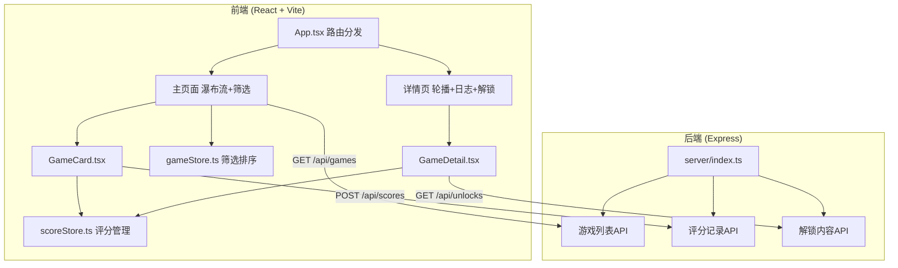
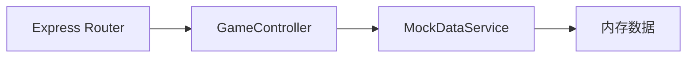
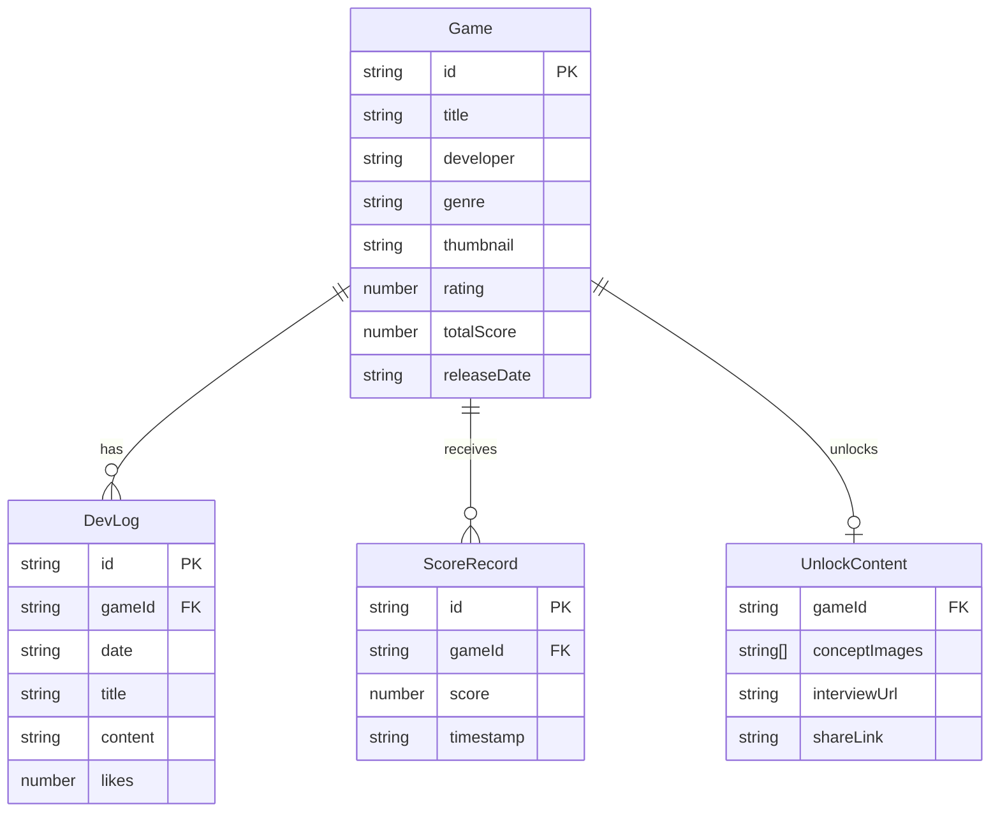

## 1. 架构设计



## 2. 技术说明
- **前端**：React 18 + TypeScript + Vite + Tailwind CSS + Zustand
- **初始化工具**：vite-init (react-express-ts模板)
- **后端**：Express 4 (TypeScript, ESM)
- **数据库**：Mock数据（内存存储）
- **路由**：react-router-dom v6
- **状态管理**：zustand
- **图标**：lucide-react

## 3. 路由定义
| 路由 | 用途 |
|------|------|
| `/` | 主页面，瀑布流卡片+筛选栏 |
| `/game/:id` | 游戏详情页，轮播+日志+解锁 |

## 4. API定义

### 4.1 获取游戏列表
```
GET /api/games?genre=动作
Response: Game[]
```

### 4.2 提交评分
```
POST /api/scores
Body: { gameId: string, score: number }
Response: { totalScore: number, unlocked: boolean }
```

### 4.3 获取解锁内容
```
GET /api/unlocks/:gameId
Response: { conceptImages: string[], interviewUrl: string, shareLink: string }
```

### 4.4 获取游戏详情
```
GET /api/games/:id
Response: GameDetail
```

### 4.5 TypeScript类型定义
```typescript
interface Game {
  id: string
  title: string
  developer: string
  genre: '动作' | '解谜' | '模拟' | '角色扮演'
  thumbnail: string
  rating: number
  totalScore: number
  releaseDate: string
  platforms: string[]
}

interface GameDetail extends Game {
  screenshots: string[]
  devLogs: DevLog[]
  unlockContent?: UnlockContent
}

interface DevLog {
  id: string
  date: string
  title: string
  content: string
  likes: number
}

interface UnlockContent {
  conceptImages: string[]
  interviewUrl: string
  shareLink: string
}
```

## 5. 服务器架构图



## 6. 数据模型

### 6.1 数据模型定义

