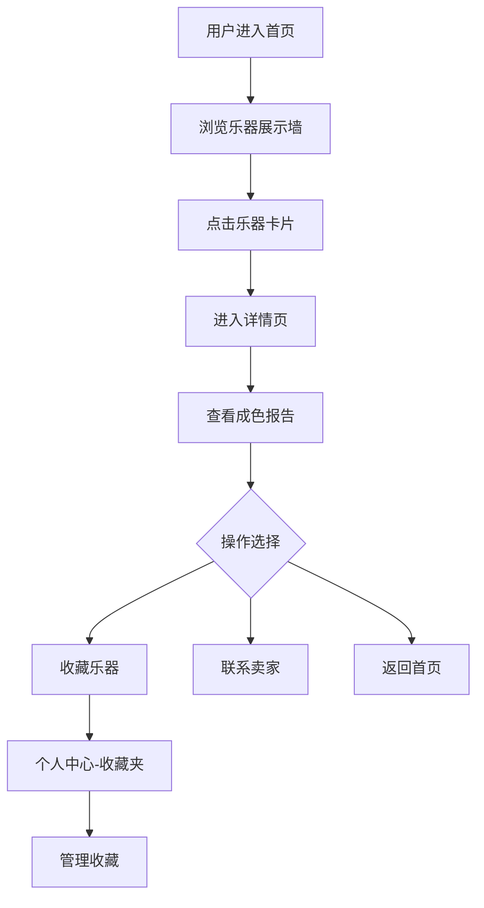

## 1. 产品概述

在线二手乐器交易与成色鉴定系统，通过图像分析技术辅助判断乐器成色，为二手乐器交易提供专业、透明的鉴定服务。

- 主要目的：解决二手乐器交易中信息不对称问题，提供标准化成色鉴定，降低交易风险
- 目标用户：乐器卖家（闲置乐器持有者）、乐器买家（寻找高性价比二手乐器的消费者）
- 市场价值：填补二手乐器专业鉴定服务空白，建立信任机制，提升交易效率

## 2. 核心功能

### 2.1 用户角色

| 角色 | 注册方式 | 核心权限 |
|------|----------|----------|
| 普通用户 | 用户名密码注册 | 浏览乐器、上传鉴定、收藏乐器、联系卖家、查看交易记录 |

### 2.2 功能模块

1. **首页**：响应式乐器展示墙，支持成色筛选、价格排序
2. **乐器详情页**：大图轮播、成色报告、收藏功能、联系卖家表单
3. **上传鉴定页**：拖拽上传图片、AI辅助成色分析、动态生成鉴定报告
4. **个人中心**：收藏夹管理、交易记录查看、账户信息

### 2.3 页面详情

| 页面名称 | 模块名称 | 功能描述 |
|----------|----------|----------|
| 首页 | 乐器展示墙 | 响应式网格布局，每行3-4张卡片，支持图片懒加载、悬停放大效果、成色标签颜色编码 |
| 首页 | 顶部导航 | Logo、导航链接、用户菜单、移动端汉堡菜单 |
| 乐器详情页 | 大图轮播 | 支持触摸滑动，展示乐器各角度高清图 |
| 乐器详情页 | 成色报告卡片 | 环形进度条展示评分、瑕疵区域标注、推荐售价区间 |
| 乐器详情页 | 交互模块 | 收藏按钮、联系卖家表单 |
| 上传鉴定页 | 拖拽上传区域 | 最多6张图片，虚线框+脉冲光效，上传进度提示 |
| 上传鉴定页 | 成色报告生成 | 模拟AI分析，动态展示评分、瑕疵标注、推荐价格 |
| 个人中心 | 收藏夹 | 卡片列表，支持取消收藏（左滑淡出动画） |
| 个人中心 | 交易记录 | 时间倒序表格，显示交易详情 |

## 3. 核心流程

### 卖家上传鉴定流程
用户登录 → 进入上传鉴定页 → 拖拽上传乐器照片 → 系统分析图片生成成色报告 → 完善乐器信息 → 发布到交易市场

### 买家浏览购买流程
用户进入首页 → 浏览乐器展示墙 → 点击乐器卡片进入详情页 → 查看成色报告 → 收藏/联系卖家 → 完成交易 → 交易记录更新

### 收藏管理流程
用户登录 → 浏览乐器 → 点击收藏按钮 → 收藏夹添加记录 → 进入个人中心 → 管理收藏列表

## 4. 用户界面设计

### 4.1 设计风格
- **主色调**：黑胶唱片深黑 `#1A1A1A` + 古典铜色 `#D4A574`
- **辅助色**：成色标签色（全新`#2ECC71`、几乎全新`#3498DB`、明显使用痕迹`#E67E22`、有瑕疵`#E74C3C`）
- **背景色**：`#F5F5F5`（展示墙）、`#1A1A1A`（深色区域）
- **文字颜色**：正文`#E0E0E0`，标题白色
- **按钮样式**：圆角8px，点击波文扩散效果0.15秒
- **字体**：Noto Serif SC（标题）、系统无衬线字体（正文）
- **布局风格**：卡片式布局，顶部导航栏，网格展示墙
- **动效风格**：优雅过渡、微妙悬停、平滑页面切换

### 4.2 页面设计概述

| 页面名称 | 模块名称 | UI元素 |
|----------|----------|--------|
| 首页 | 乐器展示墙 | 响应式Grid、卡片悬停缩放1.05倍、0.3秒滤镜过渡、成色标签、价格、品牌信息 |
| 首页 | 顶部导航 | 深色背景`#1A1A1A`、铜色Logo、导航链接、用户头像下拉菜单、移动端汉堡侧滑面板 |
| 乐器详情页 | 大图轮播 | 触摸滑动支持、指示器、图片懒加载 |
| 乐器详情页 | 成色报告卡片 | 环形进度条（0.8秒动画）、瑕疵红色半透明矩形标注、推荐售价区间 |
| 上传鉴定页 | 拖拽区域 | `#3498DB`虚线边框、渐变脉冲光效、上传数量限制提示 |
| 上传鉴定页 | 报告卡片 | 右侧动态生成、评分环形进度条（颜色从`#E74C3C`到`#2ECC71`渐变） |
| 个人中心 | 收藏夹 | 卡片列表、取消收藏按钮、左滑淡出0.2秒动画 |
| 个人中心 | 交易记录 | 时间倒序表格、交易详情行 |

### 4.3 响应式设计
- **桌面端（>1024px）**：每行3-4张乐器卡片，完整导航栏，双栏上传页面
- **平板端（768px-1024px）**：每行2-3张卡片，导航简化
- **移动端（<768px）**：单列卡片布局，导航收起为汉堡图标，上传区域单栏，卡片展开动画适配
- **触摸优化**：增大点击区域，支持滑动轮播，禁用悬停效果

### 4.4 性能要求
- 页面首次加载时间 ≤ 2秒
- 图片懒加载（Intersection Observer）
- 成色报告Mock接口响应 ≤ 500ms
- React Query数据缓存
- 代码按需分割

## 5. 技术实现要点

### 5.1 前端技术
- TypeScript + React 18 + Vite
- React Router 路由管理
- React Query 数据获取与缓存
- react-dropzone 文件上传
- Canvas API 图像处理
- CSS3 动画与过渡

### 5.2 后端技术
- Express 4
- multer 文件上传处理
- uuid 唯一ID生成
- cors 跨域处理

### 5.3 业务逻辑模块
- `analysis.ts`：图像分析算法（亮度、噪点、边缘特征模拟）
- `report.ts`：成色报告生成与格式化
